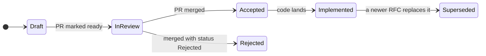

# Ostia documentation

Start with the [product requirements (PRD)](product/prd.md): what Ostia is, its four layers and the roadmap. Designs live in [RFCs](rfcs/), and individual decisions in [ADRs](adr/).

## Where documents go

| Kind | Folder | Use it for | After merge |
| --- | --- | --- | --- |
| Product | `docs/product/` | The PRD: scope, layers, roadmap, founding decisions D1–D12 | Living; updated by pull request |
| RFC | `docs/rfcs/NNNN-short-title.md` | The detailed design of a component or feature | Frozen once `Implemented`; replaced by a new RFC, not rewritten |
| ADR | `docs/adr/NNNN-short-title.md` | One architectural decision: context, decision, consequences | Never edited, except its status (`Superseded by ADR-NNNN`) |
| Guide | `docs/guides/` | How-tos for contributors: build, test, benchmark, rent hardware | Living |

Numbers are four digits and never reused. RFCs start at 0001. ADRs start at 0013, continuing the PRD's founding decisions D1–D12, so every decision has one number in one sequence.

## When you need an RFC

Write an RFC before you write code if the change:

- adds a component or a new public module;
- changes a public API, the C ABI or a wire protocol;
- changes a contract between layers (Fabric API, Exchange API, Runtime API);
- adds a third-party dependency;
- designs or reworks a hot path (data movement, partitioning, flow control).

Anything else is an ordinary pull request. When an RFC would be overkill but a choice deserves a record (a library pick, a naming rule), write an ADR instead.

## RFC lifecycle



1. **Draft.** Copy [`rfcs/0000-template.md`](rfcs/0000-template.md) to `rfcs/NNNN-short-title.md`, where `NNNN` is the next free number. Open a draft pull request; its title starts with `RFC-NNNN:`.
2. **In review.** Mark the pull request ready. Discussion happens in its review comments. While there is one maintainer, a design review by a second reviewer (human or Claude) is required. Once there are more maintainers, an RFC stays open for at least 3 working days.
3. **Accepted.** The RFC merges with `status: Accepted`. Implementation pull requests cite it, for example `Implements RFC-0002 §4`.
4. **Implemented.** A follow-up change sets `status: Implemented` when the design has landed.
5. **Rejected** RFCs merge too, with the reason recorded, so the reasoning is not lost. **Superseded** RFCs point to their replacement.

ADRs follow the same pull request flow, with [`adr/0000-template.md`](adr/0000-template.md). They are short and usually merge after one review.

## Front matter

Every RFC and ADR starts with YAML front matter. The index below is generated from it.

```yaml
---
number: 2
title: ostia-fabric
status: Draft          # Draft | In review | Accepted | Implemented | Rejected | Superseded
authors: [ShAlireza]
components: [fabric]   # fabric | exchange | runtime | query | telemetry | build | docs
created: 2026-09-25
updated: 2026-09-25
supersedes: []
superseded_by: []
discussion: https://github.com/OstiaHQ/ostia/pull/NN
---
```

## Finding documents

- **The index below** lists every RFC and ADR with its status and components. Regenerate it with `python3 tools/docs/gen_index.py`; `--check` fails if it is out of date.
- **Component READMEs** (for example `fabric/README.md`) link to the RFCs that describe them.
- **Code comments cite sections**, for example `// See RFC-0002 §5.3 (credit accounting)`, so a reader can jump from code to design.
- **Search by number:** `rg "RFC-0002"` finds the design and every place that implements it.

## Figures

- New documents use Mermaid code blocks, which GitHub renders directly.
- Hand-drawn figures keep their source next to the rendered SVG: sources in `<doc>/figures/src/*.jsx`, output in `<doc>/figures/*.svg`. Re-render with `bun tools/docs/render-figures.js docs/product/figures/src docs/product/figures`. The SVGs follow the reader's light or dark mode.

## Index

<!-- index:start -->
| Document | Title | Status | Components | Created |
| --- | --- | --- | --- | --- |
| [RFC-0003](rfcs/0003-topology-fixtures.md) | Topology fixtures | Draft | fabric, build | 2026-09-25 |
<!-- index:end -->
