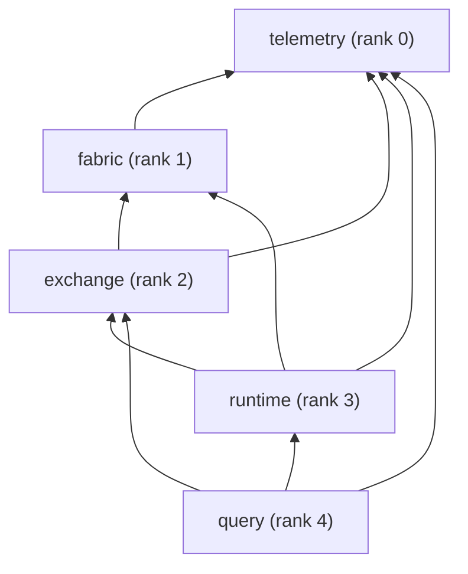
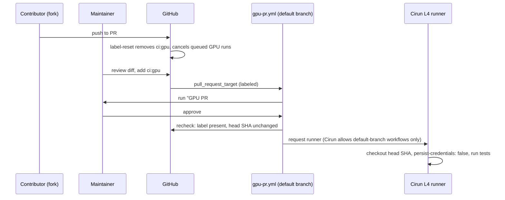

# RFC-0001: M0 foundations

## Summary

This RFC designs the foundations that M0 builds before any Ostia data path exists: the toolchain and supported platforms, how dependencies are obtained, the repository and CMake layout with enforced layering, CI (including GPU CI on a public repository), the telemetry build levels, the benchmark harness and the M0 gate, and how the competitive landscape is verified. Two parts are designed in their own RFCs and summarised here: topology fixtures ([RFC-0003, PR #8](https://github.com/OstiaHQ/ostia/pull/8)) and rented-hardware automation ([RFC-0004, PR #9](https://github.com/OstiaHQ/ostia/pull/9)). The telemetry runtime (counters, trace rings, exporters) is RFC-0002 ([PR #10](https://github.com/OstiaHQ/ostia/pull/10)).

When this RFC is implemented, every later pull request builds and tests on Linux and macOS, runs on a GPU when a maintainer approves it, and can cite a numbered, checkable requirement from this document.

## Motivation

The [PRD](../product/prd.md#roadmap-and-milestones) defines M0 as the new repository, CMake and CI, a benchmark harness, a telemetry framework, a decision log, a verified competitive landscape, and cheap testing without clusters. Its gate is that the harness reproduces the prototype's baselines: peer-to-peer NVLink bandwidth and GPUDirect RDMA near line rate.

Four founding decisions shape the design:

- **D7:** Layer 1 is C++20 + CUDA with a stable C ABI and Python bindings (nanobind), sanitizers in CI.
- **D9:** there is no owned cluster. Everyday CI uses CPU runners plus one rented single-GPU runner; gate benchmarks run on rented reference setups brought up and torn down by one command.
- **D10:** observability is built in from M0, with build levels `off`, `metrics`, `trace` and `debug`.
- **D12:** components are `ostia-fabric`, `ostia-exchange`, `ostia-runtime`, `ostia-query` and `ostia-telemetry` in one public monorepo, with layering enforced by the build.

The repository is public and the project has one maintainer, so three constraints run through every section: contributors without GPUs must be able to do real work, untrusted pull requests must never reach cloud credentials, and money spent on rented hardware must be bounded.

## Goals and non-goals

**Goals**

- A contributor with pixi installed goes from clone to passing tests on macOS or Linux in three commands (`pixi install`, `pixi run build`, `pixi run test`), without a GPU or a cloud account.
- Every pull request builds on Linux x86_64, Linux aarch64 and macOS, and on a GPU when a maintainer approves it.
- Layering between components is enforced by configure-time checks and CI, not by convention.
- The benchmark harness produces results that can be compared across commits and that refuse to pass when the evidence is not good enough.
- The M0 gate is measured on rented reference setups, with calibration against independent tools.
- Architectural decisions after this RFC are recorded as ADRs in `docs/adr/` (numbered from 0013), which is the PRD's M0 "decision log".

**M0 is done when** every "Done when" list in §1–§9 is met, RFC-0002 (telemetry runtime), RFC-0003 (topology fixtures) and RFC-0004 (rented hardware) are accepted and implemented, and the gate runs in §6 pass.

**Budget.** M0 spends at most **$1,500** on rented hardware and GPU CI together, split into enforced sub-budgets (see [§4](#4-ci) and RFC-0004). There is a **checkpoint 10 weeks after this RFC is accepted**. Reaching the budget or the checkpoint suspends new launches and triggers a re-scope review, recorded as an ADR.

**Non-goals**

- The public Fabric and Exchange APIs, the C ABI surface and the wire protocol. They belong to the fabric and exchange RFCs.
- The telemetry runtime: runtime switch, sampling, counters, rings, OpenTelemetry, Perfetto and NVTX export. RFC-0002.
- Packaging and wheels. `manylinux_2_28` is recorded as the future wheel target.
- ABI compatibility checks before the first tagged release.
- Kernels that need architecture-specific targets (`sm_90a`, `sm_100a`).

## Design

### 1. Toolchain

#### 1.1 CUDA and GPU architectures

- **Minimum CUDA is 12.8.** It is the first 12.x release with Blackwell (`sm_100`) support and runs on the older drivers that clusters keep. CI also builds with the latest CUDA 13.x (13.4 at the time of writing). CUDA 13 needs driver R580 or newer. The floor is revisited by ADR.
- **Architectures:** SASS for `sm_80`, `sm_90` and `sm_100`, plus PTX for the newest listed architecture. `sm_80` SASS runs on `sm_86` and `sm_89`, so L4 and A10G CI machines need no extra target. Architectures not in the list, such as `sm_103` and `sm_120`, run through PTX JIT; set `CUDA_CACHE_PATH` so the JIT cost is paid once. Architecture-specific targets (`sm_90a`, `sm_100a`, needed for TMA and wgmma) are left to the kernel RFCs that need them.
- A user-set `CMAKE_CUDA_ARCHITECTURES` always wins. Otherwise the top-level `CMakeLists.txt` decides before `enable_language(CUDA)`: in the `dev` preset it uses `native` only when a GPU is detected (CMake fails at configure time when `native` is set and no GPU is present), and otherwise the release list. Presets are static and cannot detect hardware, so this logic lives in CMake code, not in `CMakePresets.json`. The configure summary prints the choice.
- GPU CI builds only `sm_89` (the L4), to keep its build short; the full list is built by the nvcc compile-only CPU jobs.

#### 1.2 Host compilers and language

- nvcc compiles device code. Clang as the CUDA compiler is not supported in v1.
- Supported host compilers, bounded by what each CUDA version accepts:

| CUDA | GCC | Clang | Source |
| --- | --- | --- | --- |
| 12.8 | 11–14 | 17–19 | CUDA 12.8 installation guide |
| 13.4 (CI's 13.x) | 11–16 | 17–22 | CUDA 13.4 installation guide |

- Other 13.x minors have narrower upper bounds (13.0 stops at GCC 15 and Clang 20). CI pins 13.4, and the top-level `CMakeLists.txt` checks the host compiler against this table at configure time, failing with the detected and supported versions.
- The nvcc compile-only CI jobs use GCC 11 with CUDA 12.8 and GCC 14 with CUDA 13.4.
- **macOS** (host-only, no CUDA) uses conda-forge Clang 19 with libc++ from pixi, not Apple Clang, with a deployment target of macOS 14.0.
- **C++20 everywhere** (D7). Public headers must compile as C++20 inside `.cu` translation units. The usable standard library is what GCC 11 and nvcc 12.8 support:
  - allowed: concepts, `<span>`, `<ranges>`, `<bit>` and `std::bit_cast`, `<source_location>`, `std::jthread`, `<latch>`, `<barrier>`, `<semaphore>`;
  - banned: `<format>` (GCC 13), constexpr `std::string`/`std::vector` and `std::atomic<std::shared_ptr>` (GCC 12), chrono time zones (GCC 14).
  The allowed list also holds on the macOS toolchain: libc++ 18 and later ship `std::jthread` and `stop_token` as non-experimental, and `<latch>`, `<barrier>` and `<semaphore>` are available at deployment target 14.0. The GCC 11 job and the macOS job enforce the list by building everything.
- There is no `std::expected` in C++20, so Ostia has its own `ostia::Result<T>` whose member names mirror `std::expected`, making a later switch mechanical.
- **C++23** is revisited by ADR when the floors reach CUDA 13.3 (whose release notes add C++23 to nvcc) and GCC 14 (NVIDIA's C++23 device-language guidance requires it).

#### 1.3 CMake

CMake **4.1 or newer**. The CUDA 13 architecture tables first shipped in CMake 3.31.9, 4.0.4 and 4.1.0, so 4.1 is the lowest 4.x line with them. pixi supplies it, and the container jobs install a pinned 4.1 from Kitware's release archive, so a high floor costs contributors nothing.

CMake 4 rejects `cmake_minimum_required` below 3.5 in dependencies. CPM-fetched dependencies that still declare one are configured with `CMAKE_POLICY_VERSION_MINIMUM=3.5`, scoped to that dependency.

#### 1.4 Platforms and support tiers

| Tier | Meaning | Platforms | CI job that backs it |
| --- | --- | --- | --- |
| 1 | Built and tested on every PR; gate benchmarks run here | Ubuntu 24.04 x86_64 | `linux-x64-*`, `gpu-l4` |
| 1 | Built and tested on every PR | macOS 15 arm64, host-only (no CUDA) | `macos-arm64-host` |
| 2 | Built on every PR, tested where possible | Ubuntu 24.04 aarch64; Ubuntu 22.04 and Rocky 9 x86_64 without pixi | `linux-arm64-*`, `container-ubuntu2204`, `container-rocky9` |
| 3 | Best effort | Other Linux distributions; building without pixi elsewhere | none |

The Ubuntu 22.04 and Rocky 9 container jobs prove that Ostia builds without pixi. They use a pinned CMake 4.1 from Kitware plus distro packages for everything else (compiler, hwloc), build host-only at telemetry level `off` (neither distro packages opentelemetry-cpp, and their UCX is too old), and let CPM supply the source dependencies.

aarch64 moves to tier 1 after a gate run passes on a rented Grace Hopper machine. On macOS, CUDA code is checked with a `linux/arm64` container that has the CUDA SBSA toolkit; it runs natively on Apple silicon and nvcc needs no GPU.

**Done when**

- [ ] `CMakePresets.json` encodes the architecture list; the top-level `CMakeLists.txt` implements the `dev` GPU detection and the compiler-range check, with a configure test for each.
- [ ] The GCC 11 job builds all code with CUDA 12.8, and the GCC 14 job builds it with CUDA 13.4.
- [ ] `ostia::Result<T>` exists with `value()`, `error()`, `has_value()` and `operator bool` named as in `std::expected`.
- [ ] The support-tier table is in `docs/guides/building.md`, and each tier-1 row has a green CI job.

### 2. Dependencies

#### 2.1 How the build finds dependencies

There are two paths. **System dependencies** (UCX, hwloc, opentelemetry-cpp, CUDA) are found with `find_package()` only; the build never installs them. **Source dependencies** are fetched and configured by CPM during CMake configuration, unless a local package is found first. A packager who wants no downloads at all sets `CPM_LOCAL_PACKAGES_ONLY=ON` and supplies every package. Anyone embedding Ostia can therefore use conda, Spack, distro packages or wheels. What each source provides:

| Source | Provides | Who uses it |
| --- | --- | --- |
| pixi (conda-forge) | CUDA toolkit, UCX + rdma-core (Linux), libhwloc, libcurl, CMake, Ninja, ccache, clang tools, ruff, gersemi, pytest, scikit-build-core | Contributors and CI |
| CPM.cmake, pinned by tag and commit SHA | nanobind, GoogleTest, nvbench, nanoarrow, CCCL; opentelemetry-cpp, protobuf and abseil as static, position-independent archives linked into `libostia-telemetry` with hidden symbols (RFC-0002 §4) | The source build; `CPM_USE_LOCAL_PACKAGES`, `CPM_LOCAL_PACKAGES_ONLY` and `CPM_<pkg>_SOURCE` let packagers substitute their own |
| Loaded at runtime with `dlopen` | NVML, nvCOMP | Never linked or bundled by Ostia's libraries |
| The consumer | Everything above that `find_package()` looks for | People embedding Ostia |

#### 2.2 pixi environments

pixi uses per-platform features, because conda-forge builds UCX and rdma-core only for Linux:

- **`default`** (host-only): no CUDA toolkit, no UCX, no rdma-core, no cloud credentials. It resolves and builds on macOS arm64, Linux x86_64 and Linux aarch64.
- **`cuda-12`** and **`cuda-13`** (Linux only): add the CUDA toolkit and CUDA-enabled UCX builds.

`pixi.lock` covers `linux-64`, `linux-aarch64` and `osx-arm64`. `docs/guides/building.md` states each environment's download size and hardware needs.

#### 2.3 Approved M0 dependency set

This RFC is the approval that docs/README.md requires for new dependencies.

| Dependency | Licence | Purpose | Source | Integration milestone | Required by |
| --- | --- | --- | --- | --- | --- |
| hwloc | BSD-3-Clause | Topology discovery | pixi | M0 (fixture replay), M1 (live) | fabric |
| UCX + rdma-core | BSD-3-Clause, BSD/GPL-2.0 dual | Transports, multi-process tests | pixi, Linux | M0 (tests), M1 | fabric tests |
| opentelemetry-cpp, protobuf, abseil | Apache-2.0, BSD-3-Clause, Apache-2.0 | Metrics and span export | CPM, static PIC, symbols hidden (RFC-0002 §4) | With RFC-0002 | telemetry, `metrics`/`trace` builds only |
| libcurl | curl (MIT-style) | OTLP over HTTP | pixi or system, shared | With RFC-0002 | telemetry, `metrics`/`trace` builds only |
| CCCL | Apache-2.0 with LLVM exception | CUB, Thrust, libcu++ | CPM, from GitHub | M0 | CUDA targets |
| nanobind | BSD-3-Clause | Python bindings | CPM, one version for all extensions | M0 | every `python/` |
| GoogleTest | BSD-3-Clause | C++ tests | CPM | M0 | tests |
| nvbench | Apache-2.0 | In-process GPU benchmarks | CPM (not on conda-forge); its own NVML use is allowed because benchmark binaries are not shipped libraries | M0 | `bench/` |
| nanoarrow | Apache-2.0 | Arrow C Device Data Interface (`NANOARROW_DEVICE_WITH_CUDA`) | CPM | M2 | exchange |
| NVML | NVIDIA driver | GPU and NVLink discovery | `dlopen` | M0 (capture), M1 | fabric |
| nvCOMP | NVIDIA proprietary, optional | Compression pushdown | `dlopen`, never bundled | M2 | exchange; out of default M0 resolution |

- CCCL is taken from GitHub rather than the toolkit, which CCCL supports ("a newer CCCL with an older CUDA Toolkit"), so the CCCL version does not change with the CUDA version. CCCL 3.x supports CUDA 12.x and 13.x at their latest patch releases, which includes CUDA 12.8 (its latest patch is what CI pins).
- RFC-0002 approves xxHash and RFC-0003 approves nlohmann/json, each for its own use.
- nvCOMP is approved now and integrated with compression pushdown in M2. When integrated, it reports its capability explicitly, and any benchmark or test that requires it fails, rather than silently falling back, when it is missing or incompatible. Its redistribution terms are checked before any binary release (PRD, Third-party code).

#### 2.4 Pinning and updates

- `pixi.lock` pins conda packages. CPM pins by tag and full commit SHA, and CI caches `CPM_SOURCE_CACHE`. When an upstream tag disappears, the fix is a pull request that bumps the pin.
- **Renovate** updates pixi (its `pixi` manager) and CPM pins (a regex manager over `CPMAddPackage`, using github-tags). Regenerating `pixi.lock` needs `pixi` in Renovate's global `allowedUnsafeExecutions`, which the hosted Renovate app does not allow, so Renovate runs **self-hosted** from a scheduled GitHub Actions workflow (`renovatebot/github-action`) with that global setting. Dependabot supports neither. **Dependabot** keeps updating GitHub Actions only.

**Done when**

- [ ] `pixi install` of the `default` environment succeeds on all three platforms in CI (see §4).
- [ ] Every `CPMAddPackage` call pins a tag and a commit SHA.
- [ ] Renovate opens a test update for one pixi package and one CPM pin.
- [ ] `THIRD_PARTY_NOTICES` lists every dependency in §2.3.

### 3. Repository layout and targets

#### 3.1 Layout

Folders are organised component-first: each component owns its public headers, private sources, tests, benchmarks and bindings. This matches target-based CMake, makes a component's boundary a folder boundary, and lets a component move to its own repository later (D12).

```text
cmake/                      OstiaComponent.cmake, Dependencies.cmake (CPM pins), CPM.cmake
telemetry/                  rank 0, real code in M0
fabric/                     rank 1, M0: topology model + fixture replay (RFC-0003)
exchange/  runtime/  query/ ranks 2-4, placeholders in M0
  <component>/
    include/ostia/<component>/   public, installed: *.h = C ABI (ostia_<component>_*), *.hpp = C++
    src/                         private sources and headers, never installed
    tests/  bench/  python/
    CMakeLists.txt  README.md
tools/ci/                   check_layering.py, check_telemetry_macros.py
tools/bench/                ostia-bench driver, compare.py
bench/baselines/            committed baselines; bench/results/ is git-ignored
pixi.toml  pixi.lock  CMakeLists.txt  CMakePresets.json
```

`fabric/tools/topo-capture/` is defined by RFC-0003; `tools/rent/` and `infra/setups/` are defined by RFC-0004.

The exchange, runtime and query **placeholders** ship no public headers and no API: a `CMakeLists.txt`, a README pointing to their future RFC, and an empty INTERFACE target. They are not installed or exported, and `find_package(ostia COMPONENTS exchange)` fails with a message naming the RFC that will define it. RFC-0001 approves only the empty skeleton; each component's design needs its own RFC.

#### 3.2 Targets

```cmake
ostia_add_component(NAME fabric RANK 1 DEPENDS telemetry)
ostia_add_component(NAME exchange RANK 2 PLACEHOLDER)
```

`ostia_add_component` creates `ostia_<name>` with the alias `ostia::<name>`, sets `OUTPUT_NAME ostia-<name>` so the library is `libostia-<name>.so` (PRD), makes `include/` PUBLIC and `src/` PRIVATE, and adds the `OSTIA_BUILD_<NAME>` option. Installed consumers write `find_package(ostia COMPONENTS fabric)` and link `ostia::fabric`.

#### 3.3 Dependency table and enforcement

Components are ordered by **rank**: telemetry 0, fabric 1, exchange 2, runtime 3, query 4. Ranks order components; they are not the PRD's layers 1a, 1b, 2 and 3. The allowed direct dependencies are:

| Component | May depend on |
| --- | --- |
| telemetry | — |
| fabric | telemetry |
| exchange | fabric, telemetry |
| runtime | exchange, fabric, telemetry |
| query | runtime, exchange, telemetry |

The authority for this table is PRD D12 together with this RFC. Runtime uses fabric's topology directly for placement (PRD, Layer 2), and query uses exchange's cost estimates (PRD, Layer 3). This PR updates the PRD's layering sentence to match: dependencies only point down, and the few direct edges past the layer immediately below are the ones in this table.



Enforcement has three parts, each checking a component's **own direct** edges against the table. Exposure through another component's public interface is allowed: query code that includes a runtime header, which itself includes a fabric header, passes, because the fabric include is runtime's, not query's.

1. **At configure time,** `ostia_add_component` rejects any `DEPENDS` entry that is not in the table. Disabling a component that another enabled component needs is a configure error naming the dependent.
2. **After all targets exist,** the top-level `CMakeLists.txt` walks each `ostia_*` target's `LINK_LIBRARIES` and `INTERFACE_LINK_LIBRARIES`, resolves `ostia::` aliases, and fails on any edge not in the table. Entries hidden in generator expressions cannot be evaluated at configure time, so CI also runs `cmake --graphviz` on a configured tree and checks its resolved edge list against the table. This catches a raw `target_link_libraries` call, including an INTERFACE edge, that bypasses the helper.
3. **In CI and pre-commit,** `tools/ci/check_layering.py` scans the `#include` lines in each component's own files. An `<ostia/X/...>` include must name the component itself or one in its table row; it also fails on includes that reach into another component's `src/` and on relative includes across component folders.

Every failure follows the error-message contract ([Failure handling](#failure-handling)), for example:

```text
error: query/src/plan.cpp:12 includes <ostia/fabric/topology.hpp>
  query may depend on: runtime, exchange, telemetry
  fix: use runtime's or exchange's API, or change the dependency table through an RFC (RFC-0001 §3.3)
```

#### 3.4 Host-only boundary

The fabric **topology model and fixture replay** target is unconditional: it builds with no CUDA, NVML, ibverbs or UCX, so it works on macOS. Live discovery providers, the capture tool, UCX transport tests and GPU benchmarks are separate targets, enabled only on platforms and environments that have their dependencies. `OSTIA_ENABLE_CUDA` is `AUTO` by default, and `ON` fails at configure time with the detected and required versions.

#### 3.5 Python bindings

- Python packages share the `ostia` import namespace (PEP 420). Each component installs into `ostia/<component>/`, and no package ships `ostia/__init__.py`.
- **Development installs** are per-component scikit-build-core editable installs (scikit-build-core 1.0.1 or newer, which fixed shared namespace packages in redirect mode). One native build and install prefix per pixi environment and preset owns every `libostia-*.so`. Component editables link against that prefix and never build or bundle lower-rank native libraries. All extensions use the same pinned nanobind version.
- `pixi run py-dev` installs the editables in rank order with `--no-build-isolation`, a persistent build directory and the selected preset. Rebuilding after a native change is an explicit, documented command. Switching telemetry flavour rebuilds the whole stack or fails clearly. Only implemented components get editables; placeholders get none.
- **Library lookup.** The native prefix is the pixi environment's prefix: `libostia-*.so` installs into its `lib/`. Each extension installs into `site-packages/ostia/<component>/`, and CMake computes its `INSTALL_RPATH` as the relative path from there to the prefix's `lib/` (`$ORIGIN/../../../..`-style on Linux, `@loader_path/...` on macOS), so extensions find the one shared copy. The out-of-checkout test prints and checks the loaded library paths.
- If these conditions cannot be met in PR 1, the fallback is one shared CMake install prefix with Python packages installed from it.

**Done when**

- [ ] All five component folders exist; the placeholders are neither installed nor exported, and `find_package` on one fails with the RFC pointer.
- [ ] A negative test proves each enforcement part fails: an upward `DEPENDS`, an upward raw link, an upward include and an include into another component's `src/`.
- [ ] A positive test proves a legitimate transitive dependency passes.
- [ ] From outside the checkout, one interpreter imports `ostia.telemetry` and `ostia.fabric`, no `ostia/__init__.py` is installed, and exactly one `libostia-telemetry` path is loaded.
- [ ] After a documented rebuild, a change to native code is visible from Python.

### 4. CI

#### 4.1 CPU jobs (GitHub-hosted, free for public repositories)

| Job | Runner | What it runs | When |
| --- | --- | --- | --- |
| `linux-x64-gcc11`, `linux-x64-gcc14` | ubuntu-24.04 | Build + unit tests; all four telemetry levels on `gcc14`, `metrics` + `debug` on `gcc11` | Every PR |
| `linux-x64-clang` | ubuntu-24.04 | Build + unit tests, `metrics` + `debug` | Every PR |
| `linux-arm64-clang` | ubuntu-24.04-arm | Build + unit tests | Every PR |
| `macos-arm64-host` | macos-15 | `default` environment resolve, build, unit tests, pytest | Every PR |
| `nvcc-12.8`, `nvcc-13` | ubuntu-24.04 | CUDA compile-only (GCC 11 / GCC 14) | Every PR |
| `container-ubuntu2204`, `container-rocky9` | ubuntu-24.04 | Build with distro packages, no pixi | Every PR |
| `sanitize-asan-ubsan`, `sanitize-tsan` | ubuntu-24.04 | Clang, `debug` level | Every PR |
| `multiprocess-tcp` | ubuntu-24.04 | Multi-process tests over UCX TCP loopback (`fabric/tests/multiprocess/`) | Every PR |
| `lint` | ubuntu-24.04 | clang-format, ruff, gersemi, `check_layering.py`, `check_telemetry_macros.py`, `gen_index.py --check` | Every PR |
| `docs-as-test` | ubuntu-24.04, fresh | Runs `docs/guides/building.md`'s host-only commands verbatim; records the time taken | Every PR |
| `levels-full` | all | Full telemetry-level matrix on every configuration | Nightly |

- clang-tidy runs on changed files in CI and as a manual pre-commit stage, because it needs `compile_commands.json` and is slow.
- Required checks aim to finish within **20 minutes**. Jobs use per-PR concurrency groups with `cancel-in-progress`. Every job calls the same `pixi run` tasks a contributor runs locally (`pixi run check` is the required subset) and prints the command to reproduce a failure.
- ccache runs through pixi, with `actions/cache`, for pull-request CPU jobs only (see §4.2 on caches).
- In M0 the multi-process suite is a harness test: a launcher starts 2 or more processes, they rendezvous, and a raw UCX put moves a checksummed buffer between them. Fabric's own multi-process tests replace it in M1. It lives in `fabric/tests/multiprocess/` with the ctest label `multiprocess`.

#### 4.2 GPU jobs

**Runner.** An ephemeral AWS `g6.xlarge` (one L4, `sm_89`) per job, started by **Cirun**: it is free for public repositories and supports spot instances with fallback to on-demand. GitHub's own GPU runners were rejected: they are T4 (`sm_75`, below the architecture floor), and larger runners are not free for public repositories. RunsOn was rejected because an open-core company needs its commercial licence.

**Authorisation.** A pull request's `pull_request` workflow runs the workflow file from the PR's own merge commit, so a fork could edit it to skip any check it contains. GPU jobs therefore run only from workflow files on the default branch:



- **`gpu-pr.yml`** runs on `pull_request_target` with `types: [labeled]` and a job-level `if: github.event.label.name == 'ci:gpu'`, so it always uses the default branch's workflow file. It has `permissions: contents: read`, references no secrets, and sets `run-name: GPU PR #<number> @ <head SHA>` so the approval screen names the exact commit (the environment itself shows a default-branch SHA). The job runs in environment **`gpu-pr`**, which requires a maintainer's approval.
- After approval, a first step on a GitHub-hosted runner re-reads the PR through the API and stops unless the `ci:gpu` label is still present and the head SHA equals the one in the run name. Only then does the GPU job check out that SHA with `persist-credentials: false`.
- A per-PR concurrency group with `cancel-in-progress` keeps one GPU run per PR. The **label-reset** workflow (`pull_request_target`, `synchronize` only, no checkout, `permissions: pull-requests: write, actions: write`) removes `ci:gpu` on every push and cancels that PR's queued or running GPU runs, so every new push needs a new review and label.
- **`gpu-main.yml`** runs GPU jobs on pushes to `main` and on the nightly schedule, in environment **`gpu-main`**, which has no reviewers and a deployment-branch rule limiting it to `main`.
- **Cirun configuration is central.** Access control and runner definitions (instance type, image, start-up script) live in the organisation's `.cirun` repository, not in a file a fork can edit in this repository. Access control allows runner requests only from `pull_request_target`, `push`, `schedule` and `workflow_dispatch` events on this repository (`pull_request: false`). If Cirun cannot guarantee that a fork's edits to runner configuration are ignored, GPU runs fail closed. PR 4's security test confirms this with a fork that edits both the workflows and any Cirun file.
- The repository requires approval for all external contributors' workflows.
- Contributors without label rights ask a maintainer for `ci:gpu`. The PR shows one of four states: awaiting label, running, passed, failed.

**Isolation.** GPU CI runs in an AWS account separate from gate runs.
- The VM has **no instance profile**, so the instance metadata service holds no credentials to steal. IMDSv2 is required with a hop limit of 1, which keeps containers on the VM away from it. Security-group egress is limited to port 443, and the VM is destroyed after one job.
- The workflow has minimal `permissions:` and passes no secrets to the job.
- **No cache crosses from PR runs to trusted runs.** A `pull_request_target` run executes untrusted code in the default branch's context, and that code can obtain the runner's token and write caches scoped to `main`. So PR GPU runs save no caches, and jobs that run on `main` or on a schedule restore none: they rebuild from `pixi.lock` (hash-verified packages) and SHA-pinned CPM sources.
- Domain-level egress filtering (a proxy or AWS Network Firewall, about $290 a month per endpoint) is out of M0 scope.
- The Cirun app's permissions are listed in `MAINTAINERS.md`, and it is installed on this repository only.
- Each GPU job has a hard 60-minute timeout.

**What GPU jobs run.**
- Unit and integration tests at all telemetry levels.
- Multi-process tests with 2 or more processes on one GPU (CUDA IPC + UCX loopback).
- `compute-sanitizer` (memcheck, racecheck, synccheck) nightly.
- Tests carry ctest labels `cpu`, `gpu` and `multiprocess`. GPU tests skip with an explicit reason when no device is present.
- A spot interruption retries once on on-demand. Infrastructure failures are reported as `infra-failed`, separately from test failures.

#### 4.3 GPU CI cost (estimates, prices checked 2026-09-25)

| Item | Price | Planned use | Estimate |
| --- | --- | --- | --- |
| `g6.xlarge`, us-east-1 | $0.63/h spot, $0.81/h on demand | Nightly (~45 min), pushes to `main` (~40 × 15 min/month), labelled PRs (~20 × 15 min/month): about 40 h/month | $25–32 per month |
| Cirun | Free for public repositories | — | $0 |
| **GPU CI sub-budget for M0** | | About 2.5 months, plus retries | **$200** |

The rented-hardware sub-budget ($1,000) and a $300 contingency make up the rest of the $1,500 (RFC-0004). **Enforcement:** the GPU CI account has an AWS Budgets action at $200 that attaches a deny policy to the role Cirun launches instances with, so no new GPU job can start; notifications fire at 50% and 80%. AWS updates budget data a few times a day, so the overshoot is bounded by a few hours of jobs, each capped at 60 minutes. A maintainer decides at the re-scope review.

**Done when**

- [ ] Every job in §4.1 is green on `main`, and required checks finish within 20 minutes on a typical PR.
- [ ] The `docs-as-test` job passes and records its duration.
- [ ] A test fork PR that edits the workflow files and any Cirun file cannot obtain a GPU runner.
- [ ] A test step in the GPU job confirms that the instance metadata service returns no IAM credentials.
- [ ] Label-then-push cancels the queued run; a push between approval and checkout is caught by the recheck; re-labelling runs the new SHA only.
- [ ] Pushes to `main` and nightly runs start GPU jobs without waiting for approval.
- [ ] The AWS Budgets action is tested in a dry run that confirms Cirun's role loses launch permission.
- [ ] Nightly `compute-sanitizer` survives a simulated spot interruption through retry.
- [ ] Multi-process tests pass over UCX TCP loopback on CPU and with 2 processes on one L4.

### 5. Telemetry build levels

This section covers only how the level is chosen and compiled. The runtime is RFC-0002.

- A CMake cache variable, `OSTIA_TELEMETRY=off|metrics|trace|debug`, selects the level. Release presets default to `metrics`, the `dev` preset to `debug`. There is a preset per level.
- The build generates a `config.h` holding `OSTIA_TELEMETRY_LEVEL` (0–3). Dependent components get it through `ostia::telemetry_config`, an INTERFACE target that exists only in the build tree. It is never installed, and no public header includes it.
- The metric catalog generator (RFC-0002 §1) emits storage-free `constexpr` handles for every declared metric **in every build, including `off`**. Code outside templates is still name-checked inside a discarded `if constexpr` branch, so without the handles `OSTIA_COUNT(bytes_sent, n)` would not compile in an `off` build. The handles carry no storage and generate no code.
- The instrumentation macros `OSTIA_COUNT`, `OSTIA_TRACE_EVENT` and `OSTIA_DEBUG_CHECK` expand to `if constexpr (OSTIA_TELEMETRY_LEVEL >= N) { ... }`. Their arguments must be valid expressions and are **never evaluated** when the level is below `N`, so arguments must not have side effects. The macros work at function scope only.

```cpp
OSTIA_COUNT(bytes_sent, n);          // fine
OSTIA_COUNT(bytes_sent, pop_next()); // wrong: pop_next() does not run in an `off` build
```

- `tools/ci/check_telemetry_macros.py` fails if any header under `*/include/` uses these macros or includes `config.h`, which keeps public headers level-independent. It also parses every macro call site (with libclang) and fails on function calls, assignments and increment or decrement operators in macro arguments, since those change behaviour between levels. Calls to functions marked `[[gnu::pure]]` or `constexpr` are allowed. Any other exception needs a `// ostia-telemetry: args-pure` comment, which review must accept.
- Every flavour has the same soname and exports the same C ABI; in `off` builds it is stubs (RFC-0002 §9). A flavour applies to the whole installed stack. Each component records its compile-time level and checks it against `ostia_telemetry_build_level()` at initialisation. A mismatch makes initialisation return an error status naming both levels (Python raises `ImportError`); an embedded library never ends the host process.
- No telemetry level changes Fabric's wire format: RFC-0002 ([PR #10](https://github.com/OstiaHQ/ostia/pull/10)) sends trace context once per exchange and derives chunk span IDs, so peers built at different levels interoperate.

**Done when**

- [ ] All four levels build. In an `off` build, `nm` finds no OpenTelemetry, counter, ring or exporter symbols, and `libostia-telemetry` exports exactly the stub C ABI; the exported symbol list is identical across the four flavours.
- [ ] A compile test shows that a type error inside a disabled macro still fails to compile.
- [ ] Loading components built at different levels returns an error status (and `ImportError` in Python) naming both levels, without ending the process.
- [ ] The macro-argument lint fails on a planted `OSTIA_COUNT(x, pop_next())`.
- [ ] `check_telemetry_macros.py` fails on a planted macro in a public header.

### 6. Benchmark harness and the M0 gate

#### 6.1 Tools

- **nvbench** runs in-process benchmarks: kernels and single-process copies.
- **`ostia-bench`** (Python, in `tools/bench/`) drives multi-process and multi-node benchmark binaries built from each component's `bench/`. It converts nvbench JSON to the common schema.

#### 6.2 Result schema (version 1)

Results are JSON Lines, one record per measurement:

```json
{"schema": 1,
 "provenance": {"git_sha": "3f2a9c1", "date": "2026-11-02T10:14:00Z", "run_id": "nvlink-a100-20261102-01"},
 "compat": {"gpu": "A100-SXM4-80GB", "driver": "580.95", "cuda": "12.8", "nic": "none",
            "topology": "sha256:5d1e...", "build_level": "off", "compiler": "gcc-14 -O3", "deps": "pixi.lock:9ab3..."},
 "bench": "p2p_copy", "params": {"bytes": 1073741824, "direction": "0->1", "concurrency": 1},
 "unit": "GB/s", "higher_is_better": true,
 "samples": [44.1, 44.3, 44.2, 44.2, 44.0, 44.3, 44.1, 44.2, 44.4, 44.2],
 "median": 44.2, "p5": 44.05, "p95": 44.35}
```

- **Provenance** fields (git SHA, date, run ID) never affect comparability.
- **Compatibility** fields decide whether two results may be compared. `topology` is RFC-0003's structural `topo1` identity, which covers devices and links but not measured bandwidth or device numbering. Records made before RFC-0003 lands (Rollout PR 6) carry `"topology": null`, which is compatible only with `null`, and baselines from that period are re-recorded once it lands.
- Tools reject unknown schema versions with an explanation.

#### 6.3 Comparison (`tools/bench/compare.py`)

- **Outcomes:** `pass`, `regression`, `inconclusive` and `invalid`. A required gate never passes on `inconclusive`.
- **Validity:** each run has a manifest of expected cases. Missing or duplicate cases, malformed records and non-finite samples make the run `invalid`, and so do missing or empty result files.
- **Compatibility rules** are defined per comparison. A baseline check requires equal compatibility fields. The overhead gate deliberately compares different build levels on the same box.
- **Regression rule.** Changes are measured relative to the baseline, in the metric's "worse" direction: `d = (candidate median − baseline median) / baseline median`, signed so that positive means worse. `compare.py` computes a 95% bootstrap confidence interval [lo, hi] for `d` from at least 10 samples per side (10,000 resamples, fixed seed):
  - `pass` if hi < 5%;
  - `regression` if lo > 5%;
  - `inconclusive` otherwise, or with fewer than 10 samples per side.
- Baselines pool samples from at least two separate machines of the same setup when they exist, so the interval includes machine-to-machine variation on rented hardware, not only run-to-run noise.
- The job summary lists every skipped or inconclusive comparison.
- Baselines live in `bench/baselines/<setup>.json`. Updating one is its own pull request with a reason; `compare.py --write-baseline` produces its content.

#### 6.4 Gate workloads

The gate measures hardware ceilings and the prototype's techniques with **standalone reference programs**, not with Ostia's data path, which does not exist until M1.

| Workload | What it shows | Source | Oracle | Bound |
| --- | --- | --- | --- | --- |
| `p2p_copy` (calibration) | NVLink/PCIe ceiling for one large copy | `fabric/bench/p2p_copy.cu` | within 5% of `nvbandwidth` with matched size, direction, concurrency and memory placement | reference tool |
| `rdma_put` (calibration) | GPUDirect RDMA ceiling for one large GPU-memory put | `fabric/bench/rdma_put.cpp` (UCX) | within 5% of `ib_write_bw --use_cuda` / `ucx_perftest` with matched parameters | reference tool |
| `pipelining` | Chunked, overlapped copies vs synchronous | `fabric/bench/pipelining.cu` | received data checksummed | slower of the measured pack and transfer stage rates |
| `batching` | Throughput across message sizes | `fabric/bench/batching.cu` | received data checksummed | `m / (t0 + m / B)` for message size `m`, from the measured per-message cost `t0` (smallest size) and the ceiling `B`; the gate checks 1 MiB and larger |
| `dual_link` | Two paths at once (two NVLink paths, or two NICs) | `fabric/bench/dual_link.cu` | received data checksummed | sum of the two paths' ceilings, or the measured limit of a shared resource (PCIe switch, NIC, host memory) if lower |
| `gdr_stream` | A sustained, pipelined GPU-to-GPU stream across nodes (4 MiB chunks, several in flight) | `fabric/bench/gdr_stream.cpp` (UCX) | received data checksummed | the `rdma_put` ceiling measured on the same pair |
| `tcp_put` (informational) | TCP ceiling between nodes | `fabric/bench/tcp_put.cpp` (UCX) | within 5% of `iperf3` / `ucx_perftest` over TCP | reference tool |

`rdma_put` measures what one transfer can reach; `gdr_stream` shows that a realistic chunked stream sustains it. All programs are owned by Rollout PR 5, and they port the ideas of the prototype's micro-benchmarks without copying its code (D6).

**Required workloads per setup.** The PRD's gate names NVLink P2P and GPUDirect RDMA, so the TCP/EFA pair is informational:

| Setup (RFC-0004) | Gate workloads | Also run |
| --- | --- | --- |
| nvlink-node | `p2p_copy`, `pipelining`, `batching`, `dual_link` (two NVLink paths) | Placement re-run (§9), topology capture |
| rdma-pair | `rdma_put`, `gdr_stream`, `dual_link` (two NICs, multi-rail) | Topology capture |
| tcp-efa-pair | none | `tcp_put`, topology capture |

- **Evidence of transport.** Every gate run records evidence of the transport actually used (for example UCX transport names, the memory type of registrations, and which NICs or NVLinks carried traffic). A run that cannot show it used the capability it is testing fails instead of passing.
- **Capability profiles.** Each reference setup has a capability profile, chosen before the run, for the primary machine and its fallback (RFC-0004). A gate workload the chosen machine cannot support fails the gate on that machine; `unsupported` is acceptable only for workloads in the "Also run" column.

**The M0 gate passes when,** on each of the nvlink-node and rdma-pair setups (primary, or a pre-declared fallback with the needed capabilities):
1. Its calibration workload agrees with its reference tool within 5%.
2. Its other gate workloads reach at least 90% of their bounds, with transport evidence.

A missed target is triaged: re-run on a fresh box, compare against the reference tool, and inspect the compatibility fields. A target changes only through an ADR.

#### 6.5 The prototype's numbers (reference only)

The prototype's published figures (public repository `fardatalab/MGI`, formerly `Magi`) were measured on 4× V100-SXM2-16GB with bonded NVLink (NV2) and two mlx5 NICs. They are hardware-specific, so they calibrate expectations, not the gate.

| Figure | Result | Kind |
| --- | --- | --- |
| Opt1 pipelining | 22.4 → 44.2 GB/s | primitive |
| Opt2 batching | 2.1 GB/s (64 B) and 18.1 GB/s (1 KiB) → 43.9 GB/s | primitive |
| Opt3 | 43.9 → 58.0 GB/s (configuration not recorded in the notebook) | primitive |
| Opt4 dual-link | 43.9 → 90.2 GB/s | primitive |
| Opt5 GPUDirect RDMA | 80 → 100 Gbps (rounded in the source) | primitive |

"Primitive" means an isolated technique measured on its own, as opposed to an integrated data path or an end-to-end workload. The PRD notes that the prototype's RDMA library was never wired into its data path.

#### 6.6 Telemetry overhead gate

- PR 5 lands the measurement mechanism: paired, interleaved runs of the same benchmark on the same box, alternating `off` and the level under test, with at least 20 pairs.
- The acceptance gate activates with RFC-0002's implementation, once real counters and export exist. Its workload, instrumentation density and exporter state are defined in RFC-0002 (Performance), and it checks that the expected counters actually changed. It runs again at M1 and M2 on real instrumentation.
- **Test.** For each pair, the overhead is `r = t_level / t_off − 1`. The gate computes a 95% bootstrap confidence interval for the mean of `r`:
  - `pass` if its upper bound is below 2% (the PRD limit for `metrics`, and for `trace` with tracing switched off);
  - `fail` if its lower bound is above 2%;
  - otherwise more pairs are run, up to 100, and the gate fails if it is still undecided.
  The trace-on limit (10%) uses the same test and belongs to RFC-0002.
- **Noise floor.** Before the gate counts, an A/A run (`off` against `off`) must give a confidence interval whose half-width is at most 0.5%. If the L4 runner cannot achieve that, the gate runs on a quiet rented box instead, paid from RFC-0004's rented-hardware sub-budget, where it has its own line.

**Done when**

- [ ] `compare.py` has tests for each outcome, including the rejection of missing, duplicate and non-finite cases, and for comparing results from different commits on the same compatible box.
- [ ] An injected 3% slowdown fails the overhead mechanism's self-test, 0% passes, and an A/A run on the L4 runner reports its noise floor.
- [ ] Each gate workload in §6.4 exists with its oracle and records transport evidence.
- [ ] The gate passes on the nvlink-node and rdma-pair setups (RFC-0004), or on pre-declared fallbacks, and the informational `tcp_put` run is recorded.
- [ ] `docs/guides/benchmarks.md` shows how to run a benchmark and update a baseline.

### 7. Topology fixtures (summary)

Topology fixtures are captured descriptions of real machines, scrubbed of identifiers, that let discovery and the planner be tested offline on any laptop. The planner is Ostia's edge, its bugs depend on hardware shape, and CI never has those shapes (D9). **RFC-0003** ([PR #8](https://github.com/OstiaHQ/ostia/pull/8)) designs the capture tool, the scrubbing rules, the fixture format and replay. It also owns the **capture artifact manifest**, the contract RFC-0004 relies on before fetching fixtures and destroying a rented machine, and the structural topology identity (`topo1`) used by §6.2. Pairs are captured as two independent node captures plus a `pair.json`; nothing identifying a machine crosses between nodes.

**Done when**

- [ ] RFC-0003 is accepted and implemented (Rollout PR 6).
- [ ] `pixi run topo-show <fixture>` prints a captured machine's topology on macOS with the `default` environment.

### 8. Rented hardware (summary)

Gate benchmarks run on rented machines for the three D9 reference setups: a node with NVLink GPUs, a pair of nodes with GPUDirect RDMA NICs, and a TCP or EFA pair. **RFC-0004** ([PR #9](https://github.com/OstiaHQ/ostia/pull/9)) designs the one-command up/run/down tool, the enforced spend limits, the providers and fallbacks, credentials and quotas. It consumes RFC-0003's manifest contract. Its spend is the $1,000 rented-hardware sub-budget of the M0 budget, enforced through provider APIs rather than in-guest timers, with an hourly sweep over a ledger inventory.

**Done when**

- [ ] RFC-0004 is accepted and implemented (Rollout PR 7).
- [ ] The gate runs in §6.4 have been executed through it within the sub-budget.

### 9. Competitive landscape verification

The PRD's landscape table is "from memory and not yet checked". It is verified in a separate PRD pull request (Rollout PR 0), which may run while this RFC is in review.

**Acceptance criteria**

- Every row cites a primary source (project docs, repository or release notes) with the date it was checked.
- Every "(to verify)" is confirmed or the row is corrected, and the "not yet checked" sentence is removed.
- Newer candidates are assessed and added or dropped with one line each: Mooncake Transfer Engine, DeepEP, UCCL, NCCL's device API (with its experimental GPU-initiated networking), RAPIDS rapidsmpf, NVIDIA NIXL and Sirius.
- Each project that overlaps Ostia gets one line saying why Ostia still wins, or what scope change follows.
- The PR states a build-versus-extend conclusion: an independent fabric, a planner on an existing transport stack, or contributing to an existing exchange implementation.

**On-path placement results.** The PRD asks whether running an operator at a middle hop beats pushing it to the source. The prototype's public repository has code for four-GPU source, middle and destination variants (`micro_benchmarks/onpath/on_path_four_gpu_*`). The recorded results found cover only single-path runs with and without on-path processing, plus aggregation runs, so the source-versus-middle comparison is re-run in PR 7 on the nvlink-node setup. It is a measurement recorded in the PRD, not a gate.

- **Program:** `fabric/bench/onpath_placement.cu`, a new standalone program that ports the prototype's four-GPU source, middle and destination variants for filter and aggregation.
- **Equal resource budgets** means each variant gets the same GPUs, the same number of streams and the same memory for operator state, and the source GPU is also tested while busy with a synthetic compute load, since the PRD expects on-path placement to win mainly when the source is busy or at convergence points.
- **Reported:** time and bytes moved per variant, for at least 10 runs each, compared with `compare.py`'s relative confidence interval (§6.3).

**Done when**

- [ ] The PRD landscape PR is merged and meets every criterion above.
- [ ] The placement re-run's results are recorded in the PRD's open questions.

## Failure handling

Every tool and configure check in M0 follows one **error-message contract**: the problem, the offending item with file and line, the rule that was broken, the exact command or change that fixes it, and the RFC section. `pixi run doctor` and the configure summary print the same environment facts: compiler, CUDA on or off and why, toolkit, architectures, telemetry level, enabled components and dependencies found.

| Failure | Detected by | What the maintainer or contributor sees | State left behind |
| --- | --- | --- | --- |
| Layering violation | Configure check, link walk, `check_layering.py` | Error naming the file, line, component rank and allowed dependencies | Nothing built |
| CUDA requested but missing | Configure (`OSTIA_ENABLE_CUDA=ON`) | Detected versus required versions | Nothing built |
| Dependency fetch fails (removed tag, conda outage) | Build | Error naming the pin; fix is a pin-bump PR | CI red |
| Telemetry flavour mismatch | Component initialisation | Error status (or `ImportError` in Python) with both levels and library paths | Component not initialised; host process keeps running |
| GPU runner unavailable or spot-interrupted | Cirun | `infra-failed`, retried once on demand | VM destroyed |
| Driver or CUDA mismatch on the GPU image | GPU job preflight | Fingerprint printed, job fails | VM destroyed |
| Benchmark results missing, empty or malformed | `compare.py` | `invalid`, with the missing cases | Artifacts kept |
| Comparison cannot resolve the threshold | `compare.py` | `inconclusive`, listed in the summary; required gates fail | Artifacts kept |
| Gate target missed | Gate run | Failed gate report; triage, and a target changes only by ADR | Results kept |
| Budget or 10-week checkpoint reached | Budget ledger (§4.3, RFC-0004) | New launches refused; re-scope review | Running jobs finish |
| Quota not granted | Provider (RFC-0004) | Fallback setup used | — |

## Observability

- The four build levels in §5, and the overhead gate in §6.6 enforcing the PRD's limits.
- Every CI job summary prints the environment fingerprint and the command to reproduce it. GPU jobs print the SHA they ran.
- Benchmark records carry provenance and compatibility fields (§6.2). The rented-run ledger is in RFC-0004.

## Performance

The M0 gate (§6.4) is the performance target: calibrated ceilings within 5% of the reference tools, and the experimental workloads at 90% or more of their derived bounds. The telemetry overhead limits (≤ 2% for `metrics` and for `trace` with tracing switched off) are enforced by §6.6. CI wall time targets 20 minutes for required checks.

## Testing

| Test | Runs on |
| --- | --- |
| Layering: `DEPENDS` outside the table, raw and INTERFACE links, includes outside the table row, `src/` reach-in all fail; a legitimate transitive include passes; `cmake --graphviz` edge check | CPU CI |
| Placeholder not exported; `find_package` fails with the RFC pointer | CPU CI |
| `off` build has no instrumentation, counter, ring or exporter symbols and exports exactly the stub ABI; disabled macros still type-check; macro-argument lint | CPU CI |
| Mixed-flavour load returns an error without ending the process; macro in a public header fails the lint | CPU CI |
| PEP 420: two components in one interpreter, one telemetry library, no `ostia/__init__.py` | CPU CI (Linux and macOS) |
| Native change visible from Python after the documented rebuild | CPU CI |
| `compare.py` outcomes, manifests, non-finite values, cross-commit comparison | CPU CI |
| Overhead mechanism self-test (3% injected fails, 0% passes) and A/A noise floor | GPU CI |
| Compiler-range and `dev` GPU-detection configure tests | CPU CI |
| `docs-as-test`: building.md host-only commands on a fresh runner | CPU CI |
| macOS `default` environment resolves and builds without UCX, rdma-core or CUDA | CPU CI |
| Multi-process over UCX TCP loopback / 2 processes on one GPU | CPU CI / GPU CI |
| Fork PR editing workflows and Cirun files cannot reach a GPU runner; label/push race and the pre-checkout recheck; IMDS returns no credentials; `main` and nightly start without approval | GPU CI (manual test PR, then kept as a regression check) |
| AWS Budgets action removes Cirun's launch permission (dry run) | GPU CI account |
| Spot interruption retry in the nightly sanitizer job | GPU CI |
| Gate workloads with oracles and transport evidence | Rented setups (RFC-0004) |

Fixture tests are listed in RFC-0003 and rented-hardware tests in RFC-0004.

## Alternatives considered

- **CUDA 13 only:** simpler matrix, but needs R580 drivers that clusters lag behind on. **CUDA 12.4 floor:** wider reach, but no Blackwell in the floor toolkit.
- **aarch64 as tier 1 from M0:** needs rented Grace Hopper runs in CI before there is code to test.
- **vcpkg:** no UCX package and awkward CUDA-coupled ports. **CPM for everything:** building UCX and protobuf from source on every clean CI run. **System packages only:** nothing pinned.
- **Kind-first layout** (`include/`, `src/` at the top): older convention for single-product repos; makes component boundaries and later splits harder.
- **GitHub GPU runners:** T4 is below the architecture floor, and they cost money for public repos. **RunsOn:** commercial licence required for open core. **Self-managed SkyPilot runner:** rebuilds what Cirun provides. **No GPU CI until M1:** leaves CUDA code untested in M0.
- **Label-gated `pull_request` GPU workflows:** a fork can edit the workflow and skip the gate.
- **`workflow_run` as the GPU trigger:** a label event cannot start it, and for fork PRs the PR number would have to come from an artifact the fork's workflow can forge.
- **"max(5%, 3 × MAD)" regression rule:** mixes a relative and an absolute quantity and cannot detect the 2% overhead limit; replaced by the relative confidence-interval rule in §6.3.
- **All telemetry in RFC-0001:** doubles the size of this RFC; the runtime deserves its own review.
- **Custom-only harness or Google Benchmark:** re-implements nvbench's statistics or lacks GPU timing. **Wrapping nvbandwidth / ucx_perftest / nccl-tests as the harness:** they calibrate, but cannot run the pipelining and dual-link experiments or produce our schema; they remain the calibration references.
- **Gate on the prototype's absolute numbers:** needs hardware matched to 2020-era V100 machines.
- **One shared CMake prefix for Python** instead of per-component editables: simpler, and kept as the fallback in §3.5.
- **Domain egress filtering for GPU CI:** about $290 a month per endpoint, out of M0's budget.

## Rollout

| PR | Content | Implements |
| --- | --- | --- |
| 0 | Competitive-landscape PRD update; quota requests for the three reference setups | §9, RFC-0004 |
| 1 | Skeleton, CMake helper, presets, pixi, lint, `docs/guides/building.md`, README "Build from source" link, CONTRIBUTING setup link, `docs/guides/README.md` task index | §1–§3 |
| 2 | CPU CI (at telemetry level `metrics` until PR 3), `docs-as-test`, `gen_index.py --check` in CI, self-hosted Renovate; update CONTRIBUTING.md's "docs checks are run by hand" and the `dependabot.yml` comment | §2.4, §4.1 |
| 3 | Telemetry build levels; adds the four-level matrix and `check_telemetry_macros.py` to CI | §5 |
| 4 | GPU CI, central Cirun configuration, AWS Budgets action, GPU security tests | §4.2, §4.3 |
| 5 | Benchmark harness, gate workloads, overhead mechanism | §6 |
| 6 | Topology fixtures | RFC-0003 |
| 7 | Rented-hardware tooling, gate runs, placement re-run | RFC-0004, §6.4, §9 |
| 8 | Telemetry runtime, M0 scope (counters, host trace rings, OpenTelemetry export, C ABI); activates the overhead acceptance gate | RFC-0002, §6.6 |

- **RFC-0002 is reserved for ostia-telemetry.**
- Each PR ships its how-to guide as a "Done when" item: adding a component (PR 1), running a benchmark and updating a baseline (PR 5), capturing a fixture (PR 6), running a rented setup (PR 7).
- Each RFC must be Accepted before its implementation PR starts. PR 0 implements no RFC: it is a PRD update and quota requests, so it can run while the RFCs are in review.
- **Pre-release compatibility.** Result and fixture schemas carry a version, and tools reject versions they do not know. `docs/guides/building.md` has "update your checkout" steps: when to re-run `pixi install`, when to reconfigure, and how to remove generated state. Renamed pixi tasks or presets are listed in `CHANGELOG.md` with their replacement.

## Open questions

- What triggers C++23 beyond the stated floors (CUDA 13.3 and GCC 13): a specific library feature, or a date?
- When does aarch64 become tier 1: after the first Grace Hopper gate run, or after M1?
- Does Cirun guarantee that runner configuration comes only from the organisation's `.cirun` repository for fork PRs? PR 4 verifies it; if not, GPU runs fail closed until a launcher that does is chosen.
