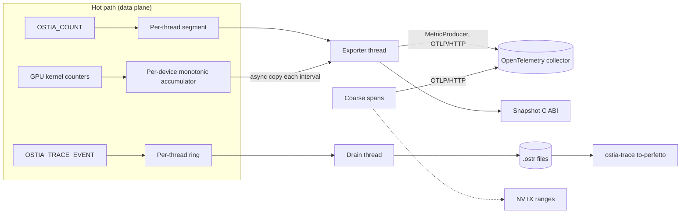

# RFC-0002: ostia-telemetry runtime

## Summary

This RFC designs what `ostia-telemetry` does at runtime:
- how metrics are declared;
- how CPU and GPU counters are stored and exported through OpenTelemetry;
- the binary trace rings for fine-grained events;
- runtime switching and sampling;
- trace-context propagation across layers and processes;
- export to Perfetto and NVTX;
- the C ABI;
- the line between telemetry and the functional statistics the system needs to run.

How the telemetry level is chosen and compiled (`OSTIA_TELEMETRY`, the `if constexpr` macros, storage-free handles, the flavour check) is set by [RFC-0001 §5 (Telemetry build levels)](https://github.com/OstiaHQ/ostia/pull/7). This RFC builds on it and is implemented by RFC-0001's Rollout PR 8, which also activates the telemetry overhead gate (RFC-0001 §6.6, workload in [Performance](#performance)).

**M0 scope** matches the PRD's M0 row: build levels, counters, trace rings and OpenTelemetry export. The flight recorder, tail capture, the device-side trace ring, fine-grained NVTX and fatal-error dumps are deferred to M2, when the pack kernel gives them real events to be designed against (§11).

## Motivation

The [PRD's observability section](../product/prd.md#observability-ostia-telemetry-all-layers) and D10 fix the shape:
- Every layer is instrumented from M0.
- Hot paths increment only local counters, and OpenTelemetry reads them at export time.
- Coarse spans go to OpenTelemetry; fine events go to binary rings exported to Perfetto and NVTX.
- One chain of trace IDs runs from query to transfer.
- Every flavour exposes the same C ABI.
- Overhead limits: ≤ 2% for `metrics`, ≤ 2% for `trace` with tracing switched off, ≤ 10% with tracing on.

Two things make this hard. Fine events can reach millions per second. And Ostia is a library embedded in other people's processes, which may run their own OpenTelemetry, protobuf and curl, and may fork.

## Goals and non-goals

**Goals**

- Stay within the PRD's overhead limits, measured by RFC-0001 §6.6's gate on the workload defined here.
- A metric added in one place gets storage, export and documentation without further work.
- A sampled exchange is traced completely on every GPU and node that takes part.
- Coexist with any OpenTelemetry, protobuf or curl version an embedding application uses.
- Behaviour is identical in every flavour. Telemetry observes; it never decides.

**Non-goals**

- Logging. Components log through their own facilities.
- Layer 2's and Layer 3's own spans. They use this ABI; their RFCs decide what they record.
- Dashboards and alert rules.
- The M2 features listed in §11.

## Design



### 1. Metric model

Each component declares its metrics and trace events in a catalog, `<component>/telemetry.toml`.

- **Generated code.** A generator run by CMake turns the catalog into a per-component table, typed handles, and the metrics reference in `docs/guides/telemetry-reference.md`.
- **`off` builds.** The generator emits only storage-free `constexpr` handles, so call sites still compile (RFC-0001 §5), and generates no storage or code.

```toml
[[metric]]
name = "ostia.fabric.bytes_sent"
kind = "counter"            # counter | updown | histogram | gauge
unit = "By"                 # UCUM
description = "Bytes handed to a transport for sending."
dimensions = ["transport"]  # declared attributes, below

[[metric]]
name = "ostia.fabric.progress_loop_latency"
kind = "histogram"          # base-2 buckets (§4)
unit = "ns"

[[metric]]
name = "ostia.exchange.partition_bytes"
kind = "gauge"
unit = "By"
mirror_of = "exchange.statistics.partition_bytes"   # §10

[[attribute]]
name = "transport"
values = ["cuda_ipc", "ucx_rc", "ucx_tcp"]          # closed set, or max_cardinality = N

[[event]]
name = "fabric.chunk_send"
args = { arg0 = "bytes", arg1 = "chunk" }
```

- **Kinds:**
  - **counter:** monotonic.
  - **updown:** can go up or down.
  - **histogram:** base-2 buckets, with no allocation per sample.
  - **gauge:** a callback evaluated at export.
- **Attributes.** Each attribute is declared either as a closed set of values or with a `max_cardinality`. The hot path never passes an attribute value, only a small **index**. Components turn values into indices off the hot path, through a per-attribute interning table: a peer rank becomes a dense peer index at exchange setup, and a transport becomes its enum value. An index past the cap goes to an `other` slot and increments `ostia.telemetry.attribute_overflow`.
- **Memory budget.** The generator computes each metric's slots (product of its dimensions' cardinalities, times buckets for histograms) and each component's per-thread segment size. It fails the build if a segment would exceed the budget, 256 KiB per component per thread by default and configurable in the catalog. So memory is bounded and known at build time.
- **Names** follow OpenTelemetry semantic style, `ostia.<component>.<name>`, with UCUM units. The generator rejects bad names, units or dimensions, and names that collide across components.

### 2. Catalog registration and CPU counters

Telemetry is rank 0 and is built before any other component, so it cannot know their catalogs at compile time. The layout is therefore two-level.

- **Registration.** At initialisation, each component registers its generated table with `ostia::telemetry::register_catalog()`. Telemetry assigns it a **component slot**, and the component keeps that slot in its own static variable. A component that loads late, after other threads already have storage, simply registers then.
- **Per-thread storage** is an array of per-component **segments**. A thread's segment for a component is allocated on first use: a fixed array sized by the generator (§1) and indexed by the handle's precomputed offset. An update is:
  1. load the thread's segment pointer for this component slot (a `thread_local` in the component's own shared library);
  2. a null check that is taken only once per thread;
  3. a relaxed atomic load and store at the offset.
  With a single writer this compiles to an ordinary add with no `lock` prefix, and ThreadSanitizer stays clean.
- **TLS model.** Components use the default global-dynamic model, because Ostia may be loaded with `dlopen` (Python), where initial-exec static TLS is unsafe. On x86-64 they build with TLS descriptors (`-mtls-dialect=gnu2`). Hot loops keep the segment pointer in a local variable. Micro-benchmarks measure the TLS access, the first-use check and the update separately (see Performance).
- **Registry and lifetimes:**
  - The registry of segments is intentionally never destroyed, so late destructors and exporter reads never touch freed memory.
  - One registry lock is shared by the exporter's summation and by thread-exit retirement. Retirement adds a thread's totals to the retired accumulator and unlinks its segments in one critical section, so a value is never counted twice or missed.
  - The lock is taken only at registration, first use, thread exit and export, never on an update.
  - `libostia-telemetry` is linked with `-z nodelete`, so `dlclose` cannot unload it under live `thread_local` destructors.
- **Main thread.** Its segments are retired by an `atexit` handler that runs before static destruction.
- **`debug` builds** check the single-writer rule.

### 3. GPU counters

Device counters are catalog entries marked `device = true`. A kernel lists the set it uses, and only those get slots.

1. Each thread accumulates in registers. At block exit, lanes reduce within the warp with `__reduce_add_sync(__activemask(), ...)` for 32-bit values, or a shuffle reduction for 64-bit values.
2. One lane per warp adds the result to a 64-bit shared-memory slot.
3. One thread per block adds each non-zero slot to a **per-device accumulator** in device memory with a single global `atomicAdd`.

- The accumulator is **monotonic and never reset**, so kernels on any stream, including kernels inside CUDA graphs, can add to it at any time.
- The exporter copies it asynchronously on a low-priority stream once per export interval, and exports deltas. It never reads it at operation completion, so it never mixes operations and adds no per-operation copy.
- **Runtime switch.** In `metrics` builds and above, device counters are switched per counter set by a **flag word passed as a kernel argument**. It is read from a host atomic at launch, so a change applies exactly to launches after it, with no race with running kernels.
  - A CUDA graph captures the flag's value at capture time; to change it, the graph node's parameters are updated (documented in the guide).
  - Controls: `OSTIA_TELEMETRY_GPU_COUNTERS=on|off|<set>,<set>` at start-up and `ostia_telemetry_set_gpu_counters()` at runtime. The default is on.
  - With the flag off, kernels take a warp-uniform branch that skips counting and flushing.
  - `off` builds contain no device telemetry code.

RFC-0002's implementation ships the mechanism and a test kernel. Real kernels adopt it as they land (the pack kernel in M2). The pack kernel's partition sizes are functional statistics (§10), not these counters.

### 4. OpenTelemetry export

**Linking.** opentelemetry-cpp, with protobuf and abseil, is built by CPM as **static, position-independent** archives and linked into `libostia-telemetry`. This replaces the pixi source listed in RFC-0001 §2.3, which ships shared libraries.
- On Linux, the archives' symbols are hidden with `-Wl,--exclude-libs,ALL` and a version script that exports only the `ostia_telemetry_*` C ABI and the `ostia::telemetry` C++ API used by other components. On macOS an exported-symbols list does the same.
- libcurl is linked dynamically from the system or pixi. Its C ABI is stable across versions.
- A test checks `nm -D` and loads the library beside an application that uses a different opentelemetry-cpp, protobuf and curl.

**Export path.**
- An **exporter thread** runs a periodic reader with a custom OpenTelemetry **`MetricProducer`**. At each interval, the producer sums the per-thread segments and the GPU accumulator deltas and emits OpenTelemetry data points:
  - counters as monotonic sums;
  - up-down counters as non-monotonic sums;
  - gauges from their callbacks;
  - histograms as **exponential histograms with scale 0**, which is exactly base-2 buckets.
  This avoids OpenTelemetry's lack of an asynchronous histogram instrument.
- If the pinned opentelemetry-cpp version lacks `MetricProducer`, the exporter thread builds `ResourceMetrics` itself and calls the OTLP exporter directly. A test pins the chosen path.
- The hot path never calls the SDK.
- **Protocol:** OTLP over HTTP/protobuf; no gRPC.

**Configuration.**
- `OSTIA_TELEMETRY_EXPORT=otlp|file|none`. **No network by default:** without an endpoint, export is `none`. The `file` exporter writes JSON Lines, for tests and offline use.
- Honoured settings:
  - `OTEL_SDK_DISABLED`;
  - `OTEL_EXPORTER_OTLP_ENDPOINT` and `OTEL_EXPORTER_OTLP_HEADERS`, plus their signal-specific variants;
  - `OTEL_METRIC_EXPORT_INTERVAL` (default 10 s);
  - `OTEL_SERVICE_NAME`.
  Because these are shared names, an application that sets them for its own OpenTelemetry also turns on Ostia's export; `OSTIA_TELEMETRY_EXPORT=none` opts Ostia out, and the guide says so.
- **Resource attributes:** host ID, GPU UUIDs, rank, PID, Ostia version and telemetry flavour. These use the PRD's stable identities, never IP-derived ones.
- **Snapshot.** `ostia_telemetry_take_snapshot()` returns every value through the C ABI (§9), so an embedding runtime can export them itself and set export to `none`.
- **Coarse spans** (exchange, plus Layer 2/3 spans created through §9's span calls) go out as OpenTelemetry traces through the same SDK.
- **Failures.**
  - Failed exports retry with back-off and increment `ostia.telemetry.export_failures`.
  - The queue is bounded and drops the oldest batch, never live counter values.
  - A permanent 4xx response disables export after 5 consecutive failures, with one error message.
  - The exporter never blocks the data path.

### 5. Trace rings

Fine events are fixed 32-byte records:

```cpp
struct Record {            // 32 bytes
  uint64_t ts_ns;          // CLOCK_MONOTONIC
  uint64_t span_id;        // owning span (usually the exchange)
  uint64_t arg0;           // e.g. bytes, partition
  uint32_t arg1;           // e.g. peer, chunk index
  uint16_t event_id;       // component slot << 10 | catalog event index
  uint16_t flags;          // begin / end / instant; GAP_BEFORE
};
```

- **Rings.** Each thread has its own single-producer ring. It is allocated only while tracing is on (64 Ki records, 2 MiB, by default, configurable) and freed when tracing is switched off and the ring has drained.
- **Commit rule.** The producer writes a whole record, then publishes it by advancing the ring's tail with a release store. The drain thread reads up to the tail with an acquire load, so it never sees a partly written record.
- **When a ring is full,** the producer drops the new record and increments the ring's out-of-band drop counter; the aggregate is `ostia.telemetry.trace_dropped`. The next record that fits carries `GAP_BEFORE`, and the drop count is written into the `.ostr` chunk header, so no slot is reserved for a marker.
- **Event names** come from the registered catalogs, so a record carries only its component slot and event index.
- **Anything larger** than one 64-bit and one 32-bit argument is two records, or belongs in a span.
- **Clocks.** Each process's drain thread records a `(CLOCK_MONOTONIC, CLOCK_REALTIME)` pair every second. Ranks on different hosts are aligned through `CLOCK_REALTIME`. Its accuracy is whatever the hosts' time sync gives, typically milliseconds with NTP and microseconds with PTP, and the converter reports it as the alignment uncertainty. M0 records no GPU timestamps in the rings; Nsight Systems correlates GPU work through NVTX (§8).

### 6. Runtime switch and sampling

- **One sampling unit: the root span.** A root span is an exchange with no parent, or whatever Layer 2 or 3 passes as the root. The component that creates the root decides with a trace-ID ratio test, OpenTelemetry's `TraceIdRatioBased` rule applied to the low 56 bits of the trace ID. It records the result in the context's **sampled flag**.
- **The flag is authoritative.** Every other participant follows the sampled flag it receives (parent-based sampling) and never recomputes the ratio. Different local rates or library versions therefore cannot split a trace.
- **Fine events** check the sampled bit in the thread's current context. When tracing is off, the check is one relaxed load of a global flag per instrumentation point, which keeps `trace` builds within 2% with tracing off.
- **A peer with tracing off** records nothing for a sampled context, but still forwards the context.
- **Controls:**
  - environment variables `OSTIA_TRACE=off|on` and `OSTIA_TRACE_SAMPLE=<ratio>` (default 0.01);
  - `ostia_telemetry_set_tracing()`.
  A change applies to root spans created after it.
- The same global switch gates coarse OpenTelemetry spans and NVTX ranges.

### 7. Trace-context propagation

- **The context** is a W3C Trace Context: a 128-bit trace ID, a 64-bit span ID and flags. Tracestate is not propagated.
- **Who creates it.** An exchange's context comes from its Layer 2 parent when one is given. Otherwise the exchange's **coordinator** (the first rank of the exchange group) creates it and sends it in the exchange-setup control message, and every other rank adopts it.
- **On the wire,** it is the 26-byte binary form of W3C `traceparent`: version byte `0x00`, trace ID, parent span ID and flags. The field is always present in the exchange-setup message, in every build. All-zero IDs mean "no context" and are treated as absent, as is a malformed field (counted in `ostia.telemetry.bad_context`).
- **The wire format is identical across flavours.** Peers built at different telemetry levels interoperate, and no per-message trace bytes exist.
- **Derived span IDs.** Chunk and transfer span IDs are computed, not sent: `XXH3_64` with seed 0 over the little-endian encoding of `(exchange_span_id, kind, chunk_index, attempt, path)`, where a result of 0 becomes 1.
  - `kind` distinguishes the sender's and the receiver's span, so the two sides never export different spans under one ID.
  - `attempt` and `path` keep retries and multipath stripes distinct.
  - The fabric RFC must carry the chunk index, attempt and path in its data header, which it needs for other reasons.
  - **xxHash** (BSD-2-Clause, header-only, via CPM) is approved by this RFC.
- **Within a process:** a thread-local current context, plus explicit passing at asynchronous boundaries. For example, the progress thread restores an operation's context when it completes it.
- **PRD wording.** This replaces the PRD's "IDs travel in 1a message headers" with the same chain at lower cost. A PRD update lands with this RFC's acceptance.

### 8. Perfetto and NVTX export

- **At runtime,** the drain thread appends ring contents in chunks to a raw file, `.ostr`. There is one file per process in `OSTIA_TRACE_DIR`, named by host ID, rank and PID. Each chunk has a header: thread ID, drop count, and the latest clock pair. The file header carries the registered catalogs (event names and argument names), the trace-to-span mapping of every sampled root, and a schema version. Each chunk is written whole, so a crash leaves a readable file up to the last complete chunk.
- **Offline,** `ostia-trace to-perfetto` (Python, in `telemetry/tools/`) merges the `.ostr` files of every rank into one Perfetto trace:
  - a track per process and thread;
  - clocks aligned through the `CLOCK_REALTIME` pairs, with the uncertainty reported;
  - flows linking fine events to their span, carrying the OpenTelemetry trace and span IDs as arguments, so a slow exchange found in the OpenTelemetry view opens into its detailed timeline.
  It writes Perfetto's protobuf trace format directly, without the Perfetto SDK, and rejects unknown `.ostr` versions.
- **NVTX v3** (header-only, near-zero cost when no tool is attached) marks coarse spans in domain `ostia`, so Nsight Systems lines them up with CUDA activity. It is on in `trace` builds while tracing is on.

### 9. C ABI and configuration

Telemetry is a **process singleton**. The first Ostia component to use it starts it with defaults and environment variables. An explicit `ostia_telemetry_init()` can override settings; precedence is **API, then environment, then defaults**. Before or after start, it can set the export mode, endpoint and interval, the tracing settings and the GPU counter sets. Settings that fix memory layout (ring size) apply only before tracing is first switched on.

The header is `ostia/telemetry/telemetry.h`. `ostia_status` is defined in `ostia/telemetry/status.h`, and higher-rank components reuse it.

```c
typedef struct ostia_telemetry_snapshot ostia_telemetry_snapshot;   /* opaque */
typedef struct { uint8_t bytes[26]; } ostia_trace_context;          /* W3C binary traceparent */
typedef struct ostia_span ostia_span;                                /* opaque */

uint32_t     ostia_telemetry_abi_version(void);
int          ostia_telemetry_build_level(void);                      /* 0..3, RFC-0001 §5 */
ostia_status ostia_telemetry_init(const ostia_telemetry_config* cfg); /* struct_size-versioned */
ostia_status ostia_telemetry_shutdown(void);                         /* flushes; bounded 2 s */

ostia_status ostia_telemetry_take_snapshot(ostia_telemetry_snapshot** out);
size_t       ostia_telemetry_snapshot_count(const ostia_telemetry_snapshot* s);
ostia_status ostia_telemetry_snapshot_metric(const ostia_telemetry_snapshot* s, size_t i,
                                             ostia_telemetry_metric* out); /* name, unit, kind,
                                                attributes, value or base-2 buckets */
void         ostia_telemetry_snapshot_free(ostia_telemetry_snapshot* s);

ostia_status ostia_telemetry_set_gpu_counters(const char* sets);     /* "on", "off", "a,b" */
ostia_status ostia_telemetry_set_tracing(const ostia_trace_settings* s);

ostia_status ostia_telemetry_span_start(const ostia_trace_context* parent, const char* name,
                                        ostia_span** out, ostia_trace_context* out_ctx);
ostia_status ostia_telemetry_span_set_attribute(ostia_span* s, const char* key, const char* value);
ostia_status ostia_telemetry_span_end(ostia_span* s, ostia_status result);

ostia_status ostia_telemetry_context_to_traceparent(const ostia_trace_context* c,
                                                    char out[56]);   /* W3C text form */
ostia_status ostia_telemetry_context_from_traceparent(const char* text, ostia_trace_context* out);
ostia_status ostia_telemetry_register_gauge(uint32_t metric_handle,
                                            int64_t (*fn)(void* ctx), void* ctx);
ostia_status ostia_telemetry_unregister_gauge(uint32_t metric_handle);
```

- **Ownership.** Every `take_snapshot` has a matching `_free`. Span handles are freed by `span_end`. Strings passed in are copied.
- **Thread safety.** Every function is thread-safe.
- **Every flavour exports the same functions.** In `off` builds:
  - `init`, `shutdown`, the span calls and the context conversions succeed as no-ops, returning an empty context from `span_start`;
  - `set_tracing` and `set_gpu_counters` return `OSTIA_STATUS_UNSUPPORTED`;
  - `take_snapshot` returns a valid, empty snapshot.
  Applications never need `#ifdef`s, and swapping flavours means swapping the library (PRD).
- **If `shutdown` is never called,** an `atexit` handler flushes export and traces with the same 2-second bound and never blocks exit longer.
- **Fork.** fork followed by exec is supported with no action. For fork without exec:
  - the `pthread_atfork` prepare handler takes the registry and ring locks;
  - the parent handler releases them;
  - the child handler releases them and discards segments of threads that do not exist in the child;
  - the child leaks the parent's SDK objects (never destroying them, since their locks may be held) and starts fresh on its next telemetry use, with its own PID in the resource attributes and counters starting from zero.
- **Python:** thin nanobind wrappers in `ostia.telemetry`.

### 10. Functional statistics versus telemetry

Functional statistics are what the system needs to run: partition sizes and skew for the planner, achieved link bandwidth for re-planning, credit state, and typed errors with their context. They are **always on**, kept by Fabric and Exchange themselves, and returned by those components' own APIs. They exist in every build, including `off`.

- In `metrics` builds and above, telemetry **mirrors** them as gauges. The owning component registers a callback for each `mirror_of` gauge with `ostia_telemetry_register_gauge()` at initialisation, and unregisters it before the statistics it reads are freed.
- The exporter calls gauges under the registry lock, and the fields they read are relaxed atomics.
- The generator refuses a mirrored metric that also has a counter, so nothing is counted twice.
- **No decision ever reads telemetry.** The planner, flow control, retries and error reporting use functional statistics only, so behaviour is identical in every flavour.
- Typed errors carry their context (peer, exchange, partition, path) in the error object in every build. Telemetry only counts them.
- This is a requirement on the fabric and exchange RFCs. It is tested by checking that the planner's output on a fixture is byte-identical across all four flavours, once the planner exists (M1).

### 11. Deferred to M2

These features wait for the pack kernel and real exchange traffic, and get their design in an M2 amendment to this RFC:
- the flight-recorder mode and on-demand dumps;
- tail capture of slow exchanges;
- the device-side trace ring with per-record commit words;
- fine-grained NVTX ranges;
- async-signal-safe dumps on fatal errors.

The M0 design leaves room for them: the record format, the `.ostr` chunks and the C ABI's struct versioning do not change when they arrive.

## Failure handling

| Failure | Detected by | What the caller sees | State left behind |
| --- | --- | --- | --- |
| Attribute index past its cap | Counter update | Nothing; `attribute_overflow` incremented | Value counted in `other` |
| Segment or ring allocation fails | First use or tracing on | Nothing; `alloc_failures` incremented in a static slot | That thread's metric or events not recorded |
| Trace ring full | Ring write | Nothing; `trace_dropped` incremented | Next record carries `GAP_BEFORE`; chunk header holds the count |
| Export endpoint unreachable | Exporter thread | Nothing; `export_failures` incremented | Oldest batch dropped when the queue fills |
| Collector returns a permanent 4xx | Exporter thread | One error message | Export disabled after 5 failures |
| Trace directory not writable | Drain thread | One error naming the path | Tracing switched off; counters continue |
| Malformed or zero trace context received | Exchange setup | Nothing; `bad_context` incremented | Treated as no context |
| Component loaded late | Registration | Nothing | New component slot; existing threads allocate on first use |
| Flavour mismatch between components | RFC-0001 §5 check | Error status (or `ImportError`) naming both levels | Component not initialised |
| Clock pair missing for a chunk | Converter | Warning | Chunk aligned by the nearest pair, with larger uncertainty |
| Crash during tracing | Converter | Reads up to the last complete chunk | Partial `.ostr` usable |
| Unknown `.ostr` version | Converter | Rejected with the supported versions | — |
| Fork without exec | `pthread_atfork` | Nothing | Child starts fresh on next use |

Errors follow RFC-0001's error-message contract.

## Observability

Telemetry observes itself. The following are emitted at `metrics` level and above:
- `ostia.telemetry.attribute_overflow`, `alloc_failures`, `export_failures`, `bad_context`;
- exporter latency;
- the number of registered segments;
- per-component segment memory.

At `trace` level it adds `trace_dropped` and ring fill level.

## Performance

| Build and state | Limit (PRD) | How it is met |
| --- | --- | --- |
| `metrics` | ≤ 2% vs `off` | Single-writer adds on a per-thread segment (§2), indices instead of attribute values (§1), GPU register and warp aggregation (§3), SDK never on the hot path (§4) |
| `trace`, tracing off | ≤ 2% vs `off` | One relaxed flag load per event point (§6); no ring memory allocated |
| `trace`, tracing on, 1% sampling | ≤ 10% vs `off` | Fixed 32-byte records and a release store per event (§5); unsampled roots pay only the sampled-bit check |

**The overhead gate's workload** (RFC-0001 §6.6) is `telemetry/bench/instrumented_loop`, run on the GPU CI L4 (or the quiet box):
- **Host part:** a loop that copies chunks of 64 KiB to 4 MiB between pinned buffers. Per chunk it performs two counter adds with one attribute, one histogram record and one begin/end trace-event pair, for an event density of about one event per 10 µs of work.
- **GPU part:** a kernel that updates two device counters per warp.
- **Exporter:** OTLP to a local collector every 1 s. GPU counters are on.
- **What is gated:** `metrics` and `trace` with tracing off against `off`, with a 2% limit. `trace` with tracing on at 1% sampling is gated at 10%; at 100% sampling it is reported, not gated.
- **Re-running.** The gate runs again at M1 and M2 on Fabric's and Exchange's real instrumentation, and the measured event densities are recorded next to each result.

Micro-benchmarks, each run on the L4 and on a CPU runner:
- the TLS access plus the first-use check;
- one counter add;
- one histogram record;
- one ring write;
- the tracing-off check;
- a snapshot with 64 registered threads.

## Testing

| Test | Runs on |
| --- | --- |
| Catalog generator: rejects bad names, units, dimensions over budget, a mirrored metric with a counter; handles only in `off` builds | CPU CI |
| Registration: two components, one loaded after threads already hold segments; slots and offsets correct | CPU CI |
| Counters: concurrent writers sum correctly; thread exit during a snapshot is neither lost nor doubled; attribute overflow goes to `other`; TSan clean | CPU CI |
| Shared-library lifetime: `dlclose` of a component with live threads; Python import and interpreter exit | CPU CI |
| GPU counters: test kernel counts correctly on two streams concurrently and inside a CUDA graph; switching a set off affects only later launches | GPU CI |
| OTLP export against a local collector in a container; histograms arrive as exponential histograms; `file` exporter golden output; endpoint down does not block or lose counters | CPU CI |
| Symbol isolation: `nm -D` exports only the allowed symbols; loads beside an application linked to other opentelemetry-cpp, protobuf and curl versions | CPU CI |
| Snapshot and span C ABI compiled and exercised from a C program in all four flavours; `off` behaviour as specified | CPU CI |
| Rings: forced wraparound, drop with `GAP_BEFORE` and chunk count, drain never sees a partial record | CPU CI |
| Sampling: a sampled root is traced on every participant regardless of their local rate; a peer with tracing off forwards the context | CPU CI (multi-process) |
| Derived span IDs match on x86-64 and aarch64 test vectors; send and receive differ; zero maps to 1 | CPU CI |
| Wire carrier: 26-byte encode and decode, all-zero and malformed inputs treated as absent | CPU CI |
| `ostia-trace to-perfetto`: golden trace from recorded `.ostr` files of two ranks on two simulated hosts; clock alignment; partial file; unknown version rejected | CPU CI |
| Fork: fork-then-exec untouched; fork without exec while exporting and draining, child records and exports fresh | CPU CI |
| NVTX ranges visible under Nsight Systems | Manual, on a GPU box |
| Overhead gate on the instrumented loop | GPU CI |

## Alternatives considered

- **Metrics declared by macros in the source, or registered at runtime by name:** no single reviewable list and no precomputed offsets.
- **Dense compile-time IDs across all components:** impossible while telemetry is built first, hence the registered segments.
- **Per-CPU (`rseq`) or global-atomic counters:** only saves memory with many threads and is Linux-only, or bounces cache lines.
- **A `__constant__` switch for GPU counters:** writing constant memory while kernels read it is undefined in CUDA; a launch argument is exact.
- **Reading a per-stream accumulator at operation completion:** mixes operations queued on the same stream.
- **OpenTelemetry synchronous histograms on the hot path:** calls the SDK per sample; the metric producer exports our buckets instead.
- **opentelemetry-cpp shared libraries from pixi:** clash with an application's own versions.
- **Recomputing the sampling decision on every peer:** implementations and local rates can disagree; the propagated flag is authoritative.
- **Trace context in every message header, as the PRD first described:** makes the wire format depend on the flavour and adds bytes on the hottest path.
- **Perfetto SDK in-process, or Chrome JSON:** a heavy dependency with duplicate buffers, or too large and slow.
- **Tail capture and a flight recorder in M0:** an unsampled exchange records nothing to dump, and designing them before real events exist would guess; deferred to M2.

## Rollout

- Implemented by RFC-0001's Rollout **PR 8**, which also activates the overhead acceptance gate (RFC-0001 §6.6). RFC-0001 PR 3 (build levels) comes first. The catalog generator and counter segments may start earlier behind the `metrics` level.
- Real instrumentation lands with each component: Fabric in M1, Exchange (including pack-kernel device counters) in M2, together with the §11 amendment.
- `docs/guides/telemetry.md` shows how to add a metric, turn on tracing, and open a trace in Perfetto.
- A PRD update replaces "IDs travel in 1a message headers" with §7's design when this RFC is accepted.
- Must be Accepted before PR 8 starts.
- **Merge order:** RFC-0001 ([PR #7](https://github.com/OstiaHQ/ostia/pull/7)) merges first; this RFC then takes current main and regenerates the index.

## Open questions

- Should the default sampling rate be 1% or lower for long-running jobs with many small exchanges?
- Does Layer 2 want a hook to force sampling of a root (for example, a job being debugged), beyond setting the sampled flag in the context it passes?
- Should `.ostr` chunks be compressed at runtime (zstd), or only by the converter?
