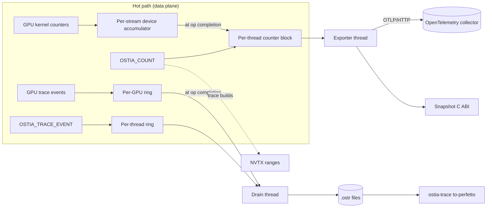

# RFC-0002: ostia-telemetry runtime

## Summary

This RFC designs what `ostia-telemetry` does at runtime: how metrics are declared, how CPU and GPU counters are stored and exported through OpenTelemetry, the binary trace rings for fine-grained events, runtime switching and sampling, trace-ID propagation across layers and processes, export to Perfetto and NVTX, and the C ABI. It also draws the line between telemetry and the functional statistics the system needs to run.

How the telemetry level is chosen and compiled (`OSTIA_TELEMETRY`, the `if constexpr` macros, the flavour check) is already set by [RFC-0001 §5 (Telemetry build levels)](https://github.com/OstiaHQ/ostia/pull/7). This RFC builds on it and is implemented by RFC-0001's Rollout PR 8, which also activates the telemetry overhead gate (RFC-0001 §6.6).

## Motivation

The [PRD's observability section](../product/prd.md#observability-ostia-telemetry-all-layers) and D10 fix the shape. Every layer is instrumented from M0. Hot paths increment only local counters (per thread on the CPU, per warp on the GPU), and OpenTelemetry asynchronous instruments read them at export time. Coarse spans go to OpenTelemetry, and fine events go to binary rings exported to Perfetto and NVTX. One chain of trace IDs runs from query to transfer. Every flavour exposes the same C ABI. The overhead limits are ≤ 2% for `metrics`, ≤ 2% for `trace` with tracing switched off, and ≤ 10% with tracing on.

Two things make this hard: the fine events can reach millions per second, and Ostia is a library embedded in other people's processes, which may run their own OpenTelemetry.

## Goals and non-goals

**Goals**

- Stay within the PRD's overhead limits, measured by RFC-0001 §6.6's gate.
- A metric added in one place gets storage, export and documentation without further work.
- A sampled exchange is traced completely on every GPU and node that takes part.
- Coexist with any OpenTelemetry version an embedding application uses.
- Behaviour is identical in every flavour. Telemetry observes; it never decides.

**Non-goals**

- Logging. Components log through their own facilities.
- Layer 2's and Layer 3's own spans (job, stage, task, query). They use this ABI; their RFCs decide what they record.
- Dashboards and alert rules.

## Design



### 1. Metric model

Each component declares its metrics and trace events in a catalog, `<component>/telemetry.toml`. A generator run by CMake turns it into dense compile-time IDs, typed handles and the metrics reference in `docs/guides/telemetry-reference.md`. In an `off` build it generates only storage-free `constexpr` handles, so instrumentation call sites still compile (RFC-0001 §5); no storage and no code are generated.

```toml
[[metric]]
name = "ostia.fabric.bytes_sent"
kind = "counter"            # counter | updown | histogram | gauge
unit = "By"                 # UCUM
description = "Bytes handed to a transport for sending."
attributes = ["transport", "peer"]

[[metric]]
name = "ostia.fabric.progress_loop_latency"
kind = "histogram"          # log2 buckets
unit = "ns"
description = "Time for one progress-loop iteration."

[[metric]]
name = "ostia.exchange.partition_bytes"
kind = "gauge"
unit = "By"
mirror_of = "exchange.statistics.partition_bytes"   # §10

[[attribute]]
name = "peer"
max_cardinality = 1024

[[event]]
name = "fabric.chunk_send"
args = { arg0 = "bytes", arg1 = "chunk" }
```

- **Kinds:**
  - **counter:** monotonic.
  - **updown:** can go up or down.
  - **histogram:** fixed log2 buckets, with no allocation per sample.
  - **gauge:** a callback evaluated at export.
- **Attributes** must be declared, each with a maximum cardinality. That bounds the memory of every counter array. A value past the cap goes to an `other` bucket and increments `ostia.telemetry.attribute_overflow`; nothing is dropped silently.
- **Names** follow OpenTelemetry semantic style, `ostia.<component>.<name>`, with UCUM units. The generator rejects names, units or attributes that break the rules, and names that collide across components.

### 2. CPU counters

Each thread that records a metric gets a **per-thread block**: a fixed array indexed by (metric ID, attribute index), plus log2 bucket arrays for histograms.

- The block is allocated on the thread's first use and registered in a global list under a lock taken only then.
- **Updates.** The owning thread updates with a relaxed atomic load and store, not `fetch_add`. With a single writer this compiles to an ordinary add with no `lock` prefix, the cache line never leaves the core, and ThreadSanitizer stays clean. An update costs about the same as `x += n`.
- **Reads.** The exporter sums all blocks with relaxed loads. Up-down values summed during updates may be momentarily inconsistent across threads, which is acceptable for monitoring.
- **Thread exit.** When a thread exits, its totals fold into a retired accumulator, so nothing is lost.
- `debug` builds check the single-writer rule.

Per-CPU sharding (`rseq`) and global atomics were rejected: sharding only saves memory with very many threads and is Linux-only, and global atomics bounce cache lines between cores under load.

### 3. GPU counters

Device counters are catalog entries marked `device = true`. A kernel lists the set it uses, and only those get shared-memory slots.

1. Within a warp, lanes combine with `__reduce_add_sync`, and one lane adds the result to the block's slot with a shared-memory atomic.
2. At block exit, one global `atomicAdd` per non-zero counter goes into a small **per-stream accumulator** in device memory.
3. The host reads the accumulator when the operation completes (the progress thread already waits on that completion) and adds it to its per-thread block.

**Runtime switch.** In `metrics` builds and above, GPU counters can be switched on or off per counter set while running.
- A flag in `__constant__` memory, read once per block, gates them. When off, kernels take a warp-uniform branch that skips counting and flushing, and no shared memory is written.
- Controls: `OSTIA_TELEMETRY_GPU_COUNTERS=on|off|<set>,<set>` at start-up and `ostia_telemetry_set_gpu_counters()` at runtime. A change applies to kernels launched after it.
- The default is on.
- `off` builds contain no device telemetry code.

RFC-0002's implementation ships the mechanism and a test kernel. Real kernels (the pack kernel in M2) adopt it as they land. The pack kernel's partition sizes are functional statistics (§10), not these counters.

### 4. OpenTelemetry export

opentelemetry-cpp is linked **statically into `libostia-telemetry` with hidden symbol visibility**. opentelemetry-cpp does not promise ABI stability across versions, and hiding its symbols means an application's own OpenTelemetry, of any version, can never clash with ours.

- An **exporter thread** runs a periodic reader. Observable instruments sum the per-thread blocks when the reader calls them. The hot path never calls the SDK.
- **Protocol:** OTLP over HTTP/protobuf (curl and protobuf; no gRPC).
- `OSTIA_TELEMETRY_EXPORT=otlp|file|none`. **No network by default:** without an endpoint, export is `none`. The `file` exporter writes JSON Lines, for tests and offline use.
- Standard settings are honoured: `OTEL_EXPORTER_OTLP_ENDPOINT`, `OTEL_METRIC_EXPORT_INTERVAL` (default 10 s), `OTEL_SERVICE_NAME`.
- **Resource attributes:** host ID, GPU UUIDs, rank, Ostia version and telemetry flavour. They use the PRD's stable identities, never IP-derived ones.
- **Snapshot.** `ostia_telemetry_snapshot()` returns every value through the C ABI. An embedding runtime (Layer 2, or an application with its own OpenTelemetry) can export them itself and set export to `none`.
- **Coarse spans** (exchange, and Layer 2/3 spans through the ABI) are exported as OpenTelemetry traces through the same SDK and endpoint.
- The exporter never blocks the data path. Failed exports retry with back-off and increment `ostia.telemetry.export_failures`. The export queue is bounded and drops the oldest batch, never live counter values.

### 5. Trace rings

Fine events are written as fixed 32-byte records:

```cpp
struct Record {            // 32 bytes
  uint64_t ts_ns;          // host: CLOCK_MONOTONIC; device: %globaltimer
  uint64_t span_id;        // owning coarse span (usually the exchange)
  uint64_t arg0;           // e.g. bytes, partition
  uint32_t arg1;           // e.g. peer, chunk index
  uint16_t event_id;       // catalog-declared (§1)
  uint16_t flags;          // begin / end / instant, gap marker
};
```

Event and argument names live in the catalog, so a record carries only its 16-bit event ID. Anything that needs more than one 64-bit and one 32-bit argument is two records, or belongs in a coarse span.

- **Host rings:** one single-producer ring per thread, owned like the counter blocks. A drain thread moves records out.
- **GPU rings:** one ring per GPU in device memory. Warps reserve slots with a warp-cooperative atomic, the prototype's slot-reservation technique. The host drains the ring when an operation completes.
- **Sizes:** 64 Ki records (2 MiB) per thread and 512 Ki records (16 MiB) per GPU by default, configurable.
- **Streaming mode** (the default while tracing is on): a full ring drops the *newest* records, increments `ostia.telemetry.trace_dropped`, and writes a gap marker so the timeline shows where records are missing.
- **Flight-recorder mode:** a full ring overwrites the oldest records. The rings are dumped on request (`ostia_telemetry_dump_trace()`) or on a fatal error, which answers "what happened just before the hang".
- **Clocks:** the drain thread periodically records a pair of host `CLOCK_MONOTONIC` and GPU `%globaltimer` readings, so export can put both on one timeline.

### 6. Runtime switch and sampling

Tracing is switched on at runtime, and sampled.

- **Head sampling by trace-ID ratio.** When a root span starts (an exchange, or the job, stage or task above it), a hash of its trace ID is compared with the sampling rate, as in OpenTelemetry's `TraceIdRatioBased` sampler.
  - Every peer computes the same answer from the same trace ID without communicating, so a sampled exchange is traced completely everywhere.
  - Fine events check one "sampled" bit in the thread's current-span context.
  - GPU events get the bit through a kernel argument or a `__constant__` flag.
- **Cost when tracing is off:** one relaxed load of a global flag per instrumentation point, which the branch predictor handles. This is what keeps `trace` builds within 2% with tracing off.
- **Tail capture.** With tracing on in flight-recorder mode, an exchange that runs longer than `OSTIA_TRACE_SLOW_MS` dumps the recent ring contents even if it was not sampled. Tail sampling of everything was rejected because it needs every event written all the time, which breaks the 10% trace-on budget.
- **OpenTelemetry spans** use the same decision, through a parent-based sampler with the same ratio at the root.
- **Controls:**
  - environment variables `OSTIA_TRACE=off|on`, `OSTIA_TRACE_SAMPLE=<ratio>` (default 0.01), `OSTIA_TRACE_MODE=stream|flight` and `OSTIA_TRACE_SLOW_MS=<n>`;
  - the C ABI call `ostia_telemetry_set_tracing()`.
  A change applies to spans started after it. The GPU-counter switch (§3) uses the same mechanism.

### 7. Trace-ID propagation

The context is **W3C Trace Context**: a 128-bit trace ID, a 64-bit span ID and flags, including "sampled". It interoperates with OpenTelemetry and with whatever Layer 2 uses.

- **Across processes, once per exchange.**
  - The exchange's context travels in the exchange-setup control message, which exists anyway. The field is always present: 25 bytes, empty when not tracing.
  - Chunk and transfer span IDs are **derived**, not sent: `span_id = hash(exchange_span_id, chunk_index, kind)`. Both sides already know the chunk index from the data header.
  - So there are no per-message trace bytes in any build, and **the wire format is identical across flavours**. Peers built at different telemetry levels interoperate, and the fabric RFC needs no telemetry negotiation field.
- **Within a process:** a thread-local current context, plus explicit passing at asynchronous boundaries. For example, the progress thread restores an operation's context when it completes it.
- **From Layer 2 and 3:** exchange creation takes an optional parent context through the C ABI. Without one, the exchange starts a new root.

This replaces the PRD's "IDs travel in 1a message headers" with the same chain at lower cost. A follow-up updates the PRD's wording; RFC-0001 §5 already records that no telemetry level changes the wire format.

### 8. Perfetto and NVTX export

- **At runtime,** the drain thread only copies ring chunks to a raw file, `.ostr`: a header with the event catalog and clock-sync pairs, then 32-byte records. There is one file per process in `OSTIA_TRACE_DIR`, named by host ID, rank and PID. Flight-recorder dumps use the same format. `.ostr` carries a schema version.
- **Offline,** `ostia-trace to-perfetto` (Python, in `telemetry/tools/`) merges the `.ostr` files of every rank into one Perfetto trace:
  - a track per thread and per GPU;
  - clocks aligned from the sync pairs;
  - flows linking fine events to their exchange span, with the OpenTelemetry trace and span IDs as arguments, so a slow exchange found in the OpenTelemetry view opens into its detailed timeline.
  It writes Perfetto's stable protobuf trace format directly, without the Perfetto SDK. It rejects unknown `.ostr` versions.
- **NVTX v3** (header-only, near-zero cost when no tool is attached) marks coarse spans in domain `ostia`, so Nsight Systems lines them up with CUDA activity. `OSTIA_TRACE_NVTX=off|spans|fine` sets the detail; the default in `trace` builds is `spans`.

The Perfetto SDK in-process was rejected because it brings a heavy dependency with buffers that duplicate ours. Chrome's JSON trace format was rejected because it is too large and slow at millions of events per second.

### 9. C ABI and configuration

Telemetry is a **process singleton**. The first Ostia component to use it starts it with defaults and environment variables, so nothing is required of the user. An explicit `ostia_telemetry_init()` can override settings before or after that. Precedence is **API, then environment, then defaults**.

```c
uint32_t      ostia_telemetry_abi_version(void);
int           ostia_telemetry_build_level(void);             /* 0..3, RFC-0001 §5 */
ostia_status  ostia_telemetry_init(const ostia_telemetry_config* cfg);    /* optional */
ostia_status  ostia_telemetry_shutdown(void);                /* flushes export and traces */
ostia_status  ostia_telemetry_snapshot(ostia_telemetry_snapshot** out);
void          ostia_telemetry_snapshot_free(ostia_telemetry_snapshot* s);
ostia_status  ostia_telemetry_set_gpu_counters(const char* sets); /* "on", "off", "a,b" */
ostia_status  ostia_telemetry_set_tracing(const ostia_trace_settings* s);
ostia_status  ostia_telemetry_dump_trace(const char* path);
ostia_status  ostia_telemetry_context_create(const ostia_trace_context* parent,
                                             ostia_trace_context* out);
```

- Configuration and snapshot structs start with a `struct_size` field, so they can grow without breaking the ABI.
- Every function is thread-safe and returns an `ostia_status` (except the two queries and `_free`).
- **Every flavour exports the same functions.** Where a feature is compiled out, the call returns `OSTIA_STATUS_UNSUPPORTED` and the snapshot is empty, so applications never need `#ifdef`s. Swapping flavours means swapping the library, not recompiling the application (PRD).
- **Fork safety:** `pthread_atfork` handlers stop the exporter and drain threads in the child, which restarts telemetry on next use.
- **Python:** thin nanobind wrappers in `ostia.telemetry`.

### 10. Functional statistics versus telemetry

Functional statistics are what the system needs to run: partition sizes and skew for the planner, achieved link bandwidth for re-planning, credit state, and typed errors with their context. They are **always on**, kept as plain structs by Fabric and Exchange themselves, and returned by those components' own APIs. They exist in every build, including `off`.

- In `metrics` builds and above, telemetry **mirrors** them as observable gauges that read the structs. The catalog marks such gauges with `mirror_of`, and the generator refuses a mirrored metric that also has a counter, so nothing is counted twice.
- **No decision ever reads telemetry.** The planner, flow control, retries and error reporting use functional statistics only, so behaviour is identical in every flavour.
- Typed errors carry their context (peer, exchange, partition, path) in the error object in every build. Telemetry only counts them.
- This is a requirement on the fabric and exchange RFCs. It is tested by checking that the planner's output on a fixture is byte-identical across all four flavours, once the planner exists (M1).

## Failure handling

| Failure | Detected by | Result |
| --- | --- | --- |
| Attribute value past its declared cap | Counter update | Counted in `other`; `attribute_overflow` incremented |
| Trace ring full (streaming) | Ring write | Newest records dropped, `trace_dropped` incremented, gap marker written |
| Export endpoint unreachable | Exporter thread | Retries with back-off, `export_failures` incremented, oldest batch dropped when the queue is full; data path unaffected |
| Trace directory not writable | Drain thread | Tracing switched off with one error message naming the path; counters continue |
| Flavour mismatch between components | RFC-0001 §5 check | Process fails at initialisation with both levels |
| Unknown `.ostr` version | Converter | Rejected with the supported versions |
| Feature compiled out | C ABI | `OSTIA_STATUS_UNSUPPORTED` |
| Fork | `pthread_atfork` | Child's telemetry threads stopped; restarted on next use |

Errors follow RFC-0001's error-message contract.

## Observability

Telemetry observes itself through `ostia.telemetry.*` metrics:
- `attribute_overflow`, `trace_dropped`, `export_failures`;
- exporter latency;
- ring fill level;
- the number of registered thread blocks.

## Performance

| Build and state | Limit (PRD) | How it is met |
| --- | --- | --- |
| `metrics` | ≤ 2% vs `off` | Single-writer per-thread adds (§2); GPU warp aggregation (§3); SDK never on the hot path (§4) |
| `trace`, tracing off | ≤ 2% vs `off` | One relaxed flag load per event point (§6) |
| `trace`, tracing on at the default 1% sampling | ≤ 10% vs `off` | Fixed 32-byte records, no allocation (§5); unsampled exchanges pay only the sampled-bit check |

RFC-0001 §6.6's overhead gate measures these with interleaved A/B runs on the same machine. It activates with this RFC's implementation and checks that the expected counters and events were actually recorded. Micro-benchmarks cover:
- a counter add;
- a histogram record;
- a ring write, host and device;
- the tracing-off check;
- a snapshot with 64 threads registered.

## Testing

| Test | Runs on |
| --- | --- |
| Catalog generator: rejects bad names, units, duplicate names, a mirrored metric with a counter; generates only storage-free handles in `off` builds | CPU CI |
| Counter blocks: concurrent writers sum correctly; thread exit keeps totals; attribute overflow goes to `other`; TSan clean | CPU CI |
| GPU counters: test kernel counts correctly; switched-off set writes nothing; switch applies to later launches | GPU CI |
| OTLP export against a local collector in a container; `file` exporter golden output; endpoint down does not block or lose counters | CPU CI |
| Snapshot C ABI returns every catalog metric; `off` build returns empty and `UNSUPPORTED` | CPU CI |
| Rings: wraparound, drop-newest with gap marker, flight-recorder overwrite and dump, device ring under many warps | CPU CI / GPU CI |
| Sampling: same decision on independent processes for the same trace ID; unsampled exchange records no fine events; slow-exchange tail capture | CPU CI |
| Derived chunk span IDs match on sender and receiver | CPU CI (multi-process) |
| `ostia-trace to-perfetto`: golden trace from recorded `.ostr` files of two ranks; clock alignment; unknown version rejected | CPU CI |
| NVTX ranges visible under Nsight Systems | Manual, on a GPU box |
| Fork: child process records and exports after restart | CPU CI |
| Overhead gate (RFC-0001 §6.6) | GPU CI |

## Alternatives considered

- **Declaring metrics with macros in the source, or registering them at runtime by name:** no single reviewable list, no dense IDs, and runtime lookups.
- **Per-CPU (`rseq`) or global-atomic counters:** see §2.
- **Host-only counters in v1, or global atomics on the GPU:** host-only hides kernel-internal facts; global atomics contend.
- **An application-provided OpenTelemetry SDK, or our own OTLP encoder:** version coupling, or protocol code we would maintain.
- **64-byte or variable-length trace records:** double the memory, or slower writes and a hard device side.
- **Per-event random sampling or full tail sampling:** fragmented timelines, or a broken trace-on budget.
- **Trace context in every message header, as the PRD first described:** makes the wire format depend on the flavour and adds bytes on the hottest path.
- **Perfetto SDK in-process, or Chrome JSON:** see §8.
- **Functional statistics built on telemetry counters:** breaks "an `off` build carries no telemetry code" and blurs what decisions may depend on.

## Rollout

- Implemented by RFC-0001's Rollout **PR 8**, which also activates the overhead acceptance gate (RFC-0001 §6.6). RFC-0001 PR 3 (build levels) comes first. Parts that only need the build levels (catalog generator, counter blocks) may start earlier behind the `metrics` level.
- Real instrumentation lands with each component: Fabric in M1, Exchange (including pack-kernel device counters) in M2.
- `docs/guides/telemetry.md` shows how to add a metric, turn on tracing, and open a trace in Perfetto.
- Must be Accepted before PR 8 starts.
- **Merge order:** RFC-0001 ([PR #7](https://github.com/OstiaHQ/ostia/pull/7)) merges first; this RFC then takes current main and regenerates the index.

## Open questions

- Should the default trace sampling rate be 1% or lower for long-running jobs with many small exchanges?
- Does Layer 2 want a hook to veto root-span sampling (for example, always trace a job being debugged), or is the context's sampled flag enough?
- Should `.ostr` files be compressed at runtime (zstd), or only by the converter?
