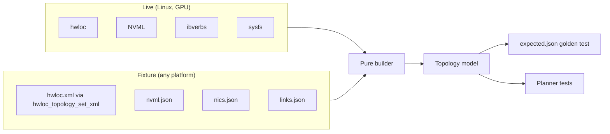

# RFC-0003: Topology fixtures

## Summary

A topology fixture is a captured, scrubbed description of a real machine: its GPUs, NVLinks, PCIe tree, NUMA nodes and NICs, plus the link bandwidths measured on it. This RFC designs the capture tool, the artifact manifest that other tools rely on, the scrubbing rules that make fixtures safe to publish, the on-disk format, and how fixtures replay into Fabric's topology model so discovery and the planner can be tested on any laptop.

It is part of M0 and is summarised in [RFC-0001 §7 (Topology fixtures)](https://github.com/OstiaHQ/ostia/pull/7). RFC-0004 (Rented hardware automation) runs the capture tool on every rented machine and depends on the manifest contract in §2.

## Motivation

The planner is Ostia's edge: transport choice, multipath and operator placement all take the topology graph as input (PRD, Layer 1a). Their bugs show up on particular machine shapes: 8 GPUs on NVSwitch, two NICs on different NUMA nodes, PCIe-only cloud boxes, Grace Hopper's NVLink-C2C. Everyday CI has one L4 and there is no owned cluster (D9), so without fixtures that code is tested only on rare, paid gate runs.

Fixtures fix that:

- A machine captured once is tested on every pull request for free, so a regression found on it stays fixed.
- Contributors work on discovery and the planner on macOS without CUDA.
- `links.json` carries measured bandwidth, replacing the prototype's hardcoded tables (PRD, Background).

## Goals and non-goals

**Goals**

- Capture any Linux GPU machine in one command, producing a folder that is safe to commit to a public repository.
- Replay a fixture into the same topology model live discovery produces, using hwloc's real XML parser.
- Keep fixtures readable in diffs and stable across captures of the same machine.

**Non-goals**

- Live discovery itself (hwloc, NVML, ibverbs and sysfs providers). The fabric RFC designs it; this RFC defines only the source interfaces the fixtures replay into.
- The topology model's public API. Also the fabric RFC.
- Running captures on rented machines. RFC-0004 invokes the tool.

## Design

### 1. Capture tool

`ostia-topo-capture` lives in `fabric/tools/topo-capture/`. It is a C++ program against hwloc, NVML (loaded with `dlopen`), ibverbs and sysfs, built only on Linux, and installed as a developer tool, not as part of Fabric's public API.

```bash
ostia-topo-capture --out capture/ [--links bench/results/links.json] [--pair-with other-host-capture/]
```

It writes one folder per machine:

| File | Content |
| --- | --- |
| `hwloc.xml` | `lstopo --of xml` with PCI and OS devices, after scrubbing |
| `nvml.json` | GPU UUIDs, PCI bus IDs, compute capability, per-NVLink state, version and remote end, P2P capability matrix |
| `nics.json` | ibverbs devices and ports (state, link layer, speed, GID type), PCIe width and generation from sysfs, NUMA node |
| `nvidia-smi-topo.txt` | `nvidia-smi topo -m`, for people to cross-check |
| `links.json` | Measured bandwidth and latency per link and direction, from the RFC-0001 harness (optional) |
| `meta.json` | Provider, instance type, driver and CUDA versions, capture date, tool version |
| `manifest.json` | The artifact manifest (§2) |

### 2. Artifact manifest contract

This RFC owns the contract between the capture tool and anything that consumes a capture, in particular RFC-0004's rent tool, which must know whether a capture is complete and safe before it fetches it and destroys the machine that holds the raw originals.

```json
{"schema": 1,
 "tool_version": "0.1.0",
 "status": "complete",
 "sanitized": true,
 "leak_check": "passed",
 "topology_id": "sha256:5d1e...",
 "files": {"hwloc.xml": "sha256:...", "nvml.json": "sha256:...", "nics.json": "sha256:...",
           "nvidia-smi-topo.txt": "sha256:...", "links.json": "sha256:...", "meta.json": "sha256:..."},
 "missing": [],
 "errors": []}
```

- **`status`** is `complete`, `partial` or `failed`. A partial capture lists what is `missing` (for example `nics.json` on a machine without ibverbs) and why, in `errors`.
- **`sanitized`** and **`leak_check`** are set only after §3's scrubbing and on-box leak check pass. A consumer publishes or commits a capture only when both are true.
- **`topology_id`** is a structural identity: a hash over devices and links, excluding measured values, identifiers and dates. Two captures of the same machine shape share it. RFC-0001's benchmark records use the same hash as their `topology` compatibility field.
- **Exit codes:** 0 complete, 2 partial, 3 scrub or leak-check failure, 1 any other failure. On 3, the tool never writes scrubbed files that might still contain identifiers.
- Consumers reject manifests with an unknown `schema` version, with an explanation.

### 3. Scrubbing

Fixtures are committed to a public repository, so every identifier of the source machine is removed before anything leaves it.

- **One mapping table per capture set.** Every file of a capture, and both machines of a pair capture (`--pair-with`), use the same table. The same MAC, GUID or UUID therefore maps to the same placeholder everywhere, and remote-port relationships and NVLink remote ends stay intact.
- **Format-preserving placeholders.** Each identifier becomes a sequential placeholder that keeps its type's shape, so parsers still accept it: `host-0`, a MAC like `02:00:00:00:00:01`, a GUID like `0000:0000:0000:0001`, a UUID like `00000000-0000-0000-0000-000000000001`. Numbering follows a stable order (sorted by PCI bus ID, then device index), so recapturing the same machine gives the same fixture. Placeholders are never hashes of the original, since a hash of a MAC with a known vendor prefix can be brute-forced.
- **hwloc info by allowlist.** Only allowlisted hwloc `info` keys survive, for example `PCIVendor`, `PCIDevice`, `PCISlot`, `GPUModel`, `CPUModel`. Everything else is dropped, including `HostName`, `DMIProductUUID`, `DMIBoardSerial`, `DMIChassisSerial` and OS or kernel release strings.
- **IP addresses, hostnames and serial numbers** are removed or replaced in every file, including `nvidia-smi-topo.txt` and `meta.json`.
- **Structure and measurements are kept apart.** Identity and structure live in `hwloc.xml`, `nvml.json` and `nics.json`. Measured values live only in `links.json`, so re-measuring a machine never changes its structural files.

**Leak check, in two passes:**

1. **On the capture machine,** before anything is written or uploaded, the tool searches the scrubbed output for every raw identifier it read (hostnames, IPs, MACs, GUIDs, UUIDs, serials) and fails with exit code 3 if any appears.
2. **In CI,** a format-regex pass over every committed fixture fails the pull request on anything shaped like an IPv4 or IPv6 address, a non-placeholder MAC, GUID or UUID, or a serial-number field.

### 4. Layout and format

```text
fabric/tests/fixtures/topology/
  aws-p5.48xlarge/            one folder per machine: <provider>-<instance>
    hwloc.xml  nvml.json  nics.json  nvidia-smi-topo.txt  links.json  meta.json  manifest.json
    expected.json             golden output of the builder (§5)
  lambda-8xa100-pair/         pair captures: one subfolder per node
    node-0/ ...  node-1/ ...
  synthetic/
    broken-nvlink/  no-nic/  multi-numa/  asymmetric-links/  partial-discovery/
```

- Files are plain text so reviews can read diffs. A file above about 1 MB is stored xz-compressed.
- Every JSON file carries `"schema": 1`. The replay code rejects unknown versions with an explanation.

### 5. Replay

Discovery is split into **sources** and a **pure builder**:



- Sources implement small interfaces (topology tree, GPU and NVLink facts, NIC facts, measured links). Live sources are gated targets; `FixtureSource` is part of the unconditional host-only target (RFC-0001 §3.4).
- `FixtureSource` loads `hwloc.xml` with `hwloc_topology_set_xml`, so hwloc's real parser runs. It replays NVML and NIC facts from JSON.
- **Golden tests.** For every fixture, the builder's output is serialised to canonical JSON and compared with `expected.json`. `--update-golden` regenerates it; a golden update is reviewed like code.
- **Synthetic fixtures** are small hand-written cases: a broken NVLink, GPUs with no NIC, several NUMA domains, asymmetric links, and partial discovery (a source that returns nothing).
- **The hello-world moment.** `pixi run topo-show <fixture>` prints a fixture's topology (GPUs, NVLink and PCIe links, NICs, measured bandwidths) on any laptop, with RFC-0001's `default` environment and no GPU. It is the first thing `docs/guides/building.md` shows after the tests pass.

## Failure handling

| Failure | Detected by | Result |
| --- | --- | --- |
| A source is missing (no ibverbs, no NVML) | Capture tool | `status: partial`, exit 2, `missing` and `errors` say which and why |
| Scrubbing leaves an identifier | On-box leak check | Exit 3, no scrubbed files written, the identifier's type (never its value) is reported |
| A committed fixture contains an identifier pattern | CI regex pass | PR fails naming the file and line |
| Unknown schema version | Replay code, RFC-0004 | Rejected with the supported versions |
| Builder output differs from `expected.json` | Golden test | Test fails with a readable diff; `--update-golden` for intended changes |
| Capture fails while the benchmark succeeded | RFC-0004 | Benchmark results kept, capture not fetched, diagnostics kept, machine still torn down |

## Observability

The capture tool prints each source it read, what it skipped and why, and the manifest summary. `topo-show` is itself the debugging view of a fixture. No telemetry build levels apply to this developer tool.

## Performance

A capture should finish in under a minute without `links.json`. Replay of one fixture into the builder should take well under a second, so golden tests over dozens of fixtures stay within the CPU CI time target (RFC-0001 §4.1).

## Testing

| Test | Runs on |
| --- | --- |
| Scrub round-trip: a synthetic dump with MACs, GUIDs, UUIDs, IPs, hostnames and serials comes out with none of them, and the scrubbed fixture parses and yields a topology isomorphic to the original | CPU CI |
| Pair mapping: a GUID seen from both machines maps to the same placeholder in both | CPU CI |
| Stable output: capturing the same synthetic input twice gives identical files | CPU CI |
| Leak check: a planted identifier fails the on-box pass and the CI regex pass | CPU CI |
| Partial capture: a missing source gives `status: partial` and exit 2 | CPU CI |
| Unknown schema version is rejected | CPU CI |
| Golden test for every fixture, and each synthetic edge case | CPU CI (Linux and macOS) |
| `topo-show` on a fixture with the `default` environment on macOS | CPU CI |
| Live capture on a real machine | GPU CI (L4) and every rented run (RFC-0004) |

## Alternatives considered

- **Store only the normalised topology graph.** Smaller, but discovery's parsing code would go untested, and every change to the graph format would make all fixtures stale until the machines were rented again. Raw dumps plus golden output avoid both.
- **Hash identifiers instead of numbering them.** Deterministic across captures, but reversible by brute force for MACs and GUIDs with known prefixes.
- **Denylist of hwloc info keys.** Misses identifiers added by future hwloc versions; an allowlist fails safe.

## Rollout

- Implemented by RFC-0001's Rollout **PR 6**, after the benchmark harness (PR 5), which produces `links.json`.
- The first fixtures come from the GPU CI L4 machine and from the gate runs (RFC-0004).
- **Merge order:** RFC-0001 ([PR #7](https://github.com/OstiaHQ/ostia/pull/7)) merges first; this RFC then takes current main and regenerates the index. Links to RFC-0001 and RFC-0004 use their draft PRs until they are on main.
- Must be Accepted before PR 6 starts.

## Open questions

- Should `links.json` also record latency distributions, or only medians, for the planner's first version?
- Do Grace Hopper's NVLink-C2C and coherent memory need their own fixture fields now, or with aarch64's tier-1 promotion?
