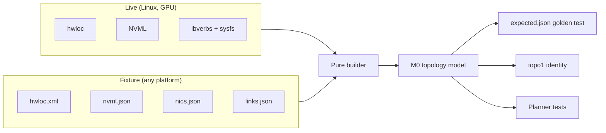

# RFC-0003: Topology fixtures

## Summary

A topology fixture is a captured description of a real machine: its GPUs, NVLinks, PCIe tree, NUMA nodes and NICs, plus link bandwidths measured on it. It contains nothing that identifies the machine or its owner, so it can be committed to a public repository. This RFC designs:
- the capture tool;
- the closed file schemas that define what may be published;
- the leak check;
- the artifact manifest that other tools rely on;
- the structural topology identity shared with RFC-0001's benchmark records;
- a minimal internal topology model;
- replay, so discovery and the planner can be tested on any laptop.

It is part of M0 and is summarised in [RFC-0001 §7 (Topology fixtures)](0001-m0-foundations.md#7-topology-fixtures-summary). [RFC-0004 (Rented hardware automation)](https://github.com/OstiaHQ/ostia/pull/9) runs the capture tool on every rented machine and relies on the manifest contract in §4.

## Motivation

The planner is Ostia's edge: transport choice, multipath and operator placement all take the topology graph as input (PRD, Layer 1a). Their bugs show up on particular machine shapes: 8 GPUs on NVSwitch, two NICs on different NUMA nodes, PCIe-only cloud boxes, Grace Hopper's NVLink-C2C. Everyday CI has one L4 and there is no owned cluster (D9), so without fixtures that code is tested only on rare, paid gate runs.

Fixtures fix that:

- A machine captured once is tested on every pull request for free, so a regression found on it stays fixed.
- Contributors work on discovery and the planner on macOS without CUDA.
- `links.json` carries measured bandwidth, replacing the prototype's hardcoded tables (PRD, Background).

## Goals and non-goals

**Goals**

- Capture any Linux GPU machine in one command, producing a folder that is safe to publish.
- Replay a fixture into the same topology model live discovery produces, using hwloc's real XML parser.
- Keep fixtures readable in diffs and byte-identical across captures of the same machine shape.
- Give RFC-0001's benchmark records a structural topology identity (`topo1`).

**Non-goals**

- Live discovery (hwloc, NVML, ibverbs and sysfs providers) and the topology model's **public** API. The fabric RFC designs them. This RFC defines only the minimal internal model the fixtures replay into (§6) and the source interfaces.
- Discovering the network fabric between nodes (switch GUIDs, `ibnetdiscover`). Pair captures record only what §7 lists.
- Provisioning machines and moving captures off them. RFC-0004 does that.

## Design

### 1. Capture tool

`ostia-topo-capture` lives in `fabric/tools/topo-capture/`. It is a C++ program built only on Linux, and installed as a developer tool, not as part of Fabric's public API. It reads:
- hwloc;
- NVML, loaded with `dlopen`;
- ibverbs, when present;
- sysfs.

```bash
ostia-topo-capture --out capture/ --provider runpod --instance-type 4xA100-SXM-80GB \
                   [--links bench/results/<run-id>/links.json] [--node-index 0]
```

- **It runs as a normal user.** Root is neither needed nor recommended; that also keeps root-only identifiers such as DMI serial numbers out of reach.
- **Provider and instance type come from flags,** set by RFC-0004's rent tool. The tool never queries a cloud metadata service.
- **Raw data** is read into memory and into a private (0700) temporary directory outside `--out`. It is deleted when the tool exits, whether it succeeds or fails.
- **Output files:**

| File | Content | Required |
| --- | --- | --- |
| `hwloc.xml` | Topology tree, rewritten to the §2 allowlist | always |
| `nvml.json` | GPUs and NVLinks (§2.2) | when NVIDIA GPUs are present |
| `nics.json` | NICs from sysfs, plus RDMA facts from ibverbs when available (§2.3) | always (may list no NICs) |
| `links.json` | Measured bandwidth and latency per link (§8) | optional |
| `meta.json` | Provider, instance type, driver and CUDA versions, tool version, capture date | always |
| `manifest.json` | The artifact manifest (§4), written last | always |
| `diagnostics.txt` | What was read, skipped and why, with no values from the machine | always |

The capture tool uses **nlohmann/json** (MIT, via CPM) to read and write JSON; this RFC approves it as a dependency. Fixtures are plain text and not compressed. *(update: Rollout PR 6b: the tool takes `--out`, `--provider`, `--instance-type`, `--links`, `--node-index`, `--extra-identifiers` and `--print-id`. `--print-id` runs the whole capture, validation and leak check included, in a private temporary directory, prints only the topology id and returns the capture's exit code; it excludes `--out`, and `--provider` and `--instance-type` then default to `unknown`. The emitter drops every OS device from `hwloc.xml`, because network interface names can be derived from a MAC and the builder ignores OS devices. A GPU's `cuda_ordinal` is its rank by PCI bus ID among the GPUs NVML lists, so the tool needs no CUDA runtime. `nvml.json` is required exactly when hwloc lists a device with vendor `0x10de` and a `0x03xx` class; if NVML is then absent or fails, the capture is partial. `rdma_probe` is `ok` when `libibverbs.so.1` loads and `ibv_get_device_list` succeeds, including with zero devices (#45).)*

### 2. Closed schemas: what may be published

Only fields listed here are ever written. Everything else the sources report is dropped before writing. Every JSON file has a JSON Schema in `fabric/tools/topo-capture/schemas/`, and the tool validates its own output against it, with `additionalProperties: false`, before the leak check runs.

**The join key between files is the PCI bus ID** (`domain:bus:device.function`). It describes where a device sits in the machine, not who owns it, so it is kept. Anything used only to identify a specific device or machine is dropped rather than replaced.

#### 2.1 `hwloc.xml`

- Capture and replay both use `hwloc_topology_set_io_types_filter(HWLOC_TYPE_FILTER_KEEP_IMPORTANT)`, so PCI devices, bridges and OS devices for GPUs and NICs are present on both sides.
- Kept per object:
  - type, `os_index` and `gp_index`;
  - cache and memory sizes;
  - PCI bus ID;
  - PCI class, vendor and device IDs;
  - PCI link speed and width. The tool reports the **maximum** link speed from sysfs, not the current one, because idle NVIDIA GPUs drop to PCIe gen 1.
  - OS device names (such as `mlx5_0`);
  - bridge types.
- Kept `info` keys: `PCIVendor`, `PCIDevice`, `CPUVendor`, `CPUModel`, `CPUFamilyNumber`, `CPUModelNumber`, `GPUVendor`, `GPUModel`, `Backend`. *(update: Rollout PR 6a: also `OstiaPCIeMaxGen` and `OstiaPCIeMaxWidth`, the maximum PCIe link generation and width the capture writes into the PCI object's info (#32).)* *(update: Rollout PR 6b: the maximum PCIe generation and width come from sysfs `max_link_speed` and `max_link_width` into `OstiaPCIeMaxGen` and `OstiaPCIeMaxWidth`, and `pci_link_speed` is written from those same maxima; the keys are omitted when sysfs lacks them (#45).)*
- **Everything else is removed,** including `HostName`, every `DMI*` key, `OSName`, `OSRelease`, `OSVersion`, `Architecture` strings with a kernel version, `NVIDIAUUID`, `NodeGUID`, `SysImageGUID`, `Port*GID*`, `Address`, `PCISlot` and any serial number.
- The rewritten XML is re-imported with `hwloc_topology_set_xml()` and `hwloc_topology_load()` before writing, and both must succeed.

#### 2.2 `nvml.json`

- **Per GPU:** PCI bus ID, name (model), compute capability, memory size, and a CUDA ordinal computed with `CUDA_DEVICE_ORDER=PCI_BUS_ID`.
- **Per NVLink:**
  - link index;
  - state (`active`, `inactive`, `not_supported`);
  - NVLink version;
  - remote device type (`gpu`, `switch`, `unknown`);
  - remote PCI bus ID when the remote is a PCI-visible device.
- **NVSwitch.** When NVSwitches are not PCI-visible (common in VMs), GPUs whose links all reach `switch` form one anonymous switch group in the model (§6), which is the coarser model.
- **P2P capability matrix** between GPU pairs, with one entry each for `read`, `write`, `nvlink` and `atomics`, each `ok`, `not_supported` or `unknown`.
- NVML queries that return `NOT_SUPPORTED` are recorded as such, never omitted. *(update: Rollout PR 6a: a GPU's `nvlinks` is an array of links, or the string `"not_supported"` when NVML can't report links (#32).)*
- **Dropped:** GPU UUIDs, serial numbers, board IDs, VBIOS versions and MIG UUIDs.

#### 2.3 `nics.json`

- **From sysfs, for every network interface backed by a PCI device:**
  - PCI bus ID;
  - driver;
  - link layer (`ethernet` or `infiniband`);
  - maximum PCIe speed and width;
  - port speed;
  - NUMA node.
- **From ibverbs, when devices exist:** device name, port number, port state, link layer, active speed and width, and whether GPUDirect RDMA is available (`nvidia_peermem` loaded, or dma-buf support).
- **No RDMA devices is a capability, not a failure.** A TCP-only machine gets `"rdma": []` and a complete capture. *(update: Rollout PR 6a: a NIC's `link_layer` may be `"unknown"` and its `port_speed_mbps` an integer or `"unknown"`; the root has `rdma_probe: ok|unavailable`, so a machine where the probe could not run differs from one with no RDMA; a NIC's PCI vendor and device IDs come from `hwloc.xml` (#32).)* *(update: Rollout PR 6b: NICs are found by a scan of PCI class `0x02xx` devices in sysfs, so a NIC whose driver exposes no network interface is still listed, and a port fact that cannot be read is written as `"unknown"` rather than omitted (#45).)*
- **Dropped:** MAC addresses, IP addresses, GUIDs, GIDs, firmware versions, board IDs, VPD and interface names derived from MACs.

#### 2.4 `meta.json`

`provider` and `instance_type` (from flags), driver version, CUDA version, `tool_version`, `schema` and `captured_at`. Nothing else. `captured_at` is excluded from byte-stability comparisons and from the topology identity.

### 3. Leak check

The leak check proves that no identifier of the source machine reached the output, including identifiers the schemas did not anticipate.

1. **Collect the raw set** from independent sources, not from what the capture read:
   - `getifaddrs` and `/sys/class/net/*/address`;
   - every RDMA GID table and node or port GUID;
   - NVML serial numbers, UUIDs and board IDs;
   - `/sys/class/dmi/id/*` (whatever is readable);
   - NIC VPD;
   - `/etc/machine-id`;
   - the hostname and FQDN.
2. **Expand derived forms:**
   - EUI-64 link-local GIDs from MACs and GUIDs (with the `ff:fe` insertion and the universal/local bit flip);
   - IPv4-mapped RoCE GIDs;
   - 20-byte IPoIB addresses;
   - hostnames of the `ip-a-b-c-d` form;
   - cloud instance-ID patterns found in DMI;
   - each value with case and separators normalised.
3. **Search** every output file for every form. Any match fails the capture with exit code 3. `diagnostics.txt` reports the file, line and identifier type, never the value.

In CI, a second pass runs a format-regex scan over every committed fixture, both in `lint` and as a pre-commit hook. It looks for:
- IPv4 and IPv6 addresses;
- MACs;
- `GPU-` and `MIG-` UUIDs;
- `i-[0-9a-f]{8,17}` instance IDs;
- `ip-\d+-\d+-\d+-\d+` hostnames;
- serial-number fields.

PCI bus IDs and the placeholder grammar in §6 are explicit exceptions. A corpus test checks the regex's false positives, and failures report `file:line:type` only. *(update: Rollout PR 6a: the pass is `ostia-dev check fixture-leaks`, part of `ostia-dev lint` and so of pre-commit. It scans only git-tracked files under `fabric/tests/fixtures/topology/`, and also flags any hwloc `<info>` name outside §2.1's allowlist (including `OstiaPCIeMaxGen` and `OstiaPCIeMaxWidth`). Output is `path:line: kind`, never the value (#32).)* *(update: Rollout PR 6b: the raw set comes from sources independent of what the capture reads: sysfs network addresses, InfiniBand GUIDs and GIDs, NIC VPD serial keywords, the identifying DMI fields only (serial numbers, UUIDs, asset tags and instance-ID-shaped values), live interface addresses, the hostname and FQDN, `/etc/machine-id`, NVML UUIDs, serial numbers and board IDs, and the lines of `--extra-identifiers`, which is where a caller puts site names and asset tags. Loopback and unspecified addresses and all-zero or all-`f` values are skipped. Hex identifiers match case- and separator-insensitively; names, addresses and extra identifiers match as whole tokens, and a multi-word value as a boundary-anchored substring; values shorter than six normalised characters are skipped and counted. A finding names the file, line and a locator (a JSON pointer, or an element path with `/@attribute` for XML) with the kind. The CI regex pass also flags bare 16-hex GUIDs and `enx` interface names with twelve hex digits. A known limit of the remote runner's own identifiers (node name, kube context and kubeconfig cluster name): segments shaped like cloud regions or zones are skipped as shared by every account, while whole values are still searched (#45).)*

### 4. Artifact manifest contract

This RFC owns the contract between the capture tool and anything that consumes a capture, in particular RFC-0004's rent tool. The rent tool must know whether a capture is complete and safe before it fetches it and destroys the machine.

```json
{"schema": 1,
 "tool_version": "0.1.0",
 "status": "complete",
 "sanitized": true,
 "leak_check": "passed",
 "topology_id": "topo1:sha256:5d1e...",
 "files": {"hwloc.xml": "sha256:...", "nvml.json": "sha256:...", "nics.json": "sha256:...",
           "links.json": "sha256:...", "meta.json": "sha256:..."},
 "missing": [],
 "errors": []}
```

- **`status`:**
  - `complete`: every file that is required for this machine's capabilities (§1 table) is present;
  - `partial`: a required source failed (for example NVML returned an error on a GPU machine);
  - `failed`.
  An absent optional `links.json` does not make a capture partial.
- **`missing`** is a list of `{"file": ..., "reason": ...}`, and **`errors`** a list of `{"code": ..., "message": ...}`. Neither contains values from the machine.
- **`sanitized`** is `true` only after schema validation passes. **`leak_check`** is `not_run`, `passed` or `failed`.
- **`files`** holds the SHA-256 of each file's bytes exactly as written.
- **Writing.** The manifest is always written, even on failure, and written last: to a temporary file, then `fsync`, then `rename`. A reader never sees a partial manifest.
- **Exit codes** follow this precedence when several apply: 3 (leak or schema failure; no data files are left in `--out`), then 1 (other failure), then 2 (partial), then 0 (complete).
- **Consumers must:**
  - reject unknown `schema` versions;
  - fetch only the files listed in `files`;
  - verify every hash;
  - reject symlinks and unexpected paths;
  - publish a capture only when `sanitized` is `true` and `leak_check` is `passed`.
  `diagnostics.txt` is values-free by construction and may be fetched for debugging, but is never committed. *(update: Rollout PR 6b: `topology_id` is the `topo1` id of replaying the written files, and is `null` unless the exit code is 0 or 2. A failed manifest carries `status`, `leak_check`, `missing` and `errors`. A consumer fetches the manifest first, checks it, and only then fetches the files it lists, rejecting symlinks and unlisted paths; `ostia-dev` validates it with `jsonschema` against `manifest.schema.json` (#45).)*

### 5. Topology identity (`topo1`)

`topology_id` is a structural identity. Two machines of the same shape share it; any real change in shape changes it. RFC-0001 §6.2 uses it as the `topology` compatibility field of benchmark records.

- **Input** is the canonical model (§6), with PCI bus IDs, device names, placeholders, measured values and dates removed. What remains:
  - node kinds and attributes: GPU model and compute capability, NIC link layer and port speed, PCIe maximum generation and width, NUMA and package counts;
  - edges: PCIe parent-child, NVLink link counts between GPUs or a switch group, NUMA locality, RDMA availability.
- **Canonical ordering** uses three rounds of Weisfeiler–Lehman relabelling over the graph. Node order therefore never depends on enumeration. Nodes are then sorted by final label. *(update: Rollout PR 6a: the identity input is fixed. A GPU contributes its model and compute capability, a NIC its PCI vendor and device IDs, a PCIe edge its generation and width, an NVLink edge its link count; every other node contributes its kind only. NIC port speed, link layer and RDMA state are data, not identity, so a probe that fails does not change the identity. The canonical form is a stable refinement followed by individualisation-refinement with twin pruning. It accepts models of at most 256 nodes, and the search stops after 1,000,000 leaves. The search also prunes with automorphisms found from equal leaf certificates: it backjumps to the common prefix and skips children in the same orbit of the path stabiliser, computed with deterministic Schreier–Sims. No `topo1` id changed. Symmetric shapes whose vertices are not twins, such as one bridge per GPU or NIC with 8 GPUs and 8 NICs, now finish in milliseconds, and some models that hit `leaf_cap` before now get an id. Known limit: the stabiliser chain is rebuilt per search node, so very symmetric shapes far beyond real machines (such as 64 disjoint edge pairs, or 32 GPU plus 32 NIC branches) can take up to about a minute (Release); an incremental chain is the follow-up (#33).)*
- **Output:** `topo1:sha256:` followed by the SHA-256 of the canonical JSON (sorted keys, integers only, no floats). A change to the input definition bumps the prefix to `topo2`.
- **Pair identity** is the SHA-256 of the two node IDs in sorted order plus `pair.json`'s structural fields (§7).
- **Sequencing with RFC-0001.** The identity is implemented with the model in PR 6. Benchmark records from before PR 6 carry `"topology": null`, which `compare.py` treats as compatible only with `null`. Baselines recorded before PR 6 are re-recorded once it lands. *(update: Rollout PR 6b: benchmark records now carry the machine's `topo1` id in `compat.topology`, taken with `ostia-topo-capture --print-id`, and the `bench-smoke` suite requires it with `--require-topology`. In a two-pod gate the records carry the pair id instead, and the gate marks them with `provenance.topology_source: gate`; when either capture is rejected or partial the records stay unstamped. Because `compare.py` skips cases whose topology differs, a gate with a baseline exits 1 when any record's topology is one the baseline was not recorded on, null included (#45).)*

### 6. Minimal M0 topology model

The fixtures replay into a small **internal** model defined here. The fabric RFC may replace it with its public model later, as long as the golden files are regenerated.

- **Nodes:** `package`, `numa`, `pcie_bridge`, `gpu`, `switch_group`, `nic`.
- **Edges:**
  - `pcie`: parent to child, with maximum generation and width;
  - `nvlink`: between GPUs, or between a GPU and a switch group, with a link count;
  - `numa_local`: a device to its NUMA node.
- **Attributes:** as in §5, plus the PCI bus ID as each device's key.
- **Placeholders** appear only where a structural name is needed and no safe value exists, for example `switch-group-0`. They are sequential and ordered by the smallest PCI bus ID they cover.
- **Serialisation.** The builder writes the model as canonical JSON (sorted keys, integers only). This is the golden file, `expected.json`. *(update: Rollout PR 6a: the model is the internal static library `ostia_fabric_topology`, not installed and not yet linked into `ostia_fabric`. It also holds the schema validator, an in-house subset of JSON Schema that includes `oneOf`, with the schemas embedded at configure time. An NVLink pair's `links` is the minimum of the active-link counts its two sides report, so an inactive link on either side lowers it. All links to NVSwitches go to one `switch-group-0` per machine (#32).)*

### 7. Pair captures

Each node of a pair is captured and scrubbed **independently**; no identifier or mapping table crosses between nodes. RFC-0004 then writes a `pair.json` alongside them from its own setup description:

```json
{"schema": 1,
 "nodes": ["node-0", "node-1"],
 "link_class": "infiniband",
 "rails": [{"node-0": {"nic_index": 0}, "node-1": {"nic_index": 0}},
           {"node-0": {"nic_index": 1}, "node-1": {"nic_index": 1}}],
 "measured": [{"rail": 0, "direction": "0->1", "bw_mbps": 196000, "test": "rdma_put"}]}
```

- NICs are referred to by their index in each node's `nics.json`, which lists NICs ordered by PCI bus ID.
- `link_class` is `infiniband`, `roce`, `efa` or `tcp`.
- The pair's status is the worse of the two node statuses. The pair's `topology_id` follows §5.
- There is no fabric discovery: switch GUIDs and node descriptions are never collected.
- *(update: Rollout PR 6a: `pair_id` puts the two node ids in sorted order. When that swaps them, it also swaps each rail's `node-0` and `node-1` entries, so a rail stays attached to its node (#32).)*
- *(update: Rollout PR 6b: `pair.json` is written by the gate, until RFC-0004 PR 7 brings the rent tool, from the rail NIC facts and the rank-1 records, and the pair id is computed by the host's `ostia-topo id`. The records are stamped only when both captures are `complete`; the captures land under `capture/node-0` and `capture/node-1` next to `pair.json` (#45).)*

### 8. `links.json`

```json
{"schema": 1,
 "links": [{"from": "0000:07:00.0", "to": "0000:0a:00.0", "kind": "nvlink",
            "direction": "forward", "bw_mbps": 187000, "latency_ns": 2100,
            "test": {"bench": "p2p_copy", "bytes": 1073741824, "concurrency": 1},
            "samples": 10}]}
```

- Links are keyed by the endpoints' PCI bus IDs.
- Values are integers (MB/s and ns): medians from RFC-0001's harness, converted from its JSONL records. The harness runs with `CUDA_DEVICE_ORDER=PCI_BUS_ID`, so CUDA ordinals map to bus IDs.
- A link that was not measured is absent, never written as zero. *(update: Rollout PR 6a: links are keyed only by their `from` and `to` bus IDs. The benchmark records will carry the measured devices' bus IDs, in PR 6b, so CUDA ordinals are never mapped (#32).)* *(update: Rollout PR 6b: benchmark records carry the bus IDs they measured in a top-level `devices` field, with `src_bus` and `dst_bus` for `p2p_copy`, `pipelining` and `batching`, and `src_bus`, `dst_a_bus` and `dst_b_bus` for `dual_link --mode nvlink`, so CUDA ordinals are never mapped. `ostia-dev topo links` converts only unidirectional `p2p_copy` records, skips records whose source and destination bus IDs are equal, takes the link kind from the capture's NVLinks, and writes one entry per source, destination and transfer size (#45).)*

### 9. Layout and replay

```text
fabric/tests/fixtures/topology/
  runpod-4xa100-sxm-80gb/             one folder per machine: <provider>-<instance>[-<variant>]
    hwloc.xml  nvml.json  nics.json  links.json  meta.json  manifest.json
    expected.json                     golden output of the builder
  rdma-pair-nebius-8xh100/            pair: <setup>-<provider>-<instance>
    node-0/ ...  node-1/ ...  pair.json
  synthetic/
    broken-nvlink/  no-nic/  multi-numa/  asymmetric-links/  partial-discovery/  nvswitch-hidden/
```

*(update: Rollout PR 6a: every fixture lives at `<group>/<case>/`, which supersedes the depth-1 layout above. Synthetic cases are under `synthetic/`: `broken-nvlink`, `no-nic`, `multi-numa`, `asymmetric-links`, `partial-discovery`, `nvswitch-hidden`, `disallowed-pu`, `unknown-port` and `pair-tcp`. Captured machines go under a group directory, such as `captured/<provider>-<instance>/`. A pair is `<group>/<setup>-<provider>-<instance>/` holding `node-0/`, `node-1/` and `pair.json` (#32).)*

*(update: Rollout PR 6b: the synthetic case `nvswitch-8nic-2numa` adds the largest expected shape: eight GPUs on NVSwitch, one rail NIC per GPU and two sockets with one NUMA node each. `ostia-dev topo diff` compares two topologies by id (exit 0 when equal, 1 when they differ), `ostia-dev topo which` lists the fixtures whose id starts with a given prefix, and `ostia-dev topo import` adds an accepted, complete capture as `captured/<provider>-<instance>` with its golden, after a second leak scan; `docs/guides/fixtures.md` describes all three (#45).)*

Discovery is split into **sources** and a **pure builder**:


```mermaid
graph LR
    subgraph Live["Live (Linux, GPU)"]
        H[hwloc]
        N[NVML]
        I[ibverbs + sysfs]
    end
    subgraph Fixture["Fixture (any platform)"]
        HX[hwloc.xml]
        NJ[nvml.json]
        IJ[nics.json]
        LJ[links.json]
    end
    Live --> B[Pure builder]
    Fixture --> B
    B --> T[M0 topology model]
    T --> G[expected.json golden test]
    T --> ID[topo1 identity]
    T --> P[Planner tests]
```

- Live sources are gated targets. `FixtureSource` belongs to the unconditional host-only target (RFC-0001 §3.4).
- `FixtureSource` loads `hwloc.xml` as a foreign topology with `hwloc_topology_set_xml()`, using the same I/O filters as the capture, with no binding and no rediscovery. It replays NVML and NIC facts from JSON and joins everything by PCI bus ID. GPU OS devices come from `nvml.json`, so replay does not depend on hwloc's CUDA or NVML backends, which conda-forge builds may lack.
- **Golden tests** compare the builder's output with `expected.json` for every fixture. `--update-golden` regenerates it, and a golden update is reviewed like code. *(update: Rollout PR 6a: the goldens are ctest cases `fabric.topo.golden.<case>`, regenerated with `ostia-dev topo golden --update`. Synthetic fixtures are written by `generate.py`, and ctest `fabric.topo.fixtures_current` fails when a fixture differs from what the generator produces; `generate.py --check` is the same test by hand. The schema validator is the in-house subset with `oneOf` (§6) (#32).)*
> *Update: [ADR-0014](../adr/0014-on-demand-remote-test-runs.md) replaced GPU CI with on-demand remote runs ([RFC-0005](0005-dev-cli-remote-runner.md)). "The GPU CI machine" in this section is an L4 node reached with `ostia-dev remote k8s --suite gpu`; nothing is uploaded from those runs either.*

- **Live versus replay.** On the GPU CI machine, a test captures the machine, replays the capture, and checks that the live builder and the replayed builder produce the same model. This catches a builder that is consistently wrong, which golden files alone would freeze.
- **GPU CI uploads nothing.** PR runs execute untrusted code and their artifacts are public, so GPU CI captures, leak-checks and replays but never uploads the capture. New fixtures come from maintainer-run rented captures, added by pull request.
- **The hello-world moment.** `pixi run topo-show <fixture>` prints a fixture's topology on any laptop, with RFC-0001's `default` environment and no GPU: GPUs, NVLink and PCIe links, NICs, and measured bandwidths. It is the first thing `docs/guides/building.md` shows after the tests pass. *(update: Rollout PR 6a: the command is `pixi run ostia-dev topo show <fixture>`, RFC-0005 §7 (#32).)*

**Done when**

- [ ] `ostia-topo-capture` produces schema-valid, leak-checked captures on the GPU CI machine and on each rented setup. *(update: done on the GKE L4 machine (`remote k8s --suite topo-capture`); the rented setups follow with RFC-0004 PR 7.)*
- [ ] The manifest contract is implemented, including atomic writes, the exit-code precedence and consumer-side hash verification in RFC-0004's tool. *(update: the writer and the `ostia-dev` consumer are done (#45); RFC-0004's tool uses the consumer from PR 7.)*
- [x] `topo1` is implemented and RFC-0001's benchmark records carry it.
- [ ] At least one fixture per RFC-0004 setup and every synthetic case have golden files that pass on Linux and macOS. *(update: Rollout PR 6b: the per-setup fixtures arrive with RFC-0004 PR 7, and the L4 fixtures in a follow-up pull request after this one merges; `docs/guides/fixtures.md` now shows how to capture a machine and add a fixture (#45). The first captured fixture is `captured/gcp-g2-standard-16`, the GKE L4 machine (#<PR>); `captured/aws-g6-4xlarge` follows when EKS has g6.4xlarge capacity.)*
- [x] `docs/guides/fixtures.md` shows how to capture a machine and add a fixture (RFC-0001 Rollout).

## Failure handling

| Failure | Detected by | Result |
| --- | --- | --- |
| No RDMA devices | Capture tool | Not a failure: `"rdma": []`, capture complete |
| NVML fails on a GPU machine | Capture tool | `status: partial`, exit 2, `missing` names `nvml.json` and the reason |
| Output fails its schema, or the leak check finds an identifier | Capture tool | Exit 3; data files removed from `--out`; manifest and `diagnostics.txt` written without values |
| Rewritten `hwloc.xml` does not re-import | Capture tool | Exit 1, error code in the manifest |
| A committed fixture matches an identifier pattern | CI regex pass | PR fails with `file:line:type` |
| Unknown schema version | Replay code, RFC-0004 | Rejected with the supported versions |
| Builder output differs from `expected.json` | Golden test | Test fails with a readable diff |
| Live and replayed models differ | GPU CI test | Test fails; the capture is not uploaded |
| Capture fails while the benchmark succeeded | RFC-0004 | Benchmark results kept, capture not fetched, `diagnostics.txt` kept locally, machine torn down |

## Observability

The capture tool prints each source it read, what it skipped and why, and the manifest summary, all without values from the machine. `ostia-dev topo show` is the debugging view of a fixture. No telemetry build levels apply to this developer tool.

## Performance

- The largest expected fixture is an 8-GPU NVSwitch machine with 8 NICs. On it, capture without `links.json` should finish in under a minute (timed by the GPU CI test on the L4, and on the first rented 8-GPU capture).
- Replay of that fixture into the builder should take under 200 ms; a CPU CI test fails above 1 s. This keeps golden tests over dozens of fixtures within RFC-0001's CI time target. *(update: Rollout PR 6a: the in-process test `FixtureSource.ReplayOfLargestFixtureIsFast` times replay plus `topo1` by process CPU time: 1 s, and 5 s under sanitizers (#33).)*

## Testing

| Test | Runs on |
| --- | --- |
| Schema validation rejects an unexpected field in each file type | CPU CI |
| Scrub round-trip: synthetic source data full of identifiers (MACs, GUIDs, GIDs, UUIDs, serials, IPs, hostnames, instance IDs, VPD) produces schema-valid output containing none of them, and the output re-imports and yields the same model as the input | CPU CI |
| Leak check: each derived form (EUI-64 GID, IPv4-mapped GID, IPoIB address, `ip-a-b-c-d` hostname) planted in output is caught | CPU CI |
| CI regex: planted identifiers fail; a corpus of legitimate fixtures (PCI bus IDs, placeholders) passes | CPU CI |
| `topo1`: equal after renumbering PCI devices, different after removing an NVLink or changing a GPU model | CPU CI |
| Stable output: the same synthetic input twice gives byte-identical files, ignoring `captured_at` | CPU CI |
| Manifest: atomic write, exit-code precedence, partial capture, TCP-only machine complete, unknown schema rejected | CPU CI |
| Malformed XML, dangling cross-file references, NVML `NOT_SUPPORTED` cases, hidden NVSwitch | CPU CI |
| Golden test for every fixture and synthetic case | CPU CI (Linux and macOS) |
| `ostia-dev topo show` on a fixture with the `default` environment on macOS | CPU CI |
| Live versus replay on the same machine; capture not uploaded | GPU CI (L4) |
| Pair capture: two independent captures plus `pair.json`, pair identity computed | Rented runs (RFC-0004), and a synthetic pair on CPU CI |

## Alternatives considered

- **Store only the normalised topology graph.** Smaller, but discovery's parsing code would go untested, and every change to the graph format would make all fixtures stale until the machines were rented again.
- **Replace identifiers with placeholders everywhere.** Most identifiers are not needed for structure once PCI bus IDs are the join key, so dropping them is simpler and leaves less to get wrong. Placeholders remain only for structural names.
- **Share one mapping table across a pair, or correlate identifiers with a per-run HMAC key.** Either moves raw identifiers, or a secret derived from them, between hosts. Correlation by NIC index gives what M0 needs.
- **Denylist of hwloc keys and free-form JSON.** Misses identifiers added by future hwloc or driver versions; closed schemas fail safe.
- **Hash identifiers.** Reversible by brute force for MACs and GUIDs with known prefixes.
- **xz compression of large fixtures.** Not needed at expected sizes, and it would add a dependency.

## Rollout

- Implemented by RFC-0001's Rollout **PR 6**, after the benchmark harness (PR 5), which produces the measurements for `links.json`.
- The first fixtures come from the gate runs (RFC-0004), added by maintainer pull requests.
- **Merge order:** RFC-0001 is merged ([`0001-m0-foundations.md`](0001-m0-foundations.md)); before this RFC merges, its branch takes current main and regenerates the index. Links to RFC-0004 use its PR until it is on main.
- Must be Accepted before PR 6 starts.

## Open questions

- Should `links.json` also record latency distributions, or only medians, for the planner's first version?
- Do Grace Hopper's NVLink-C2C and coherent memory need their own node and edge kinds now, or with aarch64's tier-1 promotion?
