# RFC-0004: Rented hardware automation

## Summary

Ostia owns no cluster (D9). Gate benchmarks run on rented machines that are brought up, used and torn down by one command. This RFC designs:
- that command, `pixi run rent`;
- the three reference setups with their primary and fallback machines;
- spend limits that hold even when the controlling laptop crashes;
- credentials;
- quotas.

It is part of M0 and is summarised in [RFC-0001 §8 (Rented hardware)](https://github.com/OstiaHQ/ostia/pull/7). It runs [RFC-0003's capture tool](https://github.com/OstiaHQ/ostia/pull/8) on every node and fetches captures only through RFC-0003's manifest contract (§4 there).

## Motivation

D9 fixes three reference setups for gate benchmarks:
- a node with 2 or more NVLink GPUs;
- two nodes with GPUDirect RDMA NICs, 2 per node for multi-rail;
- a TCP-only or AWS EFA pair.

Renting them by hand is slow and error-prone. The risk that matters most for a sole maintainer is a forgotten machine billing by the hour. M0's total budget is $1,500 (RFC-0001, Goals), of which these runs get **$1,000**.

The obvious safeguard, an in-guest `shutdown` timer, does not stop billing on most providers:
- **Azure** keeps charging a VM that is stopped but still allocated.
- **Lambda** bills until the instance is terminated through its API.
- **RunPod** pods are containers, so a guest shutdown does nothing to the pod.
- **AWS** stops, rather than terminates, an instance unless told otherwise.

Spend control therefore has to work through each provider's API.

## Goals and non-goals

**Goals**

- One command brings a setup up, runs benchmarks and the capture tool, fetches results, and tears everything down, verified through the provider's API.
- Spend stays within the sub-budget in every failure mode listed in [Failure handling](#failure-handling), including a dead controller, a partially created pair, and an outage of the cleanup sweep.
- Each setup has a pre-declared fallback, so a missing quota or provider outage does not block the gate.

**Non-goals**

- Everyday GPU CI, which uses Cirun in a separate AWS account (RFC-0001 §4.2).
- Long-lived clusters, and anything Layer 2 will need later (scheduling, membership).
- Running untrusted code: only maintainers run `rent`, on commits they chose.

## Design

### 1. The `rent` command

`tools/rent/` wraps **SkyPilot** for Nebius, RunPod, Lambda and AWS, with SkyPilot's multi-node support and fast networking (`network_tier: best`). The Azure fallback has its own small backend (§2), because SkyPilot's fast networking does not provision Azure InfiniBand. Each setup is described in `infra/setups/<setup>.yaml`:

```yaml
# infra/setups/nvlink-node.yaml
schema: 1
name: nvlink-node
gate: [p2p_copy, pipelining, batching, dual_link]        # RFC-0001 §6.4: a missing capability fails the gate
also_run: [onpath_placement, topo_capture]              # may be reported as unsupported
max_duration_hours: 4
max_usd_per_hour: 8          # aggregate for the whole setup, all nodes
machines:
  primary:
    backend: skypilot
    cloud: runpod
    region: any-secure-cloud
    purchase: on-demand
    nodes: 1
    accelerators: A100-80GB-SXM:4
    capabilities: [nvlink-p2p, cuda-ipc]
  fallback:
    backend: skypilot
    cloud: lambda
    region: us-east-1
    purchase: on-demand
    nodes: 1
    accelerators: A100-40GB-SXM:8
    capabilities: [nvlink-p2p, cuda-ipc]
    max_usd_per_hour: 20
```

```bash
pixi run rent nvlink-node --dry-run    # plan, live price quote and reservation; creates nothing
pixi run rent nvlink-node              # asks for confirmation, then runs
pixi run rent nvlink-node --yes        # non-interactive (workflow_dispatch)
pixi run rent recover <run-id>         # resumes teardown and reconciliation of a run
pixi run rent status                   # active runs, their age, expiry and reservation, from provider APIs
```

- `--cap <usd/h>` lowers a setup's cap for one run.
- `--allow-over-cap` raises it, after an interactive confirmation, and reserves at the raised cap. It can never exceed the remaining sub-budget.
- `--fallback` forces the fallback machine.

#### 1.1 Lifecycle

Every step records its state in the run's ledger entry (§3) before it acts. Any step can therefore be resumed, idempotently, by `rent recover`.

```mermaid
stateDiagram-v2
    direction LR
    [*] --> Reserved: quote price, reserve worst case
    Reserved --> Launching: persist run-id, request nodes
    Launching --> Guarded: persist provider IDs, arm provider-side expiry
    Guarded --> Preflight: topology and driver checks
    Preflight --> Setup: pixi install, build benchmarks
    Setup --> Probed: active capability probes
    Probed --> Running: gate and also-run workloads
    Running --> Capturing: soft deadline or done
    Capturing --> Fetching: manifest-listed files only
    Fetching --> TearingDown
    Preflight --> TearingDown: capability missing
    Probed --> TearingDown: capability missing
    Launching --> TearingDown: partial provisioning
    TearingDown --> Verified: provider reports every resource gone
    Verified --> Settling: hold reservation until billing settles
    Settling --> [*]: reconcile actual cost
```



- **Before launch,** `rent` gets a live price quote from the provider and refuses if it exceeds the setup's cap. It then reserves the run's worst case in the ledger (§3).
- **Provider IDs** (instances, disks, IPs, resource groups, clusters) are written to the ledger as soon as they exist. The inventory never depends on SkyPilot's local state or on the controller staying alive.
- **Provider-side expiry** is armed right after creation (§3). The in-guest timer only stops the workload; it is not a spend guard.
- **Capability checks run in two stages:**
  1. **Preflight, before setup:** `nvidia-smi topo -m`, `ibv_devinfo`, and the presence of `nvidia_peermem` or dma-buf support.
  2. **Active probes, after setup and before workloads:** a CUDA peer-access copy between each GPU pair, and on RDMA setups a GPU-buffer put on each rail. The probes record the UCX transport and devices selected, the registered memory type, and per-NIC traffic counters.
- **Missing capability.** If a **gate** workload's capability is missing on the primary machine, `rent` tears it down and tries the fallback, with a new reservation. If the fallback also lacks it, that setup's gate **fails** (RFC-0001 §6.4). `unsupported` is used only for `also_run` workloads.
- **Deadlines.** A soft deadline at `max_duration − 30 min` stops workloads, so capture and fetch always finish before the hard expiry.
- **Captures.** On pair setups, each node is captured independently (`--node-index`), and `rent` writes `pair.json` from the setup file (link class, rails by NIC index) plus the per-rail measurements (RFC-0003 §7).
- **Fetching.** Only files listed in a manifest are fetched. Every hash is verified, and symlinks and unexpected paths are rejected. A capture is kept only when `sanitized` is true and `leak_check` is `passed`. `diagnostics.txt` is kept locally and never committed or uploaded. Benchmark results go to `bench/results/<run-id>/` (git-ignored).
- **Teardown** calls the provider API for every recorded resource, retries until the provider reports it gone, and only then moves to `Verified`. A resource that cannot be deleted keeps the run in `TearingDown`, keeps its reservation, and raises an alert (§3).
- `rent` refuses to start when a run of the same setup is active, and prints its run ID and the `rent recover` command.

### 2. Reference setups and machines

Prices were checked on 2026-09-25 (sources below) and are re-quoted live at every launch. The caps apply to the **whole setup**, all nodes together.

| Setup | Nodes | Primary | Fallback | Gate workloads (RFC-0001 §6.4) |
| --- | --- | --- | --- | --- |
| **nvlink-node** | 1 | RunPod, 4× A100 SXM 80 GB, on demand, about $6.36/h | Lambda, 8× A100 SXM 40 GB, on demand, about $15.92/h | `p2p_copy`, `pipelining`, `batching`, `dual_link` |
| **rdma-pair** | 2 | Nebius, 2× 8× H100 with InfiniBand through SkyPilot `network_tier: best`, on demand at $3.85 per GPU-hour, **$61.60/h** | Azure, 2× `Standard_ND96asr_v4` (8× A100, 8× 200 Gb/s InfiniBand), on demand, $27.20/h each, **$54.40/h** | `rdma_put`, `gdr_stream`, `dual_link` (two rails) |
| **tcp-efa-pair** | 2 | AWS, 2× `g6.8xlarge` (L4, EFA without GPUDirect), on demand, $2.01/h each | AWS, 2× `g6.4xlarge`, TCP only | none; `tcp_put` and captures are informational |

- **Price sources:** runpod.io/pricing, lambda.ai/pricing, nebius.com/prices, and instances.vantage.sh for Azure and AWS list prices.
- **NVLink** on RunPod and Lambda multi-GPU instances is not stated on their pricing pages. The capability probes verify it before any gate workload runs.
- **EFA.** The TCP/EFA pair measures EFA only if EFA is attached and `fi_info -p efa` reports it. Otherwise the run records "EFA available, not measured".
- **Azure fallback backend** (`tools/rent/azure/`):
  - Both VMs run in one VM Scale Set, because Azure configures InfiniBand only between VMs in the same scale set.
  - Everything lives in a resource group created per run, so teardown deletes the group and with it every disk, NIC and IP.
  - It uses an Azure HPC image with the NVIDIA and InfiniBand drivers.
  - Spot is not used; on-demand only.
  - It has the same lifecycle, ledger entries and expiry as SkyPilot runs.
- **Before PR 7,** both RDMA profiles are preflighted: quota granted, region chosen, and a 15-minute probe run showing two InfiniBand rails with GPUDirect RDMA. Nebius stays primary if it passes, because it needs no custom backend; otherwise Azure becomes primary. The spend table below uses Nebius, the more expensive of the two.

### 3. Spend limits

The rented-hardware sub-budget is **$1,000** of the M0 total. RFC-0001 §4.3 holds the GPU CI sub-budget ($200) and the $300 contingency.

**Estimated gate spend**

| Setup | Runs | Total hours | Rate | Estimate |
| --- | --- | --- | --- | --- |
| nvlink-node (gates + placement re-run) | 2 | 8 | $6.36/h | $51 |
| rdma-pair (Nebius) | 2 | 6 | $61.60/h | $370 |
| tcp-efa-pair | 2 | 4 | $4.02/h | $16 |
| Quiet box for the overhead gate, if needed (RFC-0001 §6.6): a dedicated 1× A100 SXM on RunPod | 1 | 4 | $1.59/h | $6 |
| Retries (50%) | | | | $222 |
| **Total** | | | | **about $665**: 44% of the M0 budget, 67% of this sub-budget |

**Enforcement works in layers, none of which depends on the controller:**

1. **Ledger with reservations.**
   - **Storage:** the ledger is a small private repository, so costs stay out of the public repo.
   - **Atomic reservations:** a reservation is a compare-and-swap. `rent` commits on top of the ledger head it read and pushes without force; a rejected push means another run went first, so it re-reads and retries.
   - **Amount reserved:** `cap × (max_duration + 2 h)`. The 2 hours cover the sweep interval plus margin.
   - **When it is released:** only after the provider reports every resource gone, **and 48 hours have passed** for billing to settle.
   - **Actual cost:** wall-clock time from creation to confirmed deletion, times the quoted price. It is reconciled against invoices monthly.
   - **Fails closed:** an unreachable ledger or a stale price quote (older than 10 minutes) blocks the launch.
2. **Provider-side expiry, armed at creation:**
   - **AWS:** `InstanceInitiatedShutdownBehavior=terminate` and delete-on-termination volumes, so the in-guest timer terminates the instance and its storage.
   - **Azure:** the per-run resource group carries an expiry tag. The VMs get a managed identity whose only right is to delete that resource group, and the in-guest timer calls the delete API at expiry.
   - **RunPod:** it bills from prepaid credit, and the account is funded with no more than the remaining sub-budget, so pods stop when the credit runs out. This is a hard cap.
   - **Lambda and Nebius:** there is no in-guest self-termination without full-power keys on the machine, so they rely on the sweep and the reservation margin.
3. **Sweep.** `pixi run rent sweep` lists every instance in the dedicated gate accounts through each provider's API, not SkyPilot's local state.
   - **What it terminates:** any instance that is past its expiry or that belongs to no active ledger run. The second rule also catches instances started by hand in the console.
   - **Identifying instances:** where a provider supports tags or labels, instances carry `ostia-rent=<run-id>` and `expires=<time>`. On RunPod and Lambda, which do not, the run ID and expiry are encoded in the instance name.
   - **When it runs:** locally before and after every `rent`, and **hourly** from a default-branch workflow, which ships in M0 (Rollout PR 7).
4. **Alerts.**
   - The sweep writes a heartbeat to the ledger on every run. An external check opens a GitHub issue and emails the maintainer if no heartbeat arrives for 2 hours.
   - A failed deletion, or any instance found outside the ledger, raises the same alert.
   - Budget alarms in each cloud account are a last warning, not a cap.
5. **Budget stop.** When the sub-budget or RFC-0001's 10-week checkpoint is reached, including outstanding reservations, new launches are refused until the re-scope review.

**Maximum overshoot.** If the sweep is down and no provider-side expiry applies (Lambda, Nebius), a run can outlive its expiry until an alert is handled. Its worst case is covered by its reservation for the first 2 hours past expiry. Beyond that it is bounded only by the maintainer's response to the alert, which this RFC states plainly.

### 4. Credentials

- Gate runs use accounts separate from GPU CI's AWS account (RFC-0001 §4.2).
- **Launching** at first happens from the maintainer's machine with local credentials. A later `workflow_dispatch` workflow runs `rent --yes` from the default branch, in an environment with required reviewers.
- **The hourly sweep** runs in a GitHub environment, `rent-sweep`, restricted to the default branch.
  - **AWS:** OIDC, with a role limited to describing instances and to `ec2:TerminateInstances` on instances tagged `ostia-rent`.
  - **Azure:** OIDC, with a custom role that can only list and delete resource groups tagged for rent runs.
  - **Nebius:** a service account with a list-and-delete role, to be confirmed in the preflight.
  - **RunPod:** its API keys cannot be limited to terminate-only, so exposure is capped by the prepaid credit.
  - **Lambda:** its API keys have full access. The key lives in a dedicated Lambda account used only for gate runs, and exposure is bounded by that account's limit. This is recorded as an accepted risk.
  - OIDC trust is pinned to `repo:OstiaHQ/ostia:environment:rent-sweep`.
- **In CI mode,** logs mask IP addresses, instance IDs and costs, because Actions logs on a public repository are public.

### 5. Quotas

Quota requests go out in RFC-0001's Rollout **PR 0**:
- Azure: 192 vCPUs of `NDASv4_A100` (two `ND96asr_v4`);
- Nebius: 16 H100 GPUs;
- AWS: G and VT on-demand vCPUs for two `g6.8xlarge` (64).

A quota not granted by PR 7 means the setup uses its fallback.

## Failure handling

| Failure | Detected by | Result |
| --- | --- | --- |
| Live price above the cap | Price quote at launch | Launch refused with the quoted price |
| Primary and fallback both unavailable (no quota, no capacity) | Launch | Setup reported as not run; gate for that setup pending; no spend |
| Only one node of a pair comes up | Launch | Every recorded resource deleted and verified; reservation held until settled |
| Capability missing on a gate workload | Preflight or probes | Fallback tried with a new reservation; if also missing, the gate fails for that setup |
| Capability missing on an also-run workload | Preflight or probes | Reported `unsupported` |
| Spot or capacity preemption | Provider | Run marked invalid, torn down and verified, rerun command printed |
| Controller killed, laptop asleep, network lost | Not detectable by the controller | Provider-side expiry (AWS, Azure, RunPod credit) or the sweep (Lambda, Nebius); `rent recover` resumes |
| Hard expiry reached during workloads | Soft deadline | Workloads stopped 30 min before; capture and fetch complete |
| Capture fails while benchmarks succeed | RFC-0003 manifest | Benchmark results kept; capture not fetched; `diagnostics.txt` kept locally; machine torn down |
| Deletion fails | Teardown | Retried; run stays in `TearingDown` with its reservation; alert raised |
| Sweep missing for 2 hours, or its credentials expired | Heartbeat check | Alert (GitHub issue and email) |
| Instance found outside the ledger | Sweep | Terminated; alert raised |
| Ledger unreachable | `rent` | Launch refused (fails closed); running jobs continue to their expiry |
| Launch would exceed the sub-budget | Ledger | Launch refused with the remaining budget |
| Quota not granted | Provider | Fallback used |
| Unknown setup-file or manifest schema version | `rent` | Rejected with the supported versions |

All errors follow RFC-0001's error-message contract, for example:

```text
error: a run of nvlink-node is still active (run-id nvlink-node-20261102-01, started 10:14)
  fix: pixi run rent recover nvlink-node-20261102-01   (RFC-0004 §1.1)
```

## Observability

Every run prints the M0 rented spend so far at start and end (spent, reserved, remaining), locally only. `rent status` lists active runs from the provider APIs. The ledger keeps each run's state history, provider IDs, quotes and reconciled cost. The sweep's heartbeat and alerts are described in §3.

## Performance

Not performance-critical. `rent` should add under a minute before setup begins; provisioning time is the provider's.

## Testing

**With a fake provider, on CPU CI:**

| Test | Checks |
| --- | --- |
| Teardown on exception, Ctrl-C, SIGKILL of the controller, network loss | Every recorded resource is deleted, or `rent recover` deletes it later |
| Partial provisioning of a pair | The surviving node and its disks and IPs are deleted |
| Two concurrent reservations for the last of the budget | Exactly one succeeds |
| Price quote above the cap; stale quote; unreachable ledger | Launch refused |
| Gate capability missing on primary, then on fallback | Fallback tried; gate fails |
| Also-run capability missing | `unsupported` |
| Manifest gating: `sanitized: false`, `leak_check: failed`, unknown schema, hash mismatch, symlink | Capture not fetched or rejected |
| `--allow-over-cap` without an interactive confirmation | Refused |
| Sweep with name-encoded run IDs; an instance outside the ledger | Terminated; alert raised |
| Missing heartbeat | Alert raised |

**Live acceptance tests,** one per enabled provider and backend, on the cheapest instance that provider offers, before PR 7's gate runs:
- create, then verify deletion of every billable resource through the API;
- kill the controller before remote setup and confirm the expiry or the sweep removes the instance;
- on the Azure backend, create and delete a two-VM scale set and its resource group;
- on RunPod, confirm that pods stop at zero credit.

## Alternatives considered

- **Terraform:** built for long-lived infrastructure; clumsy at finding capacity and at clusters that must reliably disappear.
- **Provider CLIs and scripts only:** full control, but every provider needs its own glue. Kept only for the Azure backend.
- **In-guest `shutdown` as the spend guard:** does not stop billing on Azure, Lambda or RunPod, or on AWS without terminate-on-shutdown.
- **Budget alarms as the cap:** they lag by hours and stop nothing.
- **Tag-only sweep:** SkyPilot's labels reach only some providers; the ledger inventory and name encoding cover the rest.

## Rollout

- Implemented by RFC-0001's Rollout **PR 7**, together with the gate runs and the placement re-run, including the hourly sweep, alerts and the live acceptance tests. Quota requests go out in **PR 0**, and the RDMA preflight happens before PR 7's gate runs.
- The CI `workflow_dispatch` launch path follows after M0.
- **Merge order:** RFC-0001 ([PR #7](https://github.com/OstiaHQ/ostia/pull/7)) merges first; this RFC then takes current main and regenerates the index. Links to RFC-0001 and RFC-0003 ([PR #8](https://github.com/OstiaHQ/ostia/pull/8)) use their draft PRs until they are on main.
- Must be Accepted before PR 7 starts.

## Open questions

- Which RDMA profile becomes primary is decided by the preflight (§2): Nebius if it passes, Azure otherwise.
- Can Nebius service accounts be limited to list-and-delete? If not, its key is treated like Lambda's, in a dedicated account.
