# RFC-0004: Rented hardware automation

## Summary

Ostia owns no cluster (D9). Gate benchmarks run on rented machines that are brought up, used and torn down by one command. This RFC designs that command (`pixi run rent`), the three reference setups and their fallbacks, the spend limits that stay enforced even when the controlling laptop crashes, credentials, and quotas.

It is part of M0 and is summarised in [RFC-0001 §8 (Rented hardware)](https://github.com/OstiaHQ/ostia/pull/7). It runs [RFC-0003's capture tool](https://github.com/OstiaHQ/ostia/pull/8) on every machine and relies on RFC-0003's artifact manifest (§2 there) before fetching a capture.

## Motivation

D9 fixes three reference setups for gate benchmarks: a node with 2 or more NVLink GPUs, two nodes with GPUDirect RDMA NICs (2 per node, for multi-rail), and a TCP-only or AWS EFA pair. Renting them by hand is slow and error-prone, and the risk that matters most for a sole maintainer is a forgotten machine billing by the hour. M0's total budget is $1,500 (RFC-0001, Goals), of which this RFC's runs get **$1,000**.

## Goals and non-goals

**Goals**

- One command brings a setup up, runs benchmarks and the capture tool, fetches results, and tears everything down, even on failure.
- Spend limits hold when the controlling process is killed, the laptop sleeps or the network drops.
- Each setup has a pre-declared fallback, so a missing quota or provider outage does not block the gate.

**Non-goals**

- Everyday GPU CI. It uses Cirun in a separate AWS account (RFC-0001 §4.2).
- Long-lived clusters or anything Layer 2 will need later (job scheduling, membership).
- Running untrusted code: only maintainers run `rent`, on commits they chose.

## Design

### 1. The `rent` command

`tools/rent/` wraps **SkyPilot**, which launches jobs across clouds, runs them, supports multi-node clusters and fast networking (`network_tier: best`), and tears down idle clusters. Each setup is described in `infra/setups/<setup>.yaml`:

```yaml
# infra/setups/nvlink-node.yaml
schema: 1
name: nvlink-node
capabilities: [nvlink-p2p, cuda-ipc]        # checked on the machine before benchmarks run
primary:
  cloud: runpod
  accelerators: A100-80GB-SXM:4
  max_usd_per_hour: 8
fallback:
  cloud: lambda
  accelerators: A100-40GB-SXM:8
  max_usd_per_hour: 20
max_duration_hours: 4
benchmarks: [p2p_copy, pipelining, batching, dual_link, onpath_placement]
capture: true
```

```bash
pixi run rent nvlink-node --dry-run      # prints the plan and estimated cost, changes nothing
pixi run rent nvlink-node                # asks for confirmation, then runs
pixi run rent nvlink-node --yes          # non-interactive (workflow_dispatch)
pixi run rent down <run-id>              # tears down a run by ID
```

Flags: `--cap <usd/h>` lowers a setup's cap for one run; raising it needs `--allow-over-cap` plus an interactive confirmation. `--fallback` forces the fallback machine.

**Lifecycle**

```mermaid
stateDiagram-v2
    direction LR
    [*] --> Reserve: reserve max cost in ledger
    Reserve --> Launch: tag resources with run-id and expiry
    Launch --> Guard: on-machine shutdown timer
    Guard --> Check: verify capabilities (else unsupported)
    Check --> Setup: pixi install, build benchmarks
    Setup --> Run: benchmarks + ostia-topo-capture
    Run --> Fetch: results; capture only if manifest says sanitized
    Fetch --> Teardown
    Check --> Teardown: capability missing
    Launch --> Teardown: partial provisioning
    Run --> Teardown: failure or Ctrl-C
    Teardown --> Reconcile: record actual cost
    Reconcile --> [*]
```



- Teardown runs in a `finally` block and on SIGINT/SIGTERM. If the controller dies anyway, the on-machine shutdown timer and the sweep (§3) still stop the spend.
- **Partial provisioning** (one node of a pair up, the other failed) is reconciled before exit: every tagged resource of the run is listed and destroyed.
- `rent` refuses to start when a run with the same setup is still active, and prints its run ID and the `rent down` command.
- Capability checks run before any benchmark: NVLink P2P via `nvidia-smi topo` and CUDA peer access, GPUDirect RDMA via UCX's reported transports and memory types, rail count via ibverbs ports. A missing capability tears the machine down and reports the experiment as `unsupported`, never as passed (RFC-0001 §6.4).
- Results go to `bench/results/<run-id>/` (git-ignored). A capture is fetched only if its RFC-0003 manifest has `status: complete` (or `partial` with a reason), `sanitized: true` and `leak_check: passed`. If the capture failed while the benchmarks succeeded, the benchmark results are kept, the capture's diagnostics are fetched, and the machine is still torn down.
- Each run prints and stores a run record: setup, machine, provider, duration, estimated and actual cost, result path.

### 2. Reference setups and providers

Prices were checked on 2026-09-25 and are re-checked before PR 7; spot prices move.

| Setup (D9) | Capabilities | Primary | Fallback |
| --- | --- | --- | --- |
| **nvlink-node**: 2+ NVLink GPUs; 4 for the placement re-run (RFC-0001 §9) | NVLink P2P, CUDA IPC | RunPod 4× A100 SXM 80 GB, about $6.36/h | Lambda 8× A100 SXM 40 GB, about $15.92/h |
| **rdma-pair**: 2 nodes, GPUDirect RDMA, 2 NICs per node | InfiniBand verbs, GPUDirect RDMA, 2 rails | Nebius H100 nodes with InfiniBand through SkyPilot (`network_tier: best`); price to confirm | Azure 2× `Standard_ND96asr_v4` (8× A100, 8× 200 Gb/s InfiniBand), $27.20/h each on demand |
| **tcp-efa-pair**: 2 nodes, TCP or EFA | TCP; EFA (no GPUDirect) | AWS 2× `g6.8xlarge` (L4, EFA), $2.01/h each on demand, $1.19 spot | AWS 2× `g7.8xlarge` (EFA with GPUDirect RDMA), $4.09/h each on demand |

- **Azure InfiniBand is not yet supported by SkyPilot's fast networking**, so the Azure fallback needs a small `az`-CLI backend in `tools/rent/` with the same lifecycle, tags and guards. It is built only if Nebius cannot be used (see Open questions).
- RunPod and Lambda are community-maintained in SkyPilot and cannot stop instances, only terminate them; `rent` always terminates, so this does not matter.
- NVLink on RunPod and Lambda multi-GPU instances is not stated on their pricing pages. The capability check verifies it on the machine, and the fallback is used when it is missing.
- **A gate passes on the fallback** when the fallback has every capability the gate lists. This is decided before the run, from the capability profile, never after seeing results.

### 3. Spend limits

M0's rented-hardware sub-budget is **$1,000**. RFC-0001 §4.3 holds the GPU CI sub-budget ($200) and the $300 contingency.

**Estimated gate spend**

| Setup | Runs | Hours | Rate | Estimate |
| --- | --- | --- | --- | --- |
| nvlink-node (gates + placement re-run) | 2 | 8 | $6.36/h | $51 |
| rdma-pair (upper bound: Azure on demand) | 2 | 6 | $54.40/h | $326 |
| tcp-efa-pair | 2 | 4 | $4.02/h | $16 |
| Quiet box for the overhead gate, if needed (RFC-0001 §6.6) | 1 | 4 | $0.81/h | $3 |
| Retries (50%) | | | | $198 |
| **Total** | | | | **about $594** (40% of the M0 budget) |

**Enforcement.** Caps must hold without the controller:

- **Ledger with reservations.** Before launch, `rent` reserves the run's maximum cost (cap × max duration) against the sub-budget and refuses to launch if the reservation would exceed it, counting outstanding reservations of active runs. After teardown it records the actual cost and releases the difference. The ledger lives in a small private repository, so every machine sees the same state and costs stay out of the public repo.
- **Per-setup caps:** `max_usd_per_hour` and `max_duration_hours` in the setup file.
- **On-machine timer:** the first provisioning step on every node runs `shutdown -h +<max_duration>`, and every resource is tagged `ostia-rent=<run-id>`, `owner`, `expires=<time>`.
- **Sweep:** `pixi run rent sweep` lists tagged instances through each provider's API (not SkyPilot's local state) and terminates expired ones. It runs locally before and after every `rent`, and on a schedule once CI credentials exist (§4). Until the scheduled sweep exists, the caps are documented as advisory.
- **Budget alarms** in each cloud account notify but do not stop anything; they are a last warning, not a cap.
- Reaching the sub-budget, or RFC-0001's 10-week checkpoint, stops new launches until the re-scope review.

### 4. Credentials

- Gate runs use accounts separate from GPU CI's AWS account (RFC-0001 §4.2).
- **At first,** `rent` runs from the maintainer's machine with local credentials.
- **Later,** a `workflow_dispatch` workflow on the default branch runs `rent --yes`, using OIDC federation for AWS and Azure (no long-lived keys in GitHub), and scoped API keys stored as environment secrets, with required reviewers, for RunPod, Lambda and Nebius, which have no OIDC. The scheduled sweep ships with this workflow.

### 5. Quotas

GPU quotas can take days or weeks. They are requested in RFC-0001's Rollout **PR 0**, before any code: Azure `NDASv4` family, AWS G and VT instance vCPUs (for `g6.8xlarge` and `g7.8xlarge`), and Nebius. A quota not granted by the time of PR 7 means the setup uses its fallback.

## Failure handling

| Failure | Detected by | Result |
| --- | --- | --- |
| Provisioning fails, or only one node of a pair comes up | SkyPilot / provider API | All tagged resources of the run destroyed, error with cost so far |
| Spot preemption | SkyPilot | Run marked invalid, torn down, rerun command printed |
| Capability missing on the machine | Capability check | Torn down, experiment `unsupported` |
| Controller killed, laptop asleep, network lost | Not detectable by the controller | On-machine shutdown timer and the sweep stop the machine |
| Capture fails while benchmarks succeed | RFC-0003 manifest | Benchmark results kept, capture diagnostics fetched, machine torn down |
| Launch would exceed the sub-budget | Ledger | Launch refused with the remaining budget |
| Quota not granted | Provider | Fallback setup used |
| Unknown setup-file or manifest schema version | `rent` | Rejected with the supported versions |

All errors follow RFC-0001's error-message contract, for example:

```text
error: a run of nvlink-node is still active (run-id nvlink-node-20261102-01, started 10:14)
  fix: pixi run rent down nvlink-node-20261102-01   (RFC-0004 §1)
```

## Observability

Every run writes its run record and prints the M0 spend so far (spent, reserved, remaining) at start and end. `pixi run rent status` lists active runs, their age and expiry, from the provider APIs.

## Performance

Not performance-critical. Provisioning time is dominated by the provider; `rent` itself should add under a minute before benchmarks start.

## Testing

All tests use a fake provider, so they run on CPU CI without cloud accounts.

| Test | Checks |
| --- | --- |
| Teardown on exception, Ctrl-C, SIGKILL of the controller, network loss | Every resource is destroyed (directly, or by the timer and sweep for SIGKILL and network loss) |
| Partial provisioning of a pair | The surviving node is destroyed |
| Existing run of the same setup | `rent` refuses and prints the `rent down` command |
| Expired tagged instance | `rent sweep` terminates it |
| Ledger | A launch that would exceed the sub-budget with outstanding reservations is refused |
| Capture failure with successful benchmarks | Results kept, capture not published, machine destroyed |
| Capability missing | Reported `unsupported`, not passed |
| `--dry-run` | No provider calls that create resources |

## Alternatives considered

- **Terraform:** built for long-lived infrastructure; clumsy at finding capacity and at clusters that must reliably disappear.
- **Provider CLIs and scripts only:** full control, but every provider needs its own glue and teardown logic. Kept only as the Azure fallback backend.
- **Budget alarms as the only cap:** they lag by hours and do not stop anything.
- **Azure ND as the primary RDMA pair:** well-known InfiniBand hardware, but SkyPilot cannot yet provision its InfiniBand, so it needs a custom backend.

## Rollout

- Implemented by RFC-0001's Rollout **PR 7**, together with the gate runs and the placement re-run. Quota requests go out in **PR 0**.
- The scheduled sweep and the CI `workflow_dispatch` path follow once OIDC and scoped keys are set up.
- **Merge order:** RFC-0001 ([PR #7](https://github.com/OstiaHQ/ostia/pull/7)) merges first; this RFC then takes current main and regenerates the index. Links to RFC-0001 and RFC-0003 ([PR #8](https://github.com/OstiaHQ/ostia/pull/8)) use their draft PRs until they are on main.
- Must be Accepted before PR 7 starts.

## Open questions

- **RDMA pair provider:** Nebius through SkyPilot (supported fast networking, price and quota to confirm) or Azure ND through a custom backend (known price, extra code)? Decided by PR 7 from the quota answers and a price check.
- If a private ledger repository proves awkward, should reservations move to cloud-native budgets per account instead?
