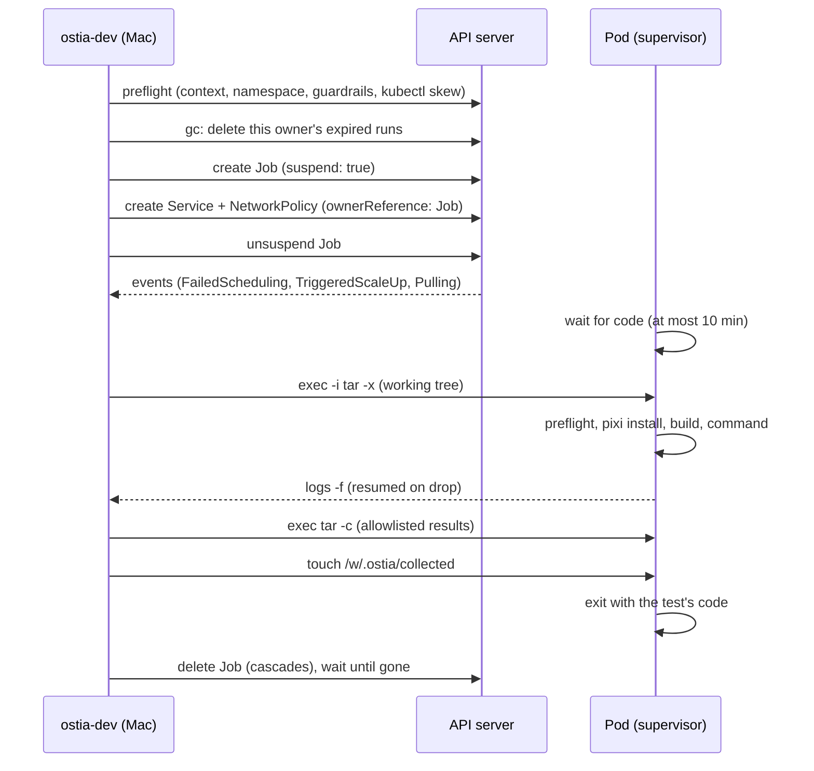
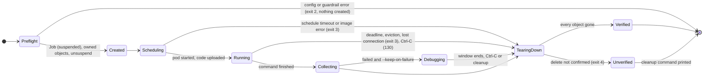

# RFC-0005: ostia dev CLI and remote runner

## Summary

This RFC designs `ostia-dev`, the one command-line tool for working on Ostia, and its `remote` subcommand, which runs Ostia's build and tests on machines other than the developer's own.

- **`ostia-dev`** gathers every contributor tool into one Python package with one entry point, one config file, one error-message contract and one exit-code contract. Build, test, lint, the repository checks, docs, benchmarks and the environment doctor all become subcommands (§1, §2).
- **`ostia-dev remote k8s`** runs a build and a test command in temporary pods on any Kubernetes cluster (GKE, EKS, AKS or another), on GPU or CPU nodes, selected by kube context and node profile. It streams the output, copies the results back and tears everything down, including when the run fails, is interrupted or the CLI crashes (§3, §4).
- **`ostia-dev remote container`** runs the same pipeline in a local podman or docker container. It replaces `check-cuda` (§5).

```bash
pixi run ostia-dev remote k8s --context gcp-us-central1-intuigence --node l4 -- ctest -L gpu
```

creates a pod on an L4 node of that GKE cluster, builds Ostia from the local working tree (uncommitted changes included), runs the GPU tests, prints the results, exits with the test result and deletes the pod.

The remote runner replaces the automated GPU CI of RFC-0001 §4.2 and §4.3. That decision, and what it does to RFC-0001's "Done when" items, is recorded in ADR-0014.

## Motivation

RFC-0001 §4.2 designed GPU CI as ephemeral AWS `g6.xlarge` runners started by Cirun, with label gating, approval environments, a separate AWS account and an AWS Budgets action (§4.3). The maintainer has since dropped automated GPU CI (ADR-0014). The reasons in short:

- Ostia has one maintainer, who already has Kubernetes clusters with GPU nodes. A separate CI account, Cirun, the label/push race handling and the budget action are a lot of machinery to guard against untrusted fork code, and none of it is needed when a maintainer runs trusted code on demand.
- GPU tests need to run on more than one GPU type (L4 today; A100 and H100 when available) and sometimes on two nodes (the UCX programs of RFC-0001 §6.4). A fixed `g6.xlarge` runner covers one of those.
- The maintainer works on macOS without CUDA (CLAUDE.md, Environment notes). The loop that matters is "edit on the Mac, run on a GPU, read the result", without pushing first.

At the same time, Ostia's contributor tooling has grown as separate scripts and pixi tasks: `tools/ci/*.py`, `tools/dev/*.py`, `tools/docs/*`, `tools/bench/*` (#18, #19), each with its own argument parsing and error printing. A remote runner needs config, credentials handling, profiles and a results contract, so it can't be yet another script. This RFC therefore defines the shared CLI first and puts the runner inside it.

The RFC rule in `docs/README.md` applies: this adds third-party dependencies (typer, kubectl, git), handles cluster credentials, and replaces RFC-0001 §4.2.

## Goals and non-goals

**Goals**

- Every contributor uses one tool, `ostia-dev`, for day-to-day Ostia development, with `--help` listing every task (§1, §2).
- The maintainer runs any Ostia test, including GPU and two-node tests, on any Kubernetes cluster from a Mac, with local uncommitted changes, in one command (§3, §4).
- Nothing stays behind: every run's cluster objects are deleted on success, failure, Ctrl-C and a crashed CLI, without relying on the CLI surviving (§4.8).
- Runs on shared clusters are isolated by default: no service-account token, no cloud identity, Pod Security `restricted`, default-deny networking (§4.6).
- A run's exit code is the test result, and its results are on the Mac afterwards in a fixed layout (§3.4, §3.5).
- Contributors without a GPU or a cluster can still check CUDA code locally (§5) and get GPU-affecting pull requests tested by a maintainer (ADR-0014).

**Non-goals**

- Automated GPU CI on pull requests. Dropped by ADR-0014.
- Running untrusted code. The runner executes whatever is in the developer's working tree; it assumes the developer trusts it. Isolation protects the cluster's other workloads, not the run from its author.
- Long-lived clusters or cluster provisioning. The runner uses clusters that already exist; it creates namespaced objects only (plus a namespace on request).
- The `ssh` and `rent` backends. §3.1 defines the interface they will implement; each gets its own RFC or ADR.
- Publishing `ostia-dev` to PyPI. It is contributor tooling and is never uploaded.

## Design

### 1. The `ostia-dev` CLI

#### 1.1 Package and entry point

- The CLI is a Python package at `tools/ostia-dev/`, with its own `pyproject.toml`: distribution `ostia-dev`, src layout `src/ostia_dev/`, classifier `Private :: Do Not Upload`, and a `[project.scripts]` entry point `ostia-dev = "ostia_dev.cli:app"`.
- pixi installs it editable in **every** environment through `[pypi-dependencies] ostia-dev = { path = "tools/ostia-dev", editable = true }`. It is therefore available on the Mac, in CI and inside remote pods, and `pixi run ostia-dev …` or plain `ostia-dev …` inside `pixi shell` both work.
- The import name `ostia_dev` stays outside the product's `ostia.*` namespace (PEP 420, PRD "Python package"). The command is `ostia-dev`, not `ostia`, so a future user-facing `ostia` command from `pip install ostia` has its name free.
- Arguments are parsed with **typer**. Commands form groups: `ostia-dev <group> <verb>`, plus top-level verbs for the everyday tasks (§2). typer's built-in shell completion (`ostia-dev --install-completion`) is documented, not extended.

#### 1.2 Config

- Format: TOML, read with the standard library's `tomllib`. Every file carries `schema = 1`; an unknown schema is rejected with the supported versions.
- Built-in defaults ship in the package (`ostia_dev/remote/profiles.toml`: node profiles and suites, §4.4 and §3.3).
- The user file is `~/.config/ostia/config.toml` (XDG; `OSTIA_CONFIG` overrides the path). It holds cluster contexts and profile overrides and additions. Keys merge per key over the built-ins.
- The repository never stores cluster names, contexts or credentials.

```toml
# ~/.config/ostia/config.toml
schema = 1

[remote.k8s.contexts.gcp-us-central1-intuigence]
provider = "gke"                # gke | eks | aks | generic
namespace = "ostia-test"        # default for this context; --namespace overrides it
kubectl = "/usr/local/bin/kubectl"   # optional; defaults to the pixi-pinned kubectl

[remote.k8s.profiles.l4.gke]    # override one built-in field
ephemeral_storage = "80Gi"
```

The CLI can write this file for you on first use (§4.3); it never writes it without asking.

#### 1.3 Error messages

Every error follows RFC-0001's error-message contract: the problem, the offending item, the rule that was broken, the exact fix and the RFC section. The shape is the one `tools/ci/_contract.py::violation()` already prints; that helper moves into `ostia_dev` (§2.3) and every subcommand uses it. For example:

```text
error: namespace ostia-test has no ResourceQuota
  context: gcp-us-central1-intuigence
  rule: runs need the guardrails of RFC-0005 §4.6 (PSA restricted, ResourceQuota, NetworkPolicy)
  fix: ostia-dev remote k8s init --context gcp-us-central1-intuigence --namespace ostia-test
       or rerun with --allow-unguarded (recorded in the run summary)
  see: RFC-0005 §4.3
```

`-v/--verbose` prints every external command (kubectl, podman, git) with its arguments, for debugging.

#### 1.4 Exit codes

For every subcommand: **0** success, **1** the checked thing failed (tests, lint, a check), **2** usage or configuration error. `remote` adds three (§3.5).

#### 1.5 Prompts and non-interactive use

The CLI prompts only on a TTY. Every prompt has a flag equivalent (`--yes`, `--namespace`, …). Without a TTY, a question the flags don't answer is an exit 2 with the fix printed, so scripts never hang.

### 2. Subcommands and migration

#### 2.1 Target layout

```text
tools/ostia-dev/
  pyproject.toml
  src/ostia_dev/
    cli.py            # typer app, top-level verbs
    contract.py       # error-message contract (from tools/ci/_contract.py)
    config.py         # §1.2
    dev/              # build, test, py-dev, clean, doctor, hooks
    ci/               # lint, fmt, check, check layering|graph|macros|cpm-pins|exports, docs-as-test
    docs/             # docs index, docs figures
    bench/            # bench run|convert|compare|overhead (from #18, #19)
    remote/           # core.py (§3), k8s/ (§4), container.py (§5), profiles.toml, pod/ (supervisor, §4.5)
  tests/
```

`telemetry/tools/gen_catalog.py` stays where it is: CMake runs it at build time as code generation, and it belongs to the telemetry component. `tools/ci/install_cmake.sh` and `tools/ci/gpu_preflight.sh` (#17) stay shell scripts, because they run before pixi exists (the container CI jobs, and inside remote pods).

#### 2.2 Everyday commands: one vocabulary

Every user-facing command becomes `ostia-dev …`. pixi keeps only internal tasks whose names start with `_`, where its task graph needs them (for example `_configure`); `ostia-dev` sequences the rest itself.

| Today | After the migration |
| --- | --- |
| `pixi run build` | `pixi run ostia-dev build` |
| `pixi run test` / `test-cpp` / `test-py` | `ostia-dev test` / `test cpp` / `test py` |
| `pixi run test-preset <p>`, `test-levels` | `ostia-dev test --preset <p>`, `ostia-dev test --levels` |
| `pixi run test-rebuild`, `test-multiprocess` | `ostia-dev test rebuild`, `ostia-dev test -L multiprocess` |
| `pixi run check` | `ostia-dev check` |
| `pixi run lint`, `fmt` | `ostia-dev lint`, `ostia-dev fmt` |
| `pixi run check-graph`, `check-macros`, `tidy` | `ostia-dev check graph`, `check macros`, `check tidy` |
| `tools/ci/check_layering.py`, `check_cpm_pins.py`, `check_exports.py` | `ostia-dev check layering`, `check cpm-pins`, `check exports` |
| `pixi run sanitize-asan`, `sanitize-tsan` | `ostia-dev test --sanitize asan-ubsan`, `--sanitize tsan` |
| `pixi run doctor`, `clean`, `py-dev`, `hooks` | `ostia-dev doctor`, `clean`, `py-dev`, `hooks` |
| `pixi run docs-index`, `python3 tools/docs/gen_index.py [--check]` | `ostia-dev docs index [--check]` |
| `bun tools/docs/render-figures.js …` | `ostia-dev docs figures` (still needs bun) |
| `pixi run docs-as-test` | `ostia-dev check docs-as-test` |
| `pixi run check-cuda [env]` | `ostia-dev remote container --env <env> --preset release --no-test` (§5) |
| `pixi run bench …`, `tools/bench/*.py` (#18, #19) | `ostia-dev bench run|convert|compare|overhead` |
| `pixi run rent …` (RFC-0004, Rollout PR 7) | `ostia-dev rent …`, and later a `remote` backend (§3.1) |
| `pixi run topo-show`, the capture tool (RFC-0003, Rollout PR 6) | `ostia-dev topo show|capture` |

The quick start in `docs/guides/building.md` becomes `pixi install`, `pixi run ostia-dev build`, `pixi run ostia-dev test`. This amends the wording of RFC-0001's first goal ("three commands"), not its intent.

#### 2.3 How the migration lands

- **Implementation PR A** adds the package, the framework (§1), `remote` (§3–§5) and the kind CI job (Testing). The existing tools stay where they are, untouched.
- **Implementation PR B**, after #17–#19 have merged so they don't conflict, moves the existing modules into `ostia_dev/{dev,ci,docs,bench}/` and removes the old pixi task names and script paths in one step (a **hard switch**, no aliases). The same PR updates CI (`.github/workflows/*.yml`), `.pre-commit-config.yaml`, `CLAUDE.md`, `CONTRIBUTING.md`, `docs/guides/building.md`, `docs/guides/README.md` and `docs-as-test`, and `CHANGELOG.md` lists every old name with its replacement (RFC-0001 Rollout, pre-release compatibility).
- **Regression proof for PR B:** the existing tests move with their modules and pass with import changes only. A parity test runs each old entry point and its new subcommand on the same fixtures and compares exit code, stdout, stderr and files written. It lands in a commit before the old paths are deleted. `ostia-dev check` and `docs-as-test` pass on the PR. The intended differences are names and paths only.

#### 2.4 New dependencies

This RFC is the approval that `docs/README.md` requires.

| Dependency | Licence | Purpose | Source | Environments |
| --- | --- | --- | --- | --- |
| typer (with click, rich, shellingham) | MIT; BSD-3-Clause; MIT; ISC | Argument parsing, help, completion | conda-forge | all |
| kubectl (`kubernetes-client`) | Apache-2.0 | Talking to clusters (§4.1) | conda-forge, pinned | all |
| git | GPL-2.0 (tool only, not linked) | CPM fetches source dependencies by `GIT_TAG` inside pods, which run as non-root and cannot install packages (§4.5) | conda-forge | all |

PR A measures whether `typer-slim` (without rich) is enough; if it is, that is used instead and the table is updated in the PR. Cloud credential plugins (`gke-gcloud-auth-plugin`, `aws`, `kubelogin`) are not dependencies: kubectl uses whatever the developer's kubeconfig names, and the guide lists them per provider.

### 3. Remote runs

#### 3.1 Backends

A backend implements seven operations: `prepare` (validate config, preflight), `upload` (put the code in place), `start`, `stream` (output and status), `collect` (copy results), `teardown` and `gc` (remove anything left by earlier runs). The pipeline (§3.2), results (§3.4) and exit codes (§3.5) are shared.

| Backend | Designed in | Where the run happens |
| --- | --- | --- |
| `k8s` | §4 | Pods on a Kubernetes cluster |
| `container` | §5 | A local podman or docker container |
| `ssh`, `rent` | later (Open questions) | A machine reached over SSH; a RFC-0004 rented setup |

Common flags for every backend:

| Flag | Default | Meaning |
| --- | --- | --- |
| `--env` | `cuda-12` on GPU profiles, `default` otherwise | pixi environment |
| `--preset` | `dev` | CMake preset |
| `--suite` | none | A named suite (§3.3) instead of a command |
| `-- <command>` | `ctest --preset <preset>` | The command to run after the build |
| `--no-build` | off | Skip configure and build (the command builds, or needs no build) |
| `--timeout` | 60 min | Limit for the whole run inside the pod |
| `--ref <sha>` | none | Clone a pushed commit instead of uploading the working tree |
| `--env-var KEY=VALUE` | none | Pass one variable (§4.10) |
| `--results <dir>` | `build/remote/` | Where results land locally |
| `--yes` | off | Answer yes to confirmations (§1.5) |

#### 3.2 Pipeline

Every run executes the same steps, in the pod or container, under the in-pod supervisor (§4.5):

1. **Unpack** the uploaded tree into the work volume (or clone `--ref`).
2. **Preflight.** GPU profiles run `tools/ci/gpu_preflight.sh` (driver ≥ R580, fingerprint) and the compute-capability check (§4.9).
3. **Install:** `pixi install --locked -e <env>`.
4. **Configure and build** the preset (skipped with `--no-build`).
5. **Command:** the command after `--`, run with `pixi run -e <env>` **in the preset's build directory**, with `OSTIA_BUILD_DIR` and `OSTIA_SOURCE_DIR` exported. That is why `-- ctest -L gpu` works as written. ctest always gets `--output-junit`.

Each step writes its exit code and duration to `/w/.ostia/steps.json`. Two guards turn "tested nothing" into a failure: `CTEST_NO_TESTS_ACTION=error` is set in the pod, and a ctest run whose `junit.xml` holds zero tests fails with exit 1.

#### 3.3 Suites

Suites are named step lists in `profiles.toml`. They reproduce what #17 and #18's GPU workflow ran, so nothing is lost when that workflow is dropped:

| Suite | Runs |
| --- | --- |
| `gpu` | preflight; the `dev` preset's `native` check (the summary line in `ostia-summary.txt`); build and full ctest at telemetry levels `off`, `metrics`, `trace`, `debug` (`level-*` presets with the node's architecture, §4.9) |
| `sanitizer` | `compute-sanitizer --tool memcheck|racecheck|synccheck --error-exitcode 1` on the GPU test binaries of a `debug` build |
| `bench-smoke` | the benchmark driver end to end (nvbench to schema 1, RFC-0001 §6.1) and every `fabric/bench` program with `--smoke` |
| `overhead-aa` | the overhead mechanism's self-test and the A/A noise-floor run on the node (RFC-0001 §6.6) |
| `cpu` | build and `ctest -L cpu` |

#### 3.4 Results

Results are copied to `build/remote/<run-id>/` (git-ignored under `/build/`):

```text
build/remote/k8s-l4-20261002-141501-a1b2c3/
  summary.json        # run ID, backend, context, namespace, profile, node, GPU, git SHA, tree hash,
                      # upload size, per-step exit codes and durations, node-hours, cost estimate, exit code
  log.txt             # the full streamed output
  fingerprint.txt     # gpu_preflight.sh output
  ostia-summary.txt   # the configure summary
  junit.xml
  Testing/            # ctest's own output
  rank-0/ rank-1/     # the same, per pod, for two-pod runs (§4.11)
```

Benchmark output is also copied to `bench/results/<run-id>/`, evidence included, where `compare.py` expects it (RFC-0001 §6.2). Only an allowlist of paths is copied back, symlinks are rejected, and the total is capped at 2 GiB. The run ID is `<backend>-<profile>-<UTC yyyymmdd-HHMMSS>-<6 hex>`.

At the end the CLI prints one summary line, which is also what goes into a pull request (ADR-0014):

```text
k8s-l4-20261002-141501-a1b2c3  passed  L4 (8.9) driver 580.95  sha 3f2a9c1+dirty(tree 9ab3…)  suite gpu  18m12s
  upload 4s · node 3m40s · install 5m02s · build 6m31s · test 2m55s
  tip: install and build took 64% of this run; --cache reuses downloads between runs (RFC-0005 §4.7)
```

The per-step durations are always shown. The tip appears when install and build dominate.

#### 3.5 Exit codes

| Code | Meaning | Cluster state afterwards |
| --- | --- | --- |
| 0 | Every step passed | Deleted and verified |
| 1 | The tests or the command failed | Deleted and verified |
| 2 | Usage or configuration error | Nothing was created |
| 3 | Infrastructure failure: unschedulable, image pull, eviction, preemption, deadline, lost connection; the test result is unknown | Deleted and verified |
| 4 | The run finished, but teardown could not be verified | Objects may remain; the `cleanup` command is printed |
| 130 | Interrupted by Ctrl-C, after teardown | Deleted and verified |

`summary.json` records the code and the failing step.

### 4. The `k8s` backend

#### 4.1 Talking to the cluster

- The backend drives a pinned `kubectl` as a subprocess with generated manifests (`apply -f -`, `wait`, `logs -f`, `exec -i`, `delete`). It uses the developer's kubeconfig and credential plugins unchanged, and has kubectl's proven tar-over-exec path. There is no Python Kubernetes client. All calls go through one thin `Kube` wrapper, which is what the unit tests replace (Testing).
- `--context` is required on every run. The tool never falls back to kubectl's current context, so a run can't land on the wrong cluster.
- Preflight reads `kubectl version -o json`. If client and server are more than one minor version apart (outside Kubernetes' version-skew policy), it prints a warning naming both versions and the fix: a newer pin, or `--kubectl PATH` / `kubectl = "…"` in the config.

```text
ostia-dev remote k8s [run flags] -- <command>   # a run (§3)
ostia-dev remote k8s init     --context C --namespace N [--privileged]   # create or complete a namespace's guardrails
ostia-dev remote k8s verify   --context C --namespace N                  # probe the isolation (§4.6)
ostia-dev remote k8s cleanup  --context C --namespace N [--run-id R | --all] [--delete-namespace]
ostia-dev remote k8s profiles [--context C]                             # list profiles, their selectors and resources
ostia-dev remote k8s usage                                              # node-hours and cost estimate from local run records
```

#### 4.2 Workload: a Job

Each run is a `batch/v1` Job:

- `backoffLimit: 0` (never retried), `activeDeadlineSeconds` (§4.8) and `ttlSecondsAfterFinished: 600`, so the API server deletes the finished Job and its pods even if the CLI is gone.
- Two-pod runs use an **Indexed Job** (`completionMode: Indexed`, `completions: 2`, `parallelism: 2`) with a headless Service as its subdomain (§4.11).
- Per-run objects (the headless Service and the per-run NetworkPolicy) carry an `ownerReference` to the Job, so deleting the Job deletes them. An ownerReference needs the Job's UID, so the Job is created with `suspend: true`, the owned objects are created next, and then the Job is unsuspended. No pod runs before its policy exists.



#### 4.3 Namespaces

- The namespace comes from `--namespace`, or from the context's `namespace` in the user config. On a TTY with neither, the CLI asks `namespace for context <name>? [ostia-test]` and then `save as this context's default? [Y/n]`, and carries on. Without a TTY that is an exit 2 with the fix.
- **Missing namespace:** on a TTY the CLI asks `create namespace ostia-test? [y/N]` (`--yes` in scripts). It creates it with the guardrails of §4.6 and the label `ostia.dev/managed=true`. A created namespace is kept and reused; `cleanup --delete-namespace` deletes a namespace only if it carries that label.
- **Existing namespace without guardrails:** the preflight reads the namespace's PSA `enforce` label, its ResourceQuota and a NetworkPolicy that selects the run's pods. If any is missing, the run is refused with an error naming what's missing (§1.3). The fix is `init` (which adds them) or `--allow-unguarded`, which is recorded in `summary.json` and printed in the summary. The pod-level settings of §4.6 apply regardless.
- **Unconfigured context:** on a TTY the CLI reads one node's labels (`cloud.google.com/gke-nodepool`, `eks.amazonaws.com/nodegroup`, `karpenter.sh/nodepool`, `kubernetes.azure.com/agentpool`), shows the provider it detected, asks `save [remote.k8s.contexts.<name>] provider = "gke" to ~/.config/ostia/config.toml? [Y/n]`, writes it and carries on. Without a TTY it prints the line to add and exits 2. It never guesses silently. `generic` clusters need an explicit `node_selector` in their profile.

The developer who uses a namespace needs a Role there allowing Jobs, pods, `pods/exec`, `pods/log`, Services, NetworkPolicies, events and (for `--cache`) PersistentVolumeClaims. `init` and namespace creation need rights to create namespaces, ResourceQuotas, LimitRanges and NetworkPolicies; on a shared cluster that is a cluster admin, once.

#### 4.4 Node profiles

A profile names a node type and maps it per provider:

```toml
# ostia_dev/remote/profiles.toml (built in)
schema = 1

[profiles.l4]
kind = "gpu"                      # gpu | cpu | rdma
gpus = 1
compute_capability = "8.9"
cpu = "7"
memory = "28Gi"
ephemeral_storage = "60Gi"
usd_per_hour = 0.0                # set per context in the user config, for summaries (ADR-0014)
[profiles.l4.gke]
node_selector = { "cloud.google.com/gke-accelerator" = "nvidia-l4" }
tolerations = [{ key = "nvidia.com/gpu", operator = "Exists", effect = "NoSchedule" }]
[profiles.l4.eks]
node_selector = { "node.kubernetes.io/instance-type" = "g6.2xlarge" }   # or karpenter.k8s.aws/instance-gpu-name = "l4"
[profiles.l4.aks]
node_selector = { "kubernetes.azure.com/accelerator" = "nvidia" }   # plus kubernetes.azure.com/agentpool of the L4 pool, set per cluster

[profiles.cpu]
kind = "cpu"
cpu = "4"
memory = "16Gi"
ephemeral_storage = "20Gi"
```

Built-in profiles: `l4`, `a100`, `h100` and `cpu`, for `gke`, `eks` and `aks`. Users override fields or add profiles in their config (§1.2). `ostia-dev remote k8s profiles` shows the result after merging.

- **Resources:** `requests` equal `limits` for CPU, memory, `ephemeral-storage` and `nvidia.com/gpu`. The work volume is an `emptyDir` with `sizeLimit` equal to `ephemeral_storage`. The defaults (60 GiB for GPU suites, 20 GiB for CPU) are revisited after the first real runs report their usage.
- **Architecture:** a profile may set `arch = "arm64"` (Graviton, T2A, Grace), which adds `kubernetes.io/arch`. The image is multi-arch.

#### 4.5 Pod, image and supervisor

- **Image:** `ghcr.io/prefix-dev/pixi:<version>-noble@sha256:…` (Ubuntu 24.04, the tier-1 platform; amd64 and arm64), with the pixi version CI uses. Renovate bumps the digest. The CUDA toolkit comes from the locked pixi environment; the NVIDIA container runtime injects the driver (`NVIDIA_DRIVER_CAPABILITIES=compute,utility`). git comes from pixi (§2.4), because the pod can't `apt-get`.
- **User:** uid 1000, `HOME=/w/home`, everything writable under the `/w` emptyDir.
- **Supervisor:** the container's command is a small POSIX `sh` script shipped in the pod spec (from `ostia_dev/remote/pod/`). It:
  1. waits for the code (`/w/.ostia/ready`), for at most 10 minutes;
  2. runs the pipeline of §3.2, recording each step in `/w/.ostia/steps.json` and the full output in `/w/.ostia/log.txt`;
  3. waits for the CLI to copy the results: it exits with the test's code as soon as `/w/.ostia/collected` exists, or after a 10-minute collection window if the CLI never comes back.

  So a crashed CLI still ends the pod and frees the GPU by itself.
- **Streaming:** the CLI follows `kubectl logs -f --timestamps`. Long streams drop (API server and kubelet timeouts), so the CLI resumes with `--since-time` from the last line it saw and drops duplicates. The complete log is copied back anyway.
- **While waiting for a node,** the CLI shows one status line with elapsed time, built from the Job's and pod's events: `FailedScheduling`, `TriggeredScaleUp` / `NotTriggerScaleUp`, `Pulling` / `Pulled`, `ContainerCreating`. After `--schedule-timeout` (default 20 minutes) the run ends with exit 3, printing the last `FailedScheduling` reason and the profile key to change.

#### 4.6 Isolation

The runner runs trusted local code, but on clusters shared with other workloads. The defaults:

- **Pod Security `restricted`** on the namespace (`pod-security.kubernetes.io/enforce: restricted`). Pods run with `runAsNonRoot`, `allowPrivilegeEscalation: false`, `capabilities.drop: [ALL]`, `seccompProfile: RuntimeDefault`, and no `hostNetwork`, `hostPID` or hostPath.
- **No Kubernetes or cloud identity:** a dedicated ServiceAccount `ostia-test-runner` with no RBAC bindings, `automountServiceAccountToken: false` on the pod, and no Workload Identity, IRSA / EKS Pod Identity or Azure Workload Identity annotations.
- **ResourceQuota and LimitRange** from `init`: a cap on GPUs, CPU, memory and ephemeral storage in the namespace, and defaults for any pod that doesn't set them.
- **NetworkPolicy:** default-deny ingress and egress for the namespace. Egress allows DNS (UDP and TCP 53) to kube-dns only, and TCP 443 to `0.0.0.0/0` except `10.0.0.0/8`, `172.16.0.0/12`, `192.168.0.0/16`, `100.64.0.0/10` and `169.254.0.0/16`, which blocks node, VPC and tailnet addresses and the cloud metadata servers. Everything a run needs (conda-forge, prefix.dev, ghcr.io, github.com for CPM) is public HTTPS. Two-pod runs get a per-run NetworkPolicy, owned by the Job, that allows traffic between pods with the same `ostia.dev/run-id`. The Kubernetes API server is reachable only if its endpoint is a public IP on 443; `verify` reports whether it is.
- **GPU requests** go through `nvidia.com/gpu`, never `privileged`.

These guarantees hold only if the cluster's network plugin enforces NetworkPolicy, and a plugin that doesn't ignores policies silently. `verify` checks that each one actually holds, from a probe pod with the run's exact spec: the metadata server is unreachable, there's no service-account token, the API server and the private ranges are unreachable, and DNS and `https://github.com` work. `verify` is a manual check, documented as the first step on every new cluster or namespace. It is not run automatically, and runs don't require it.

#### 4.7 Cache (opt-in)

Every run downloads the locked environment and CPM sources into its own emptyDir, which is clean and isolated. `--cache` mounts a PVC, `ostia-test-cache` (created on first use, labelled `ostia.dev/managed=true`), for the rattler, CPM and ccache directories. The trade-offs:

- An RWO volume is zonal and serves one pod at a time: a run on a node in another zone can't schedule, and two cached runs don't run at once.
- A cache is written by whatever code ran last. Everyone who uses the namespace with `--cache` shares that trust boundary. Packages are still hash-checked by pixi against `pixi.lock`, and CPM sources are pinned by SHA.

The guide's "faster runs" section covers the other speed levers that don't change the default: `--cache`, keeping a warm node pool while iterating, running one suite or `-L` label instead of all, and `--no-build` when the command builds itself. The target is reruns of 5 to 10 minutes with `--cache` on a warm node; the first run of a cache-off suite may take 15 to 25 minutes.

#### 4.8 Teardown and garbage collection

- **Labels** on every object: `ostia.dev/managed=true`, `ostia.dev/run-id=<id>`, `ostia.dev/owner=<hash of user@host>`. Annotation `ostia.dev/expires=<UTC time>`.
- **Limits:** `activeDeadlineSeconds` = `--timeout` + 15 minutes (plus the `--keep-on-failure` window when set); `ttlSecondsAfterFinished: 600`; a 10-minute wait for the code; a 10-minute collection window.
- **The CLI deletes** the run's Job (cascading to its pods and owned objects) on success, failure, Ctrl-C and SIGTERM, and then waits until the objects are gone. A second Ctrl-C skips the wait, not the delete. If deletion can't be verified, the exit code is 4 and the `cleanup` command is printed.
- **Every run starts** by deleting the owner's expired objects in the namespace.
- **`cleanup`** deletes the caller's runs; `--run-id` targets one run; `--all` covers every managed run in the namespace, after a confirmation. PVCs from `--cache` are deleted only by `cleanup --cache`.
- **A crashed CLI** leaves a run that still ends by itself: the supervisor exits after its windows, `activeDeadlineSeconds` kills a pod that hangs, `ttlSecondsAfterFinished` deletes the finished Job, and the ownerReferences delete the Service and the NetworkPolicy with it.
- **`--keep-on-failure[=N]`** (default 30 minutes, opt-in) keeps a failed pod for live debugging. The CLI copies the results but doesn't write the collected marker, prints the exact `kubectl exec` command and the time the pod will end, and extends the deadline by N. Ctrl-C, `cleanup --run-id` or `touch /w/.ostia/collected` ends it early.



#### 4.9 GPU preflight and CUDA architecture

- `tools/ci/gpu_preflight.sh` runs first on GPU profiles: it prints the fingerprint (`nvidia-smi` name, driver, compute capability, memory; `uname`) and fails on a driver older than R580 (RFC-0001 §1.1).
- The profile's `compute_capability` must match `nvidia-smi --query-gpu=compute_cap`. A mismatch means the run landed on the wrong node type, and the preflight fails with both values.
- **Architecture:** the default `dev` preset picks `native` when a GPU is detected (RFC-0001 §1.1), and the runner checks that `ostia-summary.txt` says so. Other presets get `-DCMAKE_CUDA_ARCHITECTURES=<cc>-real` from the profile (for example `89-real` on an L4), so the `level-*` presets build only what the node runs. The fixed `gpu-ci` preset (architecture 89) is removed in PR B.

#### 4.10 Credentials and what reaches the pod

- kubeconfig, tokens and cloud credentials never leave the Mac; kubectl uses them locally.
- No environment variables are forwarded by default. `--env-var KEY=VALUE` passes one and is recorded in `summary.json`. Keys matching `*TOKEN*`, `*SECRET*`, `*KEY*` or `*PASSWORD*` are refused unless `--allow-secret` is given.
- **Upload:** the tarball holds `git ls-files -co --exclude-standard`: tracked and untracked files, never git-ignored ones such as `.env` or `build/`. That's the same set `check_cuda.py` copies. The CLI warns about untracked files over 10 MB and refuses a tarball over 500 MB. The tree hash and size go into `summary.json`. With `--ref <sha>`, the pod clones `https://github.com/OstiaHQ/ostia` at that commit instead, for reproducing exactly what is on GitHub (for example a contributor's pull request head).

#### 4.11 Two-pod runs

For the UCX programs that need two nodes (`rdma_put`, `gdr_stream`, `tcp_put`, `dual_link --mode rails`; RFC-0001 §6.4):

- `--pods 2` creates an Indexed Job with required pod anti-affinity, so the two pods land on different nodes (`--same-node` relaxes it).
- The code is uploaded to both pods. Each pod gets `OSTIA_RANK` (0 or 1), `OSTIA_SIZE=2`, `OSTIA_PEER_HOST=<job>-0.<service>` and `OSTIA_PORT`. The same command runs in both. The benchmark driver maps rank 0 to `--listen $OSTIA_PORT` and rank 1 to `--connect $OSTIA_PEER_HOST:$OSTIA_PORT`, the programs' existing rendezvous (#19).
- Results are collected from each pod into `rank-<i>/`. If either pod fails, the run fails and both are torn down.

#### 4.12 RDMA profiles (opt-in, privileged)

Two-node RDMA and GPUDirect need things `restricted` forbids: the `IPC_LOCK` capability, RDMA device resources (`rdma/*` from the NVIDIA network operator or an RDMA device plugin) and often host networking. Profiles of `kind = "rdma"`:

- run only in a namespace labelled PSA `privileged`, which `init --privileged` creates. A normal run never creates or relabels one;
- add `IPC_LOCK`, unlimited memlock and the profile's `rdma/*` requests. The service-account, token, cloud-identity and NetworkPolicy defaults of §4.6 still apply, except where host networking makes a NetworkPolicy ineffective, which `verify` reports;
- are refused in a `restricted` namespace, with the fix naming `init --privileged`.

No RDMA-capable cluster is available today, so this section is designed but unproven. Its first real use confirms it (Open questions).

### 5. The `container` backend

`ostia-dev remote container` runs the same pipeline (§3.2) in a local container with podman or docker, whichever is found first; if neither is, it fails with the install fix, as `check_cuda.py` does today.

- The same pinned image and supervisor as §4.5. The working tree is mounted read-only and copied in the same way, so the pipeline is identical.
- On a Mac the container is `linux/arm64`, which runs natively on Apple silicon. With no GPU, `--no-test` makes it compile-only, which is how it replaces `check-cuda`: `ostia-dev remote container --env cuda-12 --preset release --no-test`.
- On a Linux host with an NVIDIA GPU and the NVIDIA container toolkit, `--gpus` passes the GPU through and GPU suites run.
- A named volume caches downloads, as `check_cuda.py`'s `ostia-pixi-cache` does. That cache is on the developer's own machine.
- CPU CI uses this backend to test the pipeline itself without a cluster (Testing).

### 6. Gate runs on Kubernetes, and the overlap with RFC-0004

The runner takes over everything the dropped GPU CI did, and lets a cluster with the right hardware serve as a gate machine.

| Work | Before | Now |
| --- | --- | --- |
| GPU unit, integration and multi-process tests at four telemetry levels | GPU CI (RFC-0001 §4.2) | `--suite gpu` on an L4 profile |
| `compute-sanitizer`, nightly | GPU CI | `--suite sanitizer` |
| Benchmark driver end to end, `--smoke` of every gate program | GPU CI (#18, #19) | `--suite bench-smoke` |
| Overhead self-test and the A/A noise floor on the L4 | GPU CI (RFC-0001 §6.6) | `--suite overhead-aa`; the quiet-box fallback stays with RFC-0004 |
| M0 gate runs (nvlink-node, rdma-pair, tcp-efa-pair) | RFC-0004 rented setups | RFC-0004, **or** a k8s machine declared in the setup file (below) |
| Topology captures (RFC-0003) | RFC-0004 | the same, on whichever machine runs the gate |

**Declaring a k8s machine for a gate setup.** A setup file in `infra/setups/<setup>.yaml` (RFC-0004 §1, #19) may name a machine with `backend: k8s`, as its primary or as a pre-declared fallback:

```yaml
machines:
  fallback:
    backend: k8s
    context: gcp-us-central1-intuigence
    namespace: ostia-gate
    profile: a100x4          # a user profile with 4 GPUs on one node
    pods: 1
    capabilities: [nvlink-p2p, cuda-ipc]
```

`ostia-dev remote gate <setup>` runs it. A k8s machine passes exactly the checks a rented one does:

- RFC-0004 §1.1's preflight and active capability probes;
- RFC-0001 §6.4's transport evidence;
- RFC-0003's manifest-gated captures.

Before any gate workload runs, a probe checks that every evidence counter it needs is readable in the pod (InfiniBand port counters in sysfs; `nvidia-smi nvlink` counters). If one isn't, the gate fails closed on that machine. RDMA gate workloads (`rdma_put`, `gdr_stream`, `dual_link` rails) must use an `rdma` profile (§4.12): loading a setup file that puts them on another kind of profile is an exit 2, because the counters that prove RDMA traffic are only visible with RDMA devices in the pod. NVLink workloads may use normal GPU profiles.

Spend on k8s machines has no rent ledger: runs on the maintainer's own clusters are outside the M0 budget (ADR-0014), and each summary records node-hours times the profile's `usd_per_hour`.

## Failure handling

Every message follows the contract of §1.3. The run's state is always one of the rows of §3.5.

| Failure | Detected by | What the developer sees | Exit | State left |
| --- | --- | --- | --- | --- |
| No context, or no namespace and no TTY | Argument parsing | The flag or config key to set | 2 | Nothing created |
| Unknown context in the config, no TTY | Preflight | The detected provider and the TOML line to add | 2 | Nothing created |
| Namespace missing, no TTY and no `--yes` | Preflight | `init` or `--yes` | 2 | Nothing created |
| Guardrails missing | Preflight | Which one; `init` or `--allow-unguarded` | 2 | Nothing created |
| RDMA profile in a restricted namespace | Preflight | `init --privileged` | 2 | Nothing created |
| RDMA gate workload on a non-RDMA profile | Setup-file load | The workload, the profile, the rule | 2 | Nothing created |
| kubectl more than one minor from the server | Preflight | Warning with both versions and the fix | — | — |
| Tarball over 500 MB | Upload | The largest untracked files | 2 | Nothing created |
| Secret-looking `--env-var` | Argument parsing | The key and `--allow-secret` | 2 | Nothing created |
| Pod never schedules (no capacity, quota, taints) | Events, `--schedule-timeout` | The last `FailedScheduling` reason and the profile key | 3 | Deleted |
| Image pull fails | Events | The image and the pull error | 3 | Deleted |
| Driver older than R580 | `gpu_preflight.sh` | The fingerprint and the rule | 3 | Deleted |
| Compute capability differs from the profile | Preflight | Both values; the profile's node selector | 3 | Deleted |
| Evidence counters unreadable (gate) | Evidence probe | Which counters | 1 (gate fails) | Deleted |
| ctest found no tests | Pipeline guard | The build directory and the ctest arguments | 1 | Deleted |
| Tests fail | Command | ctest's output; results copied | 1 | Deleted |
| Eviction (ephemeral storage) | Pod status | `ephemeral storage` and the profile key to raise | 3 | Deleted |
| Node preempted (spot) | Pod status | Preempted; the rerun command | 3 | Deleted |
| Deadline reached | Job status | The step that was running | 3 | Deleted |
| Log stream drops | kubectl | Nothing; the stream resumes | — | — |
| Connection lost for good | kubectl | The run ID and `cleanup --run-id` | 3 | Ends by itself (§4.8) |
| Ctrl-C | Signal | Teardown progress | 130 | Deleted |
| CLI killed (SIGKILL, laptop asleep) | Not detectable | Next run's GC reports what it removed | — | Ends by itself (§4.8) |
| Delete not confirmed | Teardown | The objects left and the `cleanup` command | 4 | May remain |

## Observability

- `summary.json` and the summary line (§3.4) record, per run: the identity of what ran (SHA, tree hash, upload size), where (context, namespace, profile, node, GPU fingerprint), per-step exit codes and durations, and node-hours with a cost estimate.
- `ostia-dev remote k8s usage` totals node-hours and estimated cost from the local run records.
- `-v` prints every kubectl call. The status line shows scheduling and pull progress from events (§4.5).
- Nothing is sent anywhere; there is no telemetry.

## Performance

- The CLI's own overhead (preflight, upload of a typical tree of a few MB, Job creation) targets under 30 seconds, excluding node scale-up.
- Reruns target 5 to 10 minutes with `--cache` on a warm node; a cache-off first run of `--suite gpu` may take 15 to 25 minutes (estimates, measured by the first runs' `summary.json`).
- Defaults favour isolation over speed (the cache is off); §4.7 lists the levers.

## Testing

| Test | Runs on |
| --- | --- |
| Framework: config merge and schema rejection, error contract, exit codes, TTY and non-TTY prompts, `--yes` | CPU CI (unit) |
| Manifests: Job, Indexed Job, Service, NetworkPolicy, ResourceQuota, LimitRange, securityContext, per provider and profile, as golden YAML | CPU CI (unit) |
| k8s backend with a fake `Kube` wrapper that records kubectl calls and replays scripted outputs: suspend, owned objects, unsuspend; teardown on success, failure, exception, Ctrl-C and lost connection; GC of expired runs; `cleanup` scopes; log-stream resume without duplicates; the collected marker and the window; `--keep-on-failure`; event-based status and the schedule timeout; eviction mapped to exit 3; skew warning; context and namespace prompts and config writes | CPU CI (unit) |
| Pipeline guards: zero-test ctest fails; per-step codes; results allowlist, symlink rejection, size cap | CPU CI (unit) |
| Setup-file validation for gate runs, including the RDMA profile rule | CPU CI (unit) |
| `container` backend: the real pipeline on a CPU environment | CPU CI (Linux, docker) |
| `kind` cluster, default CNI: a CPU run end to end, a two-pod run, and SIGKILL of the CLI followed by TTL cleanup | CPU CI, on pull requests that touch `tools/ostia-dev/` and nightly |
| PR B parity: each old entry point and its new subcommand give the same exit code, output and files | CPU CI, PR B only |
| Isolation on a real cluster | Manual: `ostia-dev remote k8s verify` |
| RDMA profile | Manual, on the first RDMA-capable cluster |

Two gaps are deliberate. NetworkPolicy enforcement is not exercised automatically: kind's default CNI may not enforce policies, so the policies are checked as golden YAML and `verify` is the check on real clusters. And the RDMA profile has no cluster to test on yet.

## Alternatives considered

- **Automated GPU CI on Cirun (RFC-0001 §4.2).** Built for untrusted fork code, with label gating, approval environments, a separate AWS account and a budget action. The maintainer dropped it (ADR-0014): it guards against a threat on-demand maintainer runs don't have, it covers one GPU type, and it can't test uncommitted work.
- **ARC runners on a Kubernetes cluster.** The interim plan: GitHub Actions runner scale sets on a tainted spot L4 pool of the maintainer's GKE cluster. Still automated CI, so it still needs every fork-safety measure, plus a GitHub App and budget enforcement on the cluster. It was dropped before anything was created.
- **Plain `kubectl run` scripts.** Short to write, but no teardown when the script dies, no isolation defaults, no results contract, and every provider's selectors hard-coded. The Job's deadline, TTL and ownerReferences give the crash guarantees that a script can't.
- **Bare pods instead of Jobs.** Simpler, but a finished pod stays until someone deletes it, and two-pod runs need hand-made hostnames. A Job adds `ttlSecondsAfterFinished`, `backoffLimit: 0` and Indexed completions with stable DNS names.
- **The official Python Kubernetes client, or lightkube.** Typed and easy to mock, but the official client's streaming of binary stdin over exec has historically been fragile, and lightkube has no exec at all, so kubectl would be needed anyway. kubectl also reuses the developer's credential plugins with no extra code.
- **A per-run namespace.** Deleting the namespace cleans up everything, but every developer then needs cluster-scoped rights to create namespaces, and the guardrails would be created each time by the identity they're meant to limit.
- **An Ostia-built image with the environment preinstalled.** Much faster starts, but a build and publish pipeline, and an image that drifts from `pixi.lock` unless rebuilt on every lock change. Deferred; `--cache` is the opt-in speed lever.
- **argparse or click instead of typer.** argparse is what the existing scripts use and adds nothing, but nested groups, help and completion are all hand-written. click is typer's base. typer gives typed commands with the least code.
- **Moving every tool in PR A.** One big move would conflict with the open #17–#19; PR B moves them after those merge.
- **Keeping the old pixi task names as aliases.** Rejected by the maintainer in favour of one vocabulary and a clean switch, with a CHANGELOG table and parity tests (§2.3).

## Rollout

| PR | Content | Implements |
| --- | --- | --- |
| A | `tools/ostia-dev/` package, framework, `remote k8s` and `remote container`, suites, `docs/guides/remote-runs.md` and its row in `docs/guides/README.md`, the kind CI job, pixi and Renovate entries for typer, kubectl, git and the image digest | §1, §3–§6 |
| — | Rework of #17–#19 per ADR-0014 (keep the GPU tests, drop the workflows) | ADR-0014 |
| B | Migration and hard switch: existing tools move in, old names removed, CI, pre-commit and docs updated, CHANGELOG table, parity tests; `gpu-ci` preset removed | §2 |
| later | `ssh` backend; `rent` as a backend (RFC-0004) | §3.1 |

- This RFC must be Accepted before PR A starts. ADR-0014 merges after it.
- The guide shipped with PR A (RFC-0001 Rollout: each PR ships its guide) covers cluster setup (`init`, `verify`), profiles and suites, faster runs (§4.7), debugging (`--keep-on-failure`, `-v`) and, for contributors without a cluster, the `container` backend and how to ask a maintainer for a GPU run on their pull request (`--ref <sha>`).

## Open questions

- **`ssh` backend:** worth it for a workstation with a GPU, or does the `container` backend on that machine cover it?
- **`rent` as a backend:** RFC-0004's `rent` has its own lifecycle, ledger and spend limits; how much of §3's pipeline it can reuse is decided when PR 7 lands.
- **RDMA on a real cluster:** the privileged profile (§4.12) and the evidence probe (§6) are unproven until an RDMA-capable cluster runs them.
- **Cache trust:** whether a shared `--cache` PVC should be per developer (keyed by `ostia.dev/owner`) rather than per namespace.
- **typer-slim:** measured in PR A (§2.4).
